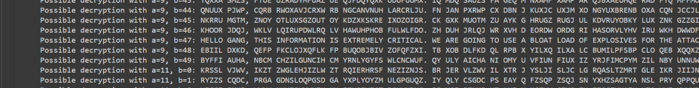

<font size='5'>AES Hijack</font>

​	19<sup>st</sup> August 2024 / Document No. D24.102.231

​	Prepared By: `rasti`

​	Challenge Author: `Skailash005`

​	Difficulty: <font color='orange'>Medium</font>

​	Classification: Official


# Synopsis

- In the AES-Hijack challenge, players must decrypt messages exchanged by a rogue criminal group to uncover their plans and save the city. The challenge begins with analyzing an encryption script that uses AES in ECB mode, leveraging its vulnerabilities to identify patterns and brute-force the encryption key using a combination of English grammar and a wordlist. Once the key is cracked, players use it to log in to a shady chat application and discover further encrypted messages secured with an affine cipher. Players must then exploit the mathematical weaknesses of the affine cipher through brute force to decrypt the final message and retrieve the full flag.

# Description

- As you infiltrate the Frontier Board's encrypted communication channel, you stumble upon a clandestine meeting of shadowy figures plotting their next move. Their messages, fragmented and encoded, hold the key to unraveling their plans. Can you piece together their secrets and expose their treachery before it's too late?


## Skills Required

- Python scripting and debugging
- Understanding of AES-ECB encryption and its vulnerabilities
- Knowledge of pattern analysis and frequency analysis in encryption
- Basic understanding of modular arithmetic and affine ciphers
- Logical thinking and problem-solving skills


## Skills Learned

- Learn how AES-ECB mode works and why it is insecure.
- Learn how to analyze repeating ciphertext blocks for vulnerabilities.
- Learn how to brute-force encryption keys using wordlists like rockyou.txt.
- Learn how to perform frequency analysis on ciphertext to deduce patterns.
- Learn how to script decryption and brute-forcing logic in Python.
- Learn how affine ciphers work and how to brute-force their keys.
- Learn how to apply logical reasoning to infer plaintext and key components.
- Learn how plaintext leaks can compromise cryptographic security.


# Enumeration

## Analyzing the source code

Initially we are exposed to an online server which is free from all vulnerabilities and displays a login page for a chat application names “FLACK” which is a 
super secret and shady chat application on the dark web. We are then exposed to a super secret message that the HTBIA has interfiered from a rouge notorious group.

On inspection we are give the source code on how the script is generated.

```python
from Crypto.Cipher import AES # exposes that code uses encryption system
from Crypto.Util.Padding import pad
import binascii

# exposes that there is a key file and it is in txt format (gives an idea it is plaintext)
with open ('key.txt', 'rb') as key_file:
		key = key_file.read().strip()
```

Based on the above code we come to know that the encryption method used was AES and also the key is most-probably in plain text format. so let us proceed with further inspection of the code.

```python
# exposes the existance of a message.txt file
with open ('message.txt', 'r') as message_file:
		message = message_file.read().strip()

words = message.split()
```

We can see that the entire message is being split into individual words for the process of encryption.

```python
# exposes the use of AES-ECB (Electronic Control Book)
ciphertext = b""
cipher = AES.new(key, AES.MODE_ECB)
```

We see that the AES ECB encryption is used for the process of encryption so there is already a well known vulnerability in the AES ECB mode which encrypts the same words with the same exact cipher texts.

```python
# We see the words are being encrypted individually.
for word in words:
		word_padded = pad(word.encode(), AES.block_size)
		encrypted_word = cipher.encrypt(word_padded)
		ciphertext += encrypted_word
```
Since we know that all the words are encrypted individually and also it all uses the same key , we can potentially bruteforce for the key if we even find out one single plain text word from the message , We also already know that the "encrypted_message.aes" file is a message from a rouge group so we can potentially use a pattern analysis script to find out if there are repeating encrypted blocks.

A little summary of all the interesting things we have found out so far:

1. The encryption algorithim used is AES-ECB which is know to have critical vulnerabilities.
2. The messages are encrypted word by word so it is possible to brute-force the keys.

# Solution 

## Finding the vulnerability

So knowing the information we come up with a script which then uses matplot lib to display a graph of the frequency of the blocks , we first split of the given encrypted message into blocks of 16 bytes (AES uses either 16 , 24 , 32 bytes for the keys) and then we try to analyze and find repeating blocks then we can move on to displaying
the graph and then we also print out each block and the number of times they are repeated.

```python
import matplotlib.pyplot as plt
from collections import Counter
import binascii

# Read Encryptedtext from file
with open ('encrypted_message.aes', 'rb') as file:
		ciphertext = file.read()
    
# Split Encryptedtext into 16-byte blocks
block_size = 16
blocks = [ciphertext[i:i+block_size] for i in range (0, len(ciphertext), block_size)]
# Count the frequency of each block
block_counts = Counter(blocks)
# Prepare data for plotting
block_labels = list(range(len(blocks)))
block_frequencies = [block_counts[block] for block in blocks]
# Plot the block frequency analysis
plt.bar(block_labels, block_frequencies)
plt.xlabel('Block Numbers')
plt.ylabel('Frequency')
plt.title('Block Frequency Analysis in Encrypted text')
plt.show()

print ("Block (hex) -> Frequency")
for block, count in block_counts.most_common():
		print (f"{binascii.hexlify(block)} -> {count}")
```


We can clearly see that a few words are repeating a lot more than the others. Since we already know that this is a message from one person to another , we can try and guess the words that are most frequent. When we talk about rouge groups or be it any other text we generally use a lot of grammer in our sentences/messages so we can try and come up with a script that can potentially take the "encrypted_message.aes" file split it into 16 bytes and then try and use the words of english grammer like [is,was,that,will,be,the,what,then,most,etc..,] with also a set of a key wordlist (rockyou.txt) to try and brute force the key.

## Exploitation

We can then come up with a brute-force script we will be trying to brute force through each of the word in the rockyou.txt file that is exactly equal to 16 bytes (assuming the key is 16 bytes if this fails we have to proceed with trying the 24 byte words and 32 byte words if this fails we would have to incorporate padding to test the keys short of 16 bytes and all the other keys). we also use an array of the most common words or the words that might be in the message file to crack the code. We have successfully cracked the key the unnnessary characters appear because of the padding during the encrypton process but it does'nt matter much as we have gotten the key , We can use cyberchef to then decrypt the entire message easily.

```python
from Crypto.Cipher import AES
import binascii

# Function to decrypt the Encryptedtext with the given key
def decrypt_aes_ecb(ciphertext, key):
    cipher = AES.new(key, AES.MODE_ECB)
    decrypted_text = cipher.decrypt(ciphertext)
    return decrypted_text

# Read the encrypted file
with open ('encrypted_word_by_word.aes', 'rb') as file:
		ciphertext = file.read()

wordlist = 'rockyou.txt'

# Brute-force to find the correct key
with open(wordlist, 'r', encoding='latin-1') as f:
		for word in f:
        # Remove any extra spaces/newlines
        word = word.strip()
        # Ensure the key is 16 bytes (AES key length for ECB)
        if len (word) == 16 :
        		key = word.encode('latin-1')
            try :
                # Decrypt the ciphertext with common words
                decrypted_text = decrypt_aes_ecb(ciphertext, key)
                common_words = [
                    b"help",
                    b"what",
                    b"OMG",
                    b"the",
                    b"password",
                    b"login",
                    b"admin",
                    b"then",
                    b"that",
                    b"what",
                    b"this",
                    b"there",
                    b"when",
                ]
                # Check for a common word in the decrypted text
                if any (common_word in decrypted_text.lower() for common_word in common_words):
                    print (f"Possible key found: {word}")
                    print (f"Decrypted message: {decrypted_text}")
                    break
            except Exception as e:
                # Ignore incorrect keys
                continue
```

The script is successful in cracking the key of the encryption and works just as expected the key is a 16 byte word "avengedsevenfold". Now, using this to decrypt the entire message, we get:

```
Hey gang, we are planning to hijack the bank on the 25th of November this year. 
The hijack is critical, and we need to make sure to sync on all details. 
The time for the hijack will be 3 PM. 
The location for the hijack will be the main branch. 
The bank is our target, and the hijack will be successful. 
This hijack requires the utmost precision.
HTB{REDACTED
Username: Hacktheboxadmin 
Password: G7!xR9$sT@2mL^bW4&uV
```
The message includes the first part of the flag and also some credentials for the login page.


We then read through the chats and find that the rouge group has used another script to encrypt their most sensetive conversations. On inspection it is revealed that the script works based on an affine cipher , It is a mathematical cipher which use's 2 integers (a , b). This cipher is not widely used in IT firms / Solutions but the working of this particular cipher is utmost interesting. we can go through it here 

[http://www.geeksforgeeks.org/implementation-affine-cipher/](http://www.geeksforgeeks.org/implementation-affine-cipher/)

On inspecting further we find an encrypted message that is encrypted through this exact script that is vulnerable to brute-force (because of less randomness of the a , b values).


On downloading we can see the scrambled up values. We then come up with a script to then brute-force through the values to find the correct values of a and b.

```python
from math import gcd

def affine_decrypt(ciphertext, a, b):
    """Decrypt the ciphertext using the affine cipher with parameters a and b."""
    inv_a = pow(a, -1, 26) if gcd(a, 26) == 1 else None
    if not inv_a:
    		return None
    
    plaintext = []
    for ch in ciphertext.upper():
        if ch.isalpha():
            decrypted_char = chr (((inv_a * ( ord (ch) - 65 - b)) % 26 ) + 65 )
            plaintext.append(decrypted_char)
        else :
            plaintext.append(char)
    return ''.join(plaintext)
  
  
def is_readable(text):
    """Check if the decrypted text is likely to be readable English."""
    common_words = ['THE', 'AND', 'TO', 'OF', 'A', 'IN', 'IS', 'IT', 'FOR', 'WITH', 'WE', 'ARE', 'FLAG']
    return any (word in text for word in common_words)
  
def brute_force_affine_cipher(ciphertext):
    """Try all possible (a, b) key pairs to decrypt the ciphertext."""
    possible_a_values = [i for i in range ( 1 , 51 ) if gcd(i, 26 ) == 1 ]
    possible_b_values = range ( 51 )
    for a in possible_a_values:
    		for b in possible_b_values:
    				plaintext = affine_decrypt(ciphertext, a, b)
    				if plaintext and is_readable(plaintext):
								print (f"Possible decryption with a={a}, b={b}: {plaintext}")
								filename = 'affine_encrypted.txt'
								try :
										with open (filename, 'r') as f:
												ciphertext = f.read().strip()
								except FileNotFoundError:
                  print (f"File {filename} not found.")
                  exit(0)

with open('encrypted.txt') as f:
		ciphertext = f.read()
brute_force_affine_cipher(ciphertext)
```
We use 50 integers from b and 50 integers that are a coprime with 26, even though we know that the hackers use the integers only until 20 we opt to use integers until 50 just to be on the safer side. 



For the values `a = 9` and `b = 47`, we can make sense of the plaintext which means that we managed to decrypt the ciphertext. The decrypted message is:

```text
"Hello gang, this information is extremely critical. "
"We are going to use a bloat load of explosives for the attack and "
"also we are successful in bribing the bank's manager for 25% of the loot. "
"We are also currently working from our base in London exactly at: "
"Latitude: 51.5074, Longitude: -0.1278. "
"FLAG: REDACTED}"
```

we also get the second part of the flag and the challenge is completed.

## Getting the flag

A final summary of all that was said above:

- The challenge involves analyzing an AES-ECB encryption script where we identify vulnerabilities, such as the predictability of encrypted blocks, to deduce the plaintext or encryption key.
-  We analyze the provided Python script to recognize the use of plaintext keys and AES encryption of words split individually, enabling block frequency analysis.
-  By using a brute-force script, we iterate over a wordlist to decrypt the ciphertext based on common grammatical words and the known vulnerabilities of AES-ECB mode.
-  After decrypting the initial message, we extract login credentials to access a chat server.
-  We encounter a secondary encryption using an affine cipher, known for its susceptibility to brute force due to the limited randomness of its parameters.
- Through modular arithmetic and brute-force decryption, we determine the affine cipher keys and recover sensitive messages containing critical details, including the final flag.
- Skills learned include understanding encryption techniques (AES-ECB and affine cipher), exploiting encryption vulnerabilities, performing block frequency analysis, and developing brute-force decryption scripts.
-  The challenge culminates with us decrypting sensitive messages to uncover the criminal group's location and stopping their plans.
