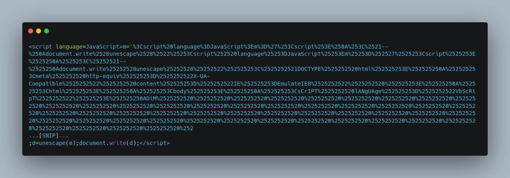
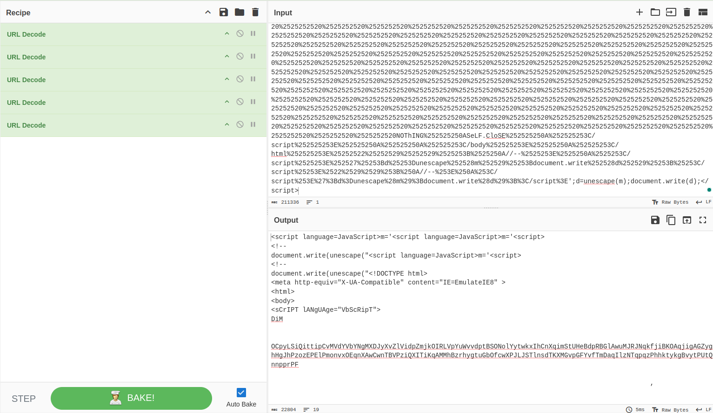
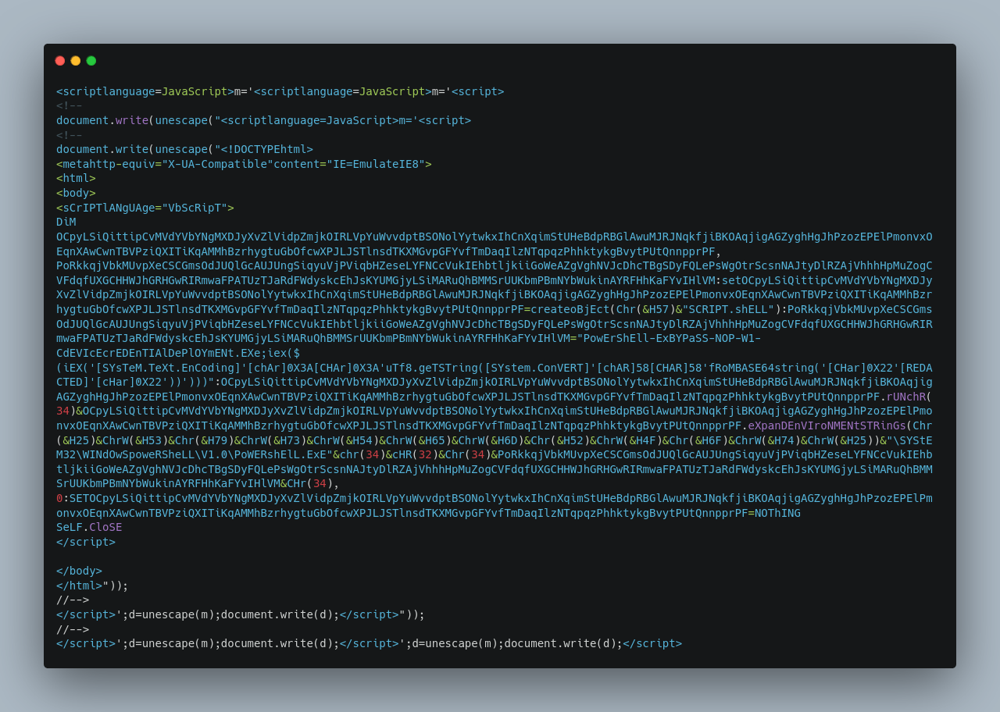
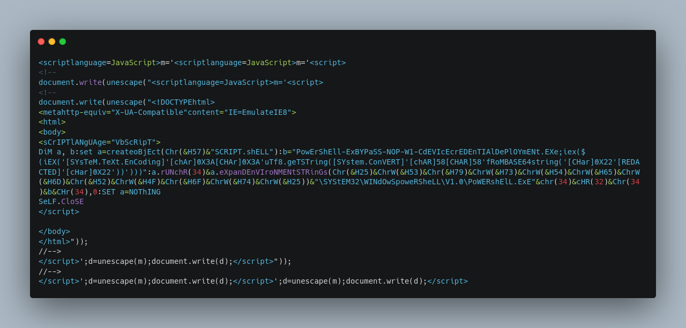
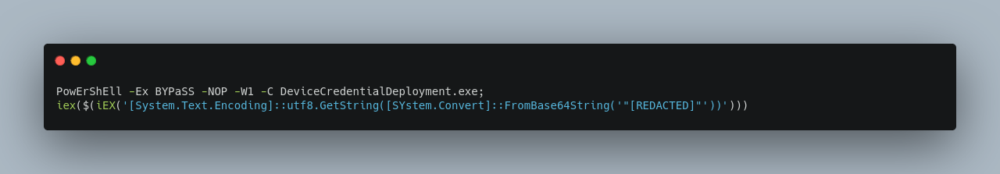
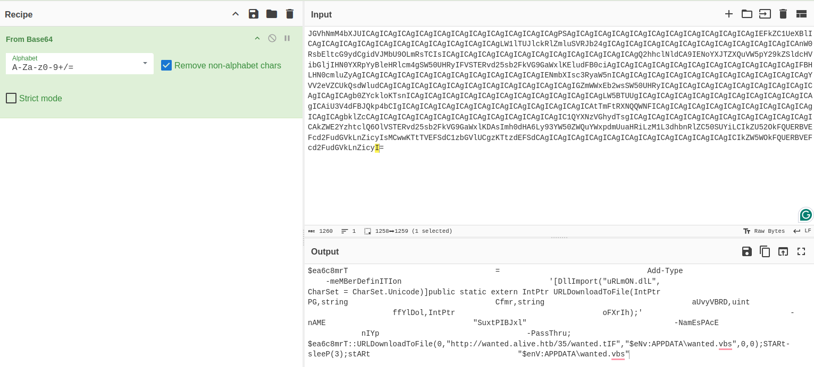
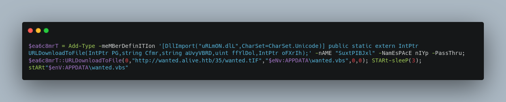
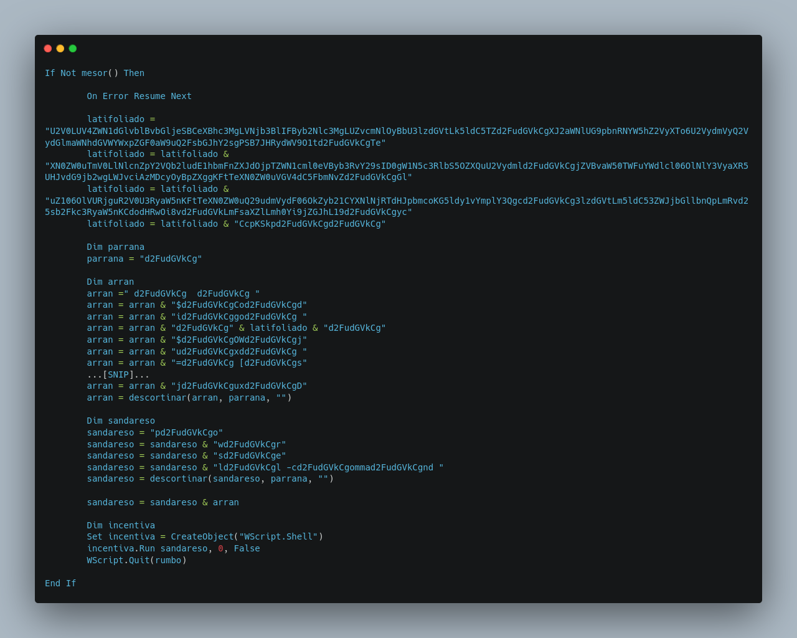
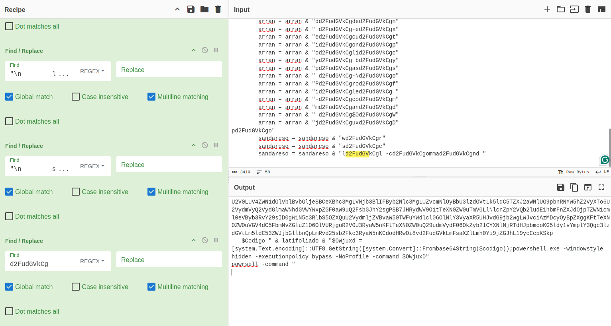
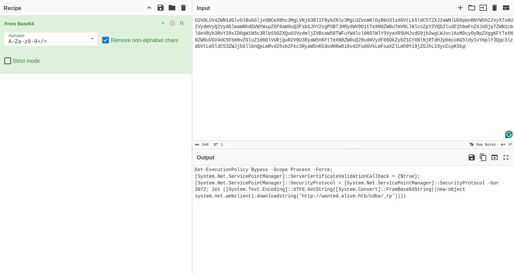

 Wanted Alive

20th November 2024 / Document No. D24.102.XX

Prepared By: thewildspirit

Challenge Author(s): thewildspirit

Difficulty: Easy

Classification: Official

# Synopsis

* Wanted Alive is an easy forensics challenge involving the analysis of two layers of obfuscation, including Jscript and VBScript based on real malware.

## Description

* A routine patrol through the Frontier Cluster's shadowy corners uncovered a sinister file embedded in a bounty report—one targeting Jack Colt himself. The file’s obfuscated layers suggest it's more than a simple message; it’s a weaponized code from the Frontier Board, aiming to tighten their grip on the stars. As a trusted ally, it's your task to peel back the layers of deception trace its origin, and turn their tools against them. Note: Ensure all domains discovered in the challenge resolve to your Docker instance, including the appropriate port when accessing URLs

## Skills Required

* Minimal experience with malware delivery concepts

## Skills Learned

* Jscript deobfuscation
* VBscript deobfuscation
* URL decoding
* Base64 decoding
* Analysis of real-world malware

# Enumeration

Players are given the following file:
* `wanted.hta`: The suspicious attachment found in the mail.

An HTA file has the extension .hta, which stands for HTML Application. It is an application created using HTML and other web technologies like JavaScript or VBScript, but it runs as a standalone application in the Windows operating system rather than inside a web browser. 

Some use cases are creating small internal tools or utilities for Windows environments, automating tasks, etc. That makes it a perfect candidate for a phishing attempt.

The file is heavily obfuscated. The encoding might be easily identified by experienced players, but in case it is not, [CyberChef](https://gchq.github.io/CyberChef/) can be used.

Cyberchef identified that there is the URL encoding used, five times. Now the next layers in unveiled, which consist of multiple uses of the space character since the syntax of VBScript allows it. If we replace the space character we can get a clear picture of what is happening.

After replacing spaces, and adding them whenever it is needed for the syntax to be correct, we can get the following result.

To better understand the script, we will replace the obfuscated variable names, with simpler names.

The script contains nested script tags that finally execute the VBS code, which does the following:
* Sets the script shell object to the variable a.
* Sets an obfuscated PowerShell script to the variable b.
* Then uses `Run` to execute the object provided the PowerShell code. This part is obfuscated here `a.rUN`.

The next step is to deobfuscate the PowerShell code.

The code base64 decodes the string and then executes it using `iex`.

Let's decode the string.

Once again, if we delete the unnecessary spaces we can clearly see the script.

* The script first imports the `URLDownloadToFile` from the `URLMON.dll` which is capable of downloading a file from a given URL and saving it to a specific file.
* Downloads a file from the URL `http://wanted.alive.htb/35/wanted.tIF` and saves it as a VBS file `$eNv:APPDATA\wanted.vbs`.
* Sleeps for 3 seconds to evade security.
* Starts the VBS file.

To download the next step, we need to visit the aforementioned URL.
The script has many lines of code, but one function can be easily identified.

The function concatenates a large base64 string and executes it.

# Solution

To deobfuscate the string, it is necessary to concatenate the string in the correct order and replace the parrana keyword with an empty string.

We can use CyberChef once again with some smart replacement to clearly see the next layer.

If we decode the base64 string we will find the last stage.

If we visit the URL found in the PoshC2 launcher we will get the flag.