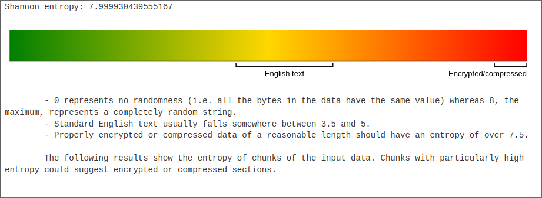
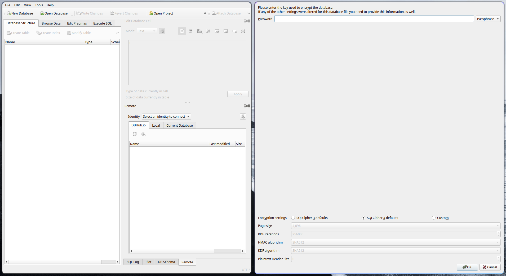
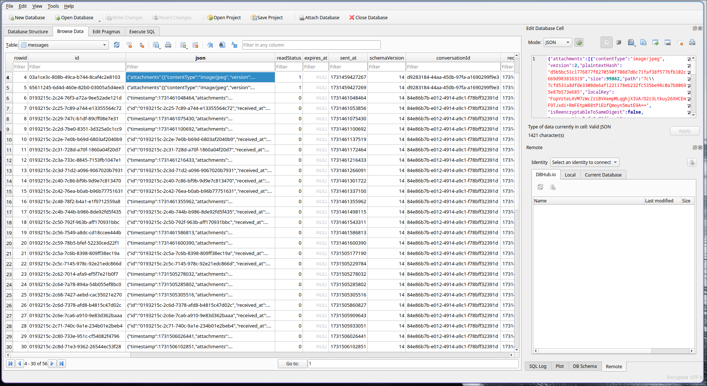
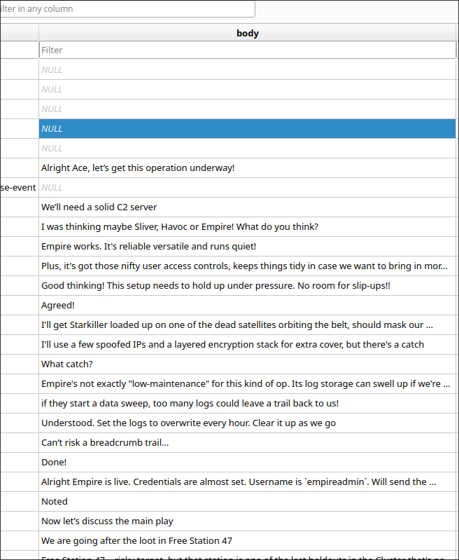
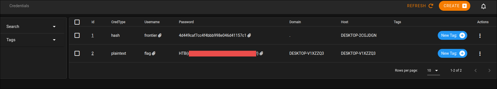

 <font size='10'>Signaling Victorious</font>

30<sup>th</sup> Nov 2024

Prepared By: c4n0pus

Challenge Author(s): c4n0pus

Difficulty: <font color=red>Hard</font>

Classification: Official

# Synopsis

* A hard forensic challenge featuring Signal's transition to Electrons Safe Storage API.
Players will need to recover an archive password from LSA Secrets and then use the `pypykatz` volatility plugin to dump the DPAPI master keys.
From there, players will need to decrypt the SQL key and dump the messages. Finally, connecting to the Starkiller instance will reveal the flag in the leaked credentials.

## Description

* In a recent raid with your fellow bounty hunters you managed to recover a memory dump and a backup archive of the Frontier Board's Operation Center!
The Board knows the Starry Spurr lies within your grasp and they are getting even more desperate...
Uncover whatever secrets lie within the artefacts you are given and find a way to halt the Board's plans!!

## Skills Required

* Windows Internals
* Code Review
* Basic Volatility

## Skills Learned

* Windows DPAPI
* Windows LSA Storage
* Electron's Safe Storage
* Signal Code Review
* Electron Code Review
* Empire's Starkiller

# Enumeration

Checking the web server first, we see that it's Empire's [Starkiller](https://github.com/BC-SECURITY/Starkiller) project, a front-end for [Empire](https://github.com/BC-SECURITY/Empire). But since we don't have any credentials we can't really do much with it at this point...

We are given a zip file containing a memory dump and an encrypted `backup.7z`. Let's start by looking at the running processes in volatility:

```bash
$ vol -f win10_memdump.elf windows.pslist

Volatility 3 Framework 2.11.0
Progress:  100.00		PDB scanning finished
PID	PPID	ImageFileName	Offset(V)	Threads	Handles	SessionId	Wow64	CreateTime	ExitTime	File output


7152	748	Signal.exe	0xb90b8a9da080	53	-	1	False	2024-11-13 00:54:38.000000 UTC	N/A	Disabled
6820	7152	Signal.exe	0xb90b8a9c7080	20	-	1	False	2024-11-13 00:54:39.000000 UTC	N/A	Disabled
6800	7152	Signal.exe	0xb90b8a2812c0	18	-	1	False	2024-11-13 00:54:39.000000 UTC	N/A	Disabled
7028	7152	Signal.exe	0xb90b8a6670c0	24	-	1	False	2024-11-13 00:54:40.000000 UTC	N/A	Disabled
3764	728	svchost.exe	0xb90b8a638080	8	-	0	False	2024-11-13 00:54:44.000000 UTC	N/A	Disabled
7468	860	ApplicationFra	0xb90b8a76d080	13	-	1	False	2024-11-13 00:54:58.000000 UTC	N/A	Disabled
7724	860	WmiPrvSE.exe	0xb90b8a6a5080	6	-	0	False	2024-11-13 00:54:59.000000 UTC	N/A	Disabled
7796	728	svchost.exe	0xb90b8a68f080	3	-	0	False	2024-11-13 00:54:59.000000 UTC	N/A	Disabled
7056	748	powershell.exe	0xb90b8a9c4080	20	-	1	False	2024-11-13 00:55:29.000000 UTC	N/A	Disabled
6808	7056	conhost.exe	0xb90b8a9ea340	8	-	1	False	2024-11-13 00:55:29.000000 UTC	N/A	Disabled
2492	728	svchost.exe	0xb90b8a9c3080	23	-	0	False	2024-11-13 00:55:36.000000 UTC	N/A	Disabled
3216	728	svchost.exe	0xb90b89be42c0	13	-	0	False	2024-11-13 00:55:36.000000 UTC	N/A	Disabled
7392	7056	backuper.exe	0xb90b8a69d2c0	4	-	1	False	2024-11-13 00:55:58.000000 UTC	N/A	Disabled
```

Let's not get ahead of ourselves and take this from what we know. We are provided an encrypted backup, and there is a process named `backuper.exe` so let's start by taking a look there. Appending `--pid 7392 --dump` to the previous command will help us dump the executable. 
Or we can dump the (unmapped) executable directly from the cache using `filescan` and `dumpfiles` plugins.

## The Backup(er)

Let's check it out inside a decompiler:

```c
int main() {
    void s;
    __builtin_memset(&s, 0xcccccccc, 0x1f8);
    int64_t rax_1 = (__security_cookie ^ &s);
    j___CheckForDebuggerJustMyCode(&data_7ff764b5a0a4);
    sub_7ff764ab4f90();
    LSA_HANDLE var_2c0 = 0;
    wchar16 const* const var_230 = u"OfflineBackupKey";
    void s_1;
    __builtin_memset(&s_1, 0, 0xc8);
    void ObjectAttributes;
    j_sub_7ff764b309e0(&ObjectAttributes, 0, 0x30);
    NTSTATUS Status;
    int64_t rdx_1;
    int64_t r8;
    int64_t r9_1;
    Status = _LsaOpenPolicy(nullptr, &ObjectAttributes, 0x20, &var_2c0);
    int64_t result;
    [...]
}
```

Let's focus on the first part of the `main()` function. We find a string named `OfflineBackupKey` and a variable of type `LSA_HANDLE`.
The `_LsaOpenPolicy()` is just a wrapper around the actual `LsaOpenPolicy()`.
So it's pretty clear that this part grabs a handle onto the (default) LSA policy.

```c
if (Status == STATUS_SUCCESS) {
    wchar16 const* const var_118_1 = var_230;
    int64_t rax_4;
    int64_t rdx_3;
    int64_t r8_1;
    int64_t r9_2;
    rax_4 = j_wcslen(var_230, rdx_1, r8, r9_1);
    int16_t KeyName = ((int16_t)(rax_4 << 1));
    int16_t var_11e_1 = ((j_wcslen(var_230, rdx_3, r8_1, r9_2) * 2) + 2);
    struct LSA_UNICODE_STRING* var_f0 = nullptr;
    NTSTATUS Status_1 = _LsaRetrievePrivateData(var_2c0, &KeyName, &var_f0);
    [...]
}
```

If the handle is acquired successfully, then it goes on to call `LsaRetrievePrivateData()` with the `OfflineBackupKey` as the key name.

```c
if (Status_1 == STATUS_SUCCESS) {
    j_sub_7ff764ab50d0(&s_1, 0xc8, "7z.exe a -t7z backup.7z "C:\User…", var_f0->Buffer);
    j_sub_7ff764acc228(&s_1);
    j_sub_7ff764b309e0(var_f0, 0, 8);
    j_sub_7ff764b309e0(&s_1, 0, 0xc8);
    sub_7ff764aae9e2(var_f0);
    sub_7ff764aaff13(var_2c0);
    result = 0;
}
```

And if that is successful too, then finally, it constructs the whole cmdline with `7z` and the resulting password, creating the `backup.7z`.

So the password in question lies inside the LSA Store with the name of `OfflineBackupKey`, and is also a __Unicode__ string (will come in handy later).

Thankfully, `volatility` has a plugin that dumps the LSA secrets so let's go ahead and recover the backup's password:

```bash
$ vol -f win10_memdump.elf windows.lsadump

Volatility 3 Framework 2.11.0
Progress:  100.00		PDB scanning finished
Key	Secret	Hex

DPAPI_SYSTEM	,Ô¢¢7}ÔYVª!¾^T+£)àÏMºf]¦p#c=ÏÇ¿L3&	2c 00 00 00 00 00 00 00 00 00 00 00 00 00 00 00 01 00 00 00 d4 a2 a2 37 7d 10 04 d4 59 56 aa 21 1d be 5e 14 54 2b a3 29 e0 cf 4d ba 66 01 5d a6 70 23 63 9f 3d cf c7 bf 4c 9f 33 26 00 00 00 00
NL$KM	@´ùhf" ÷Zúè;j¬ÂèÕ&¡ûmvaZÍÚâ`HõáLõÑáAúÓY)r
                                                 ãVÌ©2YjiAdv3oÞö%H£ÙùÞ[H	40 00 00 00 00 00 00 00 00 00 00 00 00 00 00 00 b4 f9 68 66 22 20 f7 5a fa 82 e8 82 3b 6a 9a 90 ac 0f c2 e8 d5 26 a1 19 fb 6d 76 8d 9a 61 5a cd da e2 60 48 f5 e1 4c f5 11 d1 e1 41 fa d3 59 29 72 0b e3 56 cc a9 32 59 13 6a 69 41 64 76 33 6f 15 de f6 02 25 10 48 12 a3 d9 f9 de 83 1e 5b 48
OfflineBackupKey	(yYj8g5Pk6h!-K3pBMSxF	28 00 00 00 00 00 00 00 00 00 00 00 00 00 00 00 79 00 59 00 6a 00 38 00 67 00 35 00 50 00 6b 00 36 00 68 00 21 00 2d 00 4b 00 33 00 70 00 42 00 4d 00 53 00 78 00 46 00 00 00 00 00 00 00 00 00
```

We have a lot of non-printable characters, hence the weird output, but nonetheless, we have the value of the key `yYj8g5Pk6h!-K3pBMSxF`. Notice how we skip the first byte as it's not part of the __Unicode__ string!

## The Backup

With the password, we can now decrypt the archive and view its contents! We already knew it was a backup of the `Users` directory. But now that we have Signal's data and also we can see the Signal app is running the story shifts in that direction!

Navigating to `AppData\Roaming\Signal` will reveal its storage and configuration. We are interested in the `config.json` and `sql\db.sqlite`:

```json
{
  "encryptedKey": "763130cc1843cbf3949e872b373031e89c85f8e8d6e9ec3bd9340bb9c6fd844ca424d7e666feac3663f6c2810d6ddbdfb82f7faa4456eda119bacd2709fc2404eeeb74e69b2b3f2f71e765b74a068c5549a1871559d537de08a25c700a97cd"
}
```

As seen by the entropy of the `db.sqlite`:



We can definitely say that the database, and the key for that matter, are both encrypted!

To decrypt them we need to check out how Signal implements their encryption. But before searching for that, let's check out some pretty [recent headlines](https://www.bleepingcomputer.com/news/security/signal-downplays-encryption-key-flaw-fixes-it-after-x-drama/#:~:text=Signal's%20desktop%20apps%20encrypt%20local,the%20researchers%20in%20another%20thread.&text=In%20response%2C%20Whittaker%20downplayed%20the,cannot%20completely%20protect%20the%20data.) about them.

Turns out that encrypting the key was recently implemented and before that, the key was stored as plaintext inside said directory! Let's check out the new [pull request](https://github.com/signalapp/Signal-Desktop/pull/6849):

```txt
[...]
As a simple mitigation, I've implemented Electron's safe storage API to opportunistically encrypt the key with platform APIs like DPAPI on Windows and Keychain on macOS.
I'd love some feedback on this approach, particularly
[...]
```

## Inside Signal

Alright, so this key is encrypted with `Safe Storage`, Electron's Storage API that uses DPAPI under the hood (since we are on Windows) but let's also do some code review on the signal desktop app:

```ts
async function initializeSQL(
  userDataPath: string
): Promise<{ ok: true; error: undefined } | { ok: false; error: Error }> {
  sqlInitTimeStart = Date.now();
  let key: string;
  try {
    key = getSQLKey();
  } catch (error) {
    [...]
  } 

  try {
    // This should be the first awaited call in this function, otherwise
    // `sql.sqlRead` will throw an uninitialized error instead of waiting for
    // init to finish.
    await sql.initialize({
      appVersion: app.getVersion(),
      configDir: userDataPath,
      key,
      logger: getLogger(),
    });
    [...]
  }
  [...]
  return { ok: true, error: undefined };
}
```

`initializeSQL()` is responsible for creating the database and provisioning it, it calls `getSQLKey()` which creates and encrypts the key. It's also responsible to update the key for whatever reason.

```ts
function generateSQLKey(): string {
  getLogger().info(
    'key/initialize: Generating new encryption key, since we did not find it on disk'
  );
  // https://www.zetetic.net/sqlcipher/sqlcipher-api/#key
  return randomBytes(32).toString('hex');
}
```

The key is generated using the above function and we can also see that it uses `sqlcipher`. We will use that for the decryption later.

```ts
function getSQLKey(): string {
  [...]
  let key: string;
  if (typeof modernKeyValue === 'string') {
    if (!isEncryptionAvailable) {
      throw new Error("Can't decrypt database key");
    }

    getLogger().info('getSQLKey: decrypting key');
    const encrypted = Buffer.from(modernKeyValue, 'hex');
    key = safeStorage.decryptString(encrypted);
    [...]
  }
  [...]
  if (isEncryptionAvailable) {
    getLogger().info('getSQLKey: updating encrypted key in the config');
    const encrypted = safeStorage.encryptString(key).toString('hex');
    userConfig.set('encryptedKey', encrypted);
    userConfig.set('key', undefined);

    if (isLinux && safeStorageBackend) {
      getLogger().info(
        `getSQLKey: saving safeStorageBackend: ${safeStorageBackend}`
      );
      userConfig.set('safeStorageBackend', safeStorageBackend);
    }
  } else {
    getLogger().info('getSQLKey: updating plaintext key in the config');
    userConfig.set('key', key);
  }

  return key;
}
```

Now the interesting parts, are the `safeStorage` functions:

- `key = safeStorage.decryptString(encrypted);`
- `const encrypted = safeStorage.encryptString(key).toString('hex');`

It makes calls to the `Safe Storage` API to encrypt/decrypt the key, and that, in turn, makes calls to the platform's underlying keyring, in our case DPAPI and encrypt the key.
The return value is saved in the `config.json` file under the `encryptedKey` key. Since Signal is written on top of Electron, we will have to consult the Electron documentation and source code:

From its [documentation](https://www.electronjs.org/docs/latest/api/safe-storage) we can see the available methods and from GitHub we find the [electron module](https://github.com/electron/electron/blob/main/lib/browser/api/safe-storage.ts) responsible for this is called `electron_browser_safe_storage`:

```ts
const safeStorage = process._linkedBinding('electron_browser_safe_storage');
module.exports = safeStorage;
```

And another GitHub search reveals the [undelying C++ implementation](https://github.com/electron/electron/blob/main/shell/browser/api/electron_api_safe_storage.cc):

```cpp
[...]

std::string DecryptString(v8::Isolate* isolate, v8::Local<v8::Value> buffer) {
  if (!IsEncryptionAvailable()) {
    if (!electron::Browser::Get()->is_ready()) {
      gin_helper::ErrorThrower(isolate).ThrowError(
          "safeStorage cannot be used before app is ready");
      return "";
    }
    gin_helper::ErrorThrower(isolate).ThrowError(
        "Error while decrypting the ciphertext provided to "
        "safeStorage.decryptString. "
        "Decryption is not available.");
    return "";
  }

  if (!node::Buffer::HasInstance(buffer)) {
    gin_helper::ErrorThrower(isolate).ThrowError(
        "Expected the first argument of decryptString() to be a buffer");
    return "";
  }

  // ensures an error is thrown in Mac or Linux on
  // decryption failure, rather than failing silently
  const char* data = node::Buffer::Data(buffer);
  auto size = node::Buffer::Length(buffer);
  std::string ciphertext(data, size);
  if (ciphertext.empty()) {
    return "";
  }

  if (ciphertext.find(kEncryptionVersionPrefixV10) != 0 &&
      ciphertext.find(kEncryptionVersionPrefixV11) != 0) {
    gin_helper::ErrorThrower(isolate).ThrowError(
        "Error while decrypting the ciphertext provided to "
        "safeStorage.decryptString. "
        "Ciphertext does not appear to be encrypted.");
    return "";
  }

  std::string plaintext;
  bool decrypted = OSCrypt::DecryptString(ciphertext, &plaintext);
  if (!decrypted) {
    gin_helper::ErrorThrower(isolate).ThrowError(
        "Error while decrypting the ciphertext provided to "
        "safeStorage.decryptString.");
    return "";
  }
  return plaintext;
}
[...]
```

## The Electron Spiral

These are the final function calls before we call `OSCrypt::DecryptString(ciphertext, &plaintext);` inside Chromium.
To check its implementation we need to head over to the relevant Chromium source code, [os_crypt_win.cc](https://chromium.googlesource.com/chromium/src/+/refs/heads/main/components/os_crypt/sync/os_crypt_win.cc).

We are interested in the `DecryptString()` function inside the `OSCrypt` namespace:

```cpp
bool DecryptString(const std::string& ciphertext, std::string* plaintext) {
  return OSCryptImpl::GetInstance()->DecryptString(ciphertext, plaintext);
}
```

Which, in turn, calls the `DecryptString()` function of the `OSCryptImpl` (platform-specific)

```cpp
bool OSCryptImpl::DecryptString(const std::string& ciphertext, std::string* plaintext) {
    if (!base::StartsWith(ciphertext, kEncryptionVersionPrefix, base::CompareCase::SENSITIVE))
        return DecryptStringWithDPAPI(ciphertext, plaintext);

    crypto::Aead aead(crypto::Aead::AES_256_GCM);
    const auto key = GetRawEncryptionKey();

    aead.Init(&key);
    // Obtain the nonce.
    const std::string nonce = ciphertext.substr(sizeof(kEncryptionVersionPrefix) - 1, kNonceLength);

    // Strip off the versioning prefix before decrypting.
    const std::string raw_ciphertext = ciphertext.substr(kNonceLength + (sizeof(kEncryptionVersionPrefix) - 1));
    
    return aead.Open(raw_ciphertext, nonce, std::string(), plaintext);
}
```

From there, it checks whether the ciphertext begins with `kEncryptionVersionPrefix` which is to check if the ciphertext has been encrypted using DPAPI. If it was then it also decrypts it using DPAPI, otherwise the built in decryption method.

Now that we have reached the final function call, let's take a much-needed deep breath and examine what we know. The calling stack looks like this (with arguments)

```txt
plaintext = safeStorage.decryptString(encrypted) =>
                OSCrypt::DecryptString(ciphertext, plaintext) =>
                    OSCryptImpl::DecryptString(ciphertext, plaintext)
```

There are two possible ways our ciphertext can take to be decrypted:
    - DPAPI, only if is DPAPI Blob
    - AES GCM

We know that it's not a DPAPI blob since it does not have the appropriate structure so decryption must be happening using AES GCM... But what is the key?
Well, back to code review, this time checking out `OSCryptImpl::Init()`:

```cpp
bool OSCryptImpl::Init(PrefService* local_state) {
    // Try to pull the key from the local state.
    switch (InitWithExistingKey(local_state)) {
        case OSCrypt::kSuccess:
        return true;
        case OSCrypt::kKeyDoesNotExist:
        break;
        case OSCrypt::kInvalidKeyFormat:
        return false;
        case OSCrypt::kDecryptionFailed:
        break;
    }
    // If there is no key in the local state, or if DPAPI decryption fails,
    // generate a new key.
    std::string key(kKeyLength, '\0');
    crypto::RandBytes(base::as_writable_byte_span(key));
    if (!EncryptAndStoreKey(key, local_state)) {
        return false;
    }
    // This new key is already encrypted with audit flag enabled.
    local_state->SetBoolean(kOsCryptAuditEnabledPrefName, true);
    encryption_key_.assign(key);
    return true;
}
```

Say for example, the local state does not exist (`kKeyDoesNotExist`), it will go on to call `RandBytes()` to create a key, and subsequently `EncryptAndStoreKey()` to save the key into `local_state`:

```cpp
// Takes `key` and encrypts it with DPAPI, then stores it in the `local_state`.
// Returns true if the key was successfully encrypted and stored.
bool EncryptAndStoreKey(const std::string& key, PrefService* local_state) {
    std::string encrypted_key;
    if (!EncryptStringWithDPAPI(key, &encrypted_key)) {
        return false;
    }
    // Add header indicating this key is encrypted with DPAPI.
    encrypted_key.insert(0, kDPAPIKeyPrefix);
    std::string base64_key = base::Base64Encode(encrypted_key);
    local_state->SetString(kOsCryptEncryptedKeyPrefName, base64_key);
    return true;
}
```

Bingo! There is the DPAPI encryption! It encrypts Electron's key with DPAPI and saves it under `kOsCryptEncryptedKeyPrefName` (`=os_crypt.encrypted_key`) in base64 encoding!
And uses this key to encrypt/decrypt any other data passed to `Safe Storage`! But where is this?
Well... Conveniently, there is a file inside the Signal folder with the name of `Local State` and contains:

```json
{ 
    "os_crypt": 
    { 
        "audit_enabled": true, 
        "encrypted_key": "RFBBUEkBAAAA0Iyd3wEV0RGMegDAT8KX6wEAAAD8tnGruNB7TaoSbs4Z/xkXEAAAABIAAABDAGgAcgBvAG0AaQB1AG0AAAAQZgAAAAEAACAAAACKakPvCWDeRdef30ik+0RfHTUXhQrfAdfcEOuzfv8sDQAAAAAOgAAAAAIAACAAAAAad9BHSVFuYmI0D8QG9924xL4pzewU1LemGmaTlTzcOjAAAAAg0SNGW/NP4egaKEv0Tgl9JE3d0tFQpx6G6lMcoOlF3EyR/dr0hbbBbQksTEkECcxAAAAAHaurRLkbh4yTcD+/hxG67Vfa0zLEIJpQOAWw6BIDUw+jRHY3AuIU0wdyxy5lv6CZEYmIQqUbyJSXzPIPpqYn6w=="
    }
}
```

And if we decode the `encrypted_key` value we get:

```bash
$ echo "RFBBUEkBAAAA0Iyd3wEV0RGMegDAT8KX6wEAAAD8tn[...]n6w==" | base64 -d | xxd

00000000: 4450 4150 4901 0000 00d0 8c9d df01 15d1  DPAPI...........
00000010: 118c 7a00 c04f c297 eb01 0000 00fc b671  ..z..O.........q
00000020: abb8 d07b 4daa 126e ce19 ff19 1710 0000  ...{M..n........
00000030: 0012 0000 0043 0068 0072 006f 006d 0069  .....C.h.r.o.m.i
00000040: 0075 006d 0000 0010 6600 0000 0100 0020  .u.m....f......
00000050: 0000 008a 6a43 ef09 60de 45d7 9fdf 48a4  ....jC..`.E...H.
00000060: fb44 5f1d 3517 850a df01 d7dc 10eb b37e  .D_.5..........~
00000070: ff2c 0d00 0000 000e 8000 0000 0200 0020  .,.............
00000080: 0000 001a 77d0 4749 516e 6262 340f c406  ....w.GIQnbb4...
00000090: f7dd b8c4 be29 cdec 14d4 b7a6 1a66 9395  .....).......f..
000000a0: 3cdc 3a30 0000 0020 d123 465b f34f e1e8  <.:0... .#F[.O..
000000b0: 1a28 4bf4 4e09 7d24 4ddd d2d1 50a7 1e86  .(K.N.}$M...P...
000000c0: ea53 1ca0 e945 dc4c 91fd daf4 85b6 c16d  .S...E.L.......m
000000d0: 092c 4c49 0409 cc40 0000 001d abab 44b9  .,LI...@......D.
000000e0: 1b87 8c93 703f bf87 11ba ed57 dad3 32c4  ....p?.....W..2.
000000f0: 209a 5038 05b0 e812 0353 0fa3 4476 3702   .P8.....S..Dv7.
00000100: e214 d307 72c7 2e65 bfa0 9911 8988 42a5  ....r..e......B.
00000110: 1bc8 9497 ccf2 0fa6 a627 eb              .........'.
```

Notice the prefix and the [structure](https://github.com/GhostPack/SharpDPAPI/blob/master/README.md#search), this is indeed a DPAPI blob that we can decrypt!

## Getting to the Key(s)

After all this code review we have reached the following conclusions:

- SQL Key is encrypted with Electron's key
  - Using AES GCM
- Said Electron key is in turn encrypted using the user's DPAPI master key

For decrypting Electron's key we can use `dpapi.py` (part of the [Impacket](https://github.com/fortra/impacket) project). However, we'd still need the user's (decrypted) DPAPI master keys...

But we still have a memory dump, and the `lsass.exe` process contains those keys, but `mimikatz` or `pypykatz` won't be of help here since we don't have the minidump...

We use the [pypykatz](https://github.com/skelsec/pypykatz-volatility3) volatility plugin!

```bash
$ vol -f win10_memdump.elf -p pypykatz-volatility3 pypykatz
Volatility 3 Framework 2.11.0
ERROR    pypykatz    : Failed to prcess TSPKG package! Reason: Page Fault at entry 0x0 in table page directory

credtype	domainname	username	NThash	LMHash	SHAHash	masterkey	masterkey(sha1)	key_guid	password

msv	DESKTOP-6MBJBAP	frontier-user-01	1d3e3e030ba1a179e1281406efd980bf		ded871d3a3992be2179840890d061c9f30a59a77				
dpapi						791ca70e650987684b043745c6f4b1c0f97eb2369317302c6c60f9cda19e1b4864fbece48341141501606d8d359ff7f54ee71e4a2b821d3df69582927742809f	8d53efa8456b9ba43206f4c3a6dc1c957d26105a	ab71b6fc-d0b8-4d7b-aa12-6ece19ff1917	
msv	DESKTOP-6MBJBAP	frontier-user-01	1d3e3e030ba1a179e1281406efd980bf		ded871d3a3992be2179840890d061c9f30a59a77	
```

Hence, the DPAPI master key is: `791ca70e650987684b043745c6f4b1c0f97eb2369317302c6c60f9cda19e1b4864fbece48341141501606d8d359ff7f54ee71e4a2b821d3df69582927742809f`

Since encryption happens before appending `DPAPI` in front, we need to remove it __before__ decrypting:

```bash
$ echo "RFBBUEkBAAAA0Iyd3wEV0R[...]" | base64 -d| tail -c +6 > os_crypt.key

$ dpapi.py unprotect -file os_crypt.key -key "0x791ca70e650987684b043745c6f4b1c0f97eb2369317302c6c60f9cda19e1b4864fbece48341141501606d8d359ff7f54ee71e4a2b821d3df69582927742809f"

Impacket v0.11.0 - Copyright 2023 Fortra

Successfully decrypted data
 0000   75 82 F0 84 A7 D0 08 72  EE BE 91 9C 2C 02 DA 0A   u......r....,...
 0010   8F 4D 8E 67 E6 48 BB 55  80 5E 89 94 A8 A1 65 EF   .M.g.H.U.^....e.
```

We have successfully recovered the Key that was used to encrypt the SQL key: `7582F084A7D00872EEBE919C2C02DA0A8F4D8E67E648BB55805E8994A8A165EF`

Now we can craft a small Python script that will decrypt the SQL key using AES GCM:

```python
from Crypto.Cipher import AES

NONCE_LEN = 96//8
PFX_LEN = 3

# encrypted key from config.json
data = bytes.fromhex("763130cc1843cbf3949e872b373031e89c85f8e8d6e9ec3bd9340bb9c6fd844ca424d7e666feac3663f6c2810d6ddbdfb82f7faa4456eda119bacd2709fc2404eeeb74e69b2b3f2f71e765b74a068c5549a1871559d537de08a25c700a97cd")
# DPAPI Masterkey
key = bytes.fromhex("7582F084A7D00872EEBE919C2C02DA0A8F4D8E67E648BB55805E8994A8A165EF")

nonce = data[PFX_LEN:PFX_LEN+NONCE_LEN]
ct = data[PFX_LEN+NONCE_LEN:]

cipher = AES.new(key, AES.MODE_GCM, nonce)

pt = cipher.decrypt(ct)
print(pt)
```

```bash
$ python decrypt_sql_key.py
b'65f77c5912a1456af299975228bb45857144ee8fb546683c9274e11a1617fa65\xb6\x05FYc\xf3\xd80RMX\x19\x81_\xc5\xbc'
```

Finally, the SQL Key is `65f77c5912a1456af299975228bb45857144ee8fb546683c9274e11a1617fa65`

# Solution

We can use a tool like [sqlitebrowser](https://github.com/sqlitebrowser/sqlitebrowser) to open the database:



It will ask us for the password since it using [sqlcipher](https://github.com/sqlcipher/sqlcipher). Make sure to change it into __Raw Key__ and append `0x` in front!

If all goes well, we will have the decrypted and opened database in front of us! We then can browse the `messages` table and see the conversation between `Boss` (Declan) and `Ace`:



They are talking about using Empire as a C2 server for an engagement and they will be sharing the password for `empireadmin` shortly!



Scrolling a bit more down, we can find the password ``Also, here's the password for Starkiller `eNSrj4qHp0pG#075D98@` Keep it safe boss!``

With that last piece of information, we can log in to the Starkiller portal and find the flag under credentials:


