 Binary Badresources

07th November 2024

Prepared By: bquanman, thewildspirit

Challenge Author(s): bquanman

Difficulty: Medium

Classification: Official

# Synopsis

A medium forensic challenge involves analyzing a recently disclosed infection technique that exploits the Microsoft Windows Management Console vulnerability in MSC files. The technique is called GrimResource and is identified as CVE-2024-43572. This vulnerability has been recently patched.

## Description

* Recently, a mysterious syndicate from the far reaches of the Frontier has sent shockwaves through the system by deploying a new, deceptive weapon. Disguised as a harmless gift, it lies dormant until a defender unwittingly activates it, instantly compromising the defensive line and paving the way for invaders to seize the stronghold. To reclaim control over the Frontier Cluster and protect their home from further incursions, brave outlaws and daring defenders are scrambling to decode the mechanics of this weapon and devise a way to disable it—before it’s too late.

## Skills Required

* Basic encoding types
* Basic encryption algorithm recognition
* msc file structure
* Reverse dotnet executable

## Skills Learned

* Analysis of GrimResource technique
* Javascript deobfuscation
* Config file decryption and IOC extraction

# Enumeration

We are provided with a .msc file for analysis:

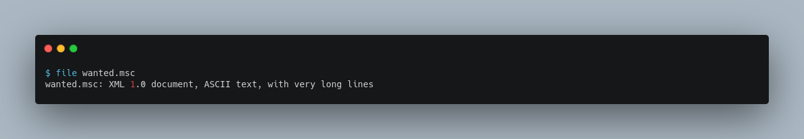
An `.msc` file has an XML structure, making it easily viewable in a text editor. Upon inspection, it contains an eval() function, which executes an escaped Unicode-encoded string: 
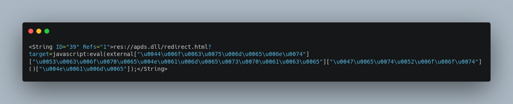
Decoding this reveals the following:
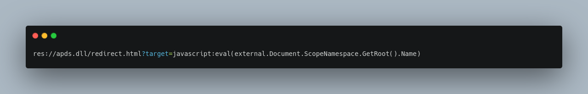
The eval() function executes the script inside the tag ID="8".
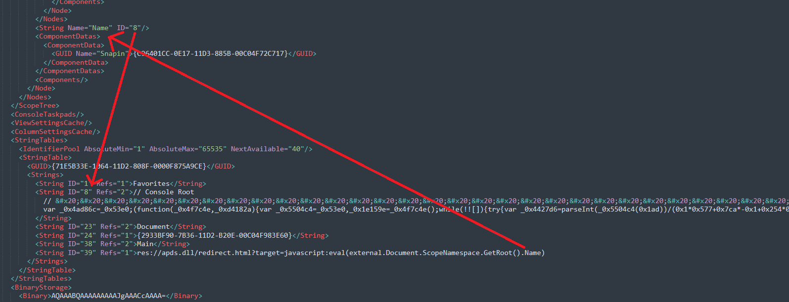
Deobfuscating the JavaScript reveals:
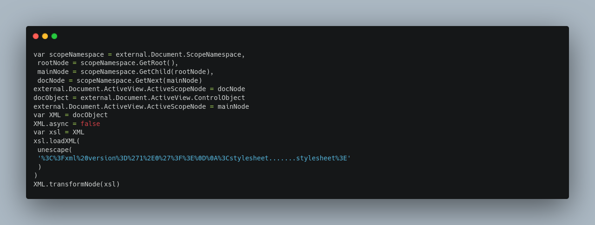
The script uses XSLT and the transformNode method to process the next layer. The string inside unescape('...') is URL-encoded XML, which, when decoded, contains a VBScript for further execution.

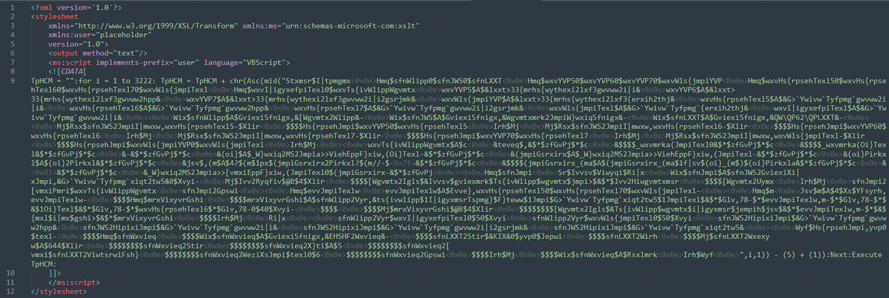

It uses a loop and decrements the ASCII value of the current character by 4. Here is a python script that does exactly that.

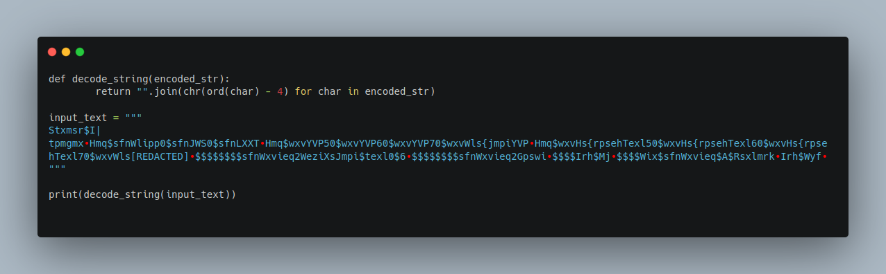

Decoding the VBScript reveals the following:

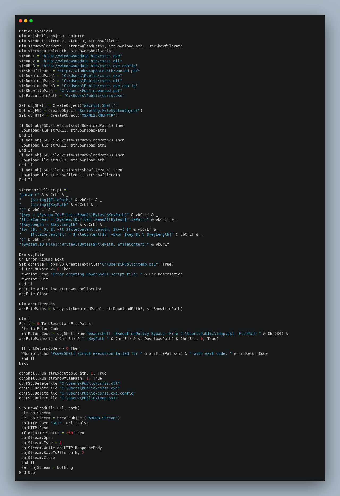
Key Findings:

Analysis of the script reveals that four files are downloaded during this stage:

- **`csrss.dll`**: Contains the XOR key used to decrypt three other files, which are subsequently executed.  
- **`wanted.pdf`**: Serves as a decoy file, executed to distract the victim by displaying irrelevant content on their screen.  
- **`csrss.exe.config`**: Contains the path to an additional file hosted on the attacker's server.  
- **`csrss.exe`**: A standard .NET application that reads the `csrss.exe.config` file to retrieve the path for downloading and executing the `5f8f9e33bb5e13848af2622b66b2308c.json` file, facilitating the next stage of the attack.  

Decrypted `csrss.exe.config` reveals a URL for the next stage:

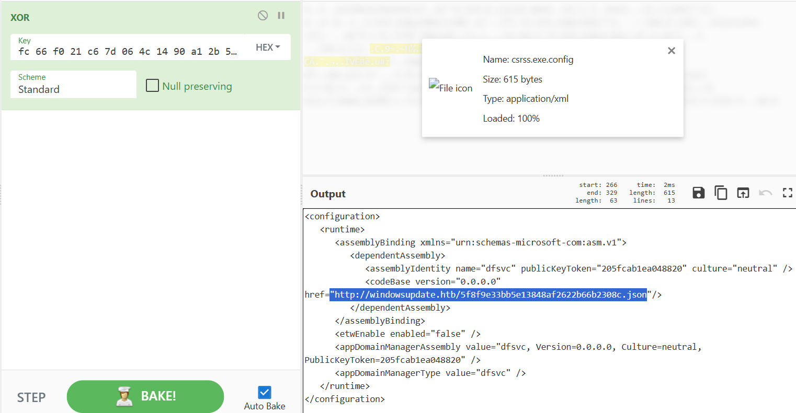

The downloaded JSON file is, in fact, a .NET DLL. This file:

 * Decodes an AES-encrypted URL.
 * Downloads shellcode from the URL.
 * Executes the shellcode in a new thread.

# Solution

The AES decryption script is as follows:

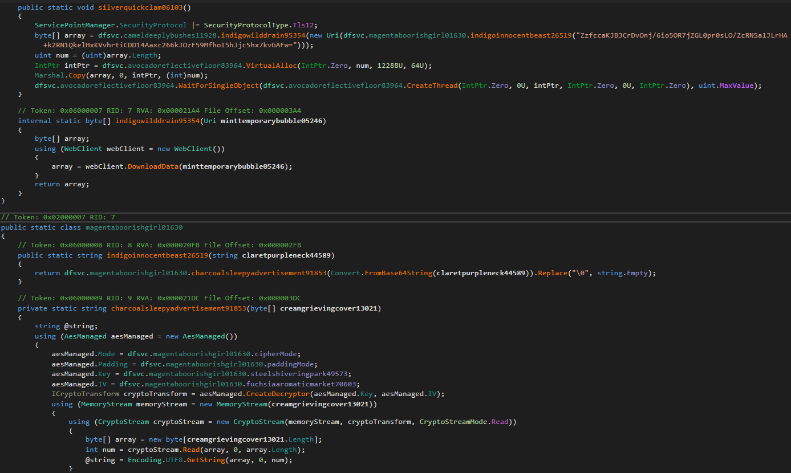

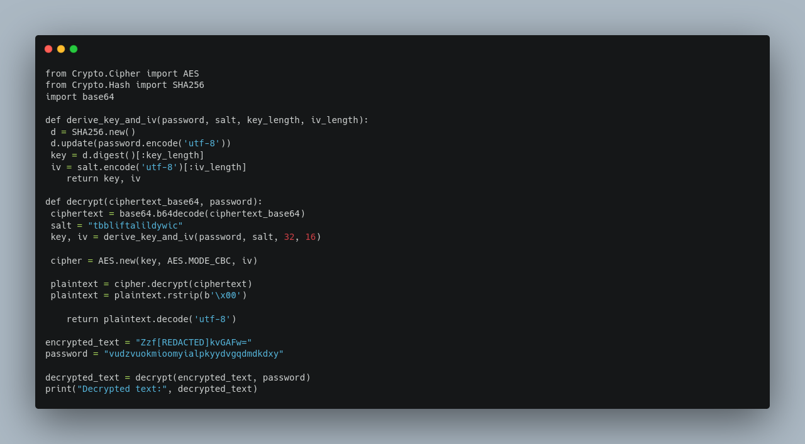
Decrypting the URL provides the final stage's shellcode. Inspecting the shellcode reveals the flag.

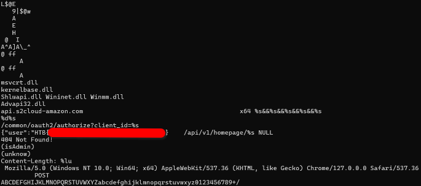
