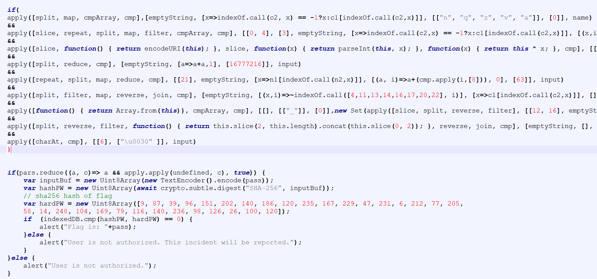

SecurityInTheFront

  10th 12 24 / Document No. D24.102.243

  Prepared By: clubby789

  Challenge Author: Leeky

  Difficulty: Easy

  Classification: Official

# Synopsis

SecurityInTheFront is an Easy reversing challenge. Players will reverse a JavaScript obfuscated flag checker.

## Skills Required
    - JavaScript fundamentals
## Skills Learned
    - Deobfuscating JavaScript

# Solution

The challenge consists out of a webpage with a username and password field that is verified locally in JavaScript:

The provided code is both minified and somewhat obfuscated:

Running it through an unminify and renaming the variables reasonably gets us a clearer view (though the indiviual functions still are a bit obscure):

Essentially we have one check on the username and a lot of checks on the password.
If we succeed through all of them our password is compared against a hash as a last verification and then given back as the correct answer.
So our goal is to pass the password check (though also passing the username check is easy as well).

Going through the code we can simplify it:

It's still not trivial to get the flag from the code, but by inverting it (e.g. some of obfuscations are just ROT13) we get the actual constraints:

- Check0: usename == "admin"
- Check1: HTB{ start
- Check2: } end
- Check3: 24 length
- Check4: 3x"3"
- Check5: [4]='F', [11]='D', [13] ='P', [14] = 'W', [16] = 'C', [17] = 'H', [20] = 'K', [22] = 'R'
- Check6: [12]='_' [15]='_'
- Check7: [5] ='r', [7]='n', [8]='t', [10]='n', [19]='c'
- Check8: [6] = '0'

So `HTB{Fr0nt?nD_PW_CH?cK?R}` through the fixed characters, since 3 are not filled, and the password needs 3x "3" we in the end get `HTB{Fr0nt3nD_PW_CH3cK3R}`
