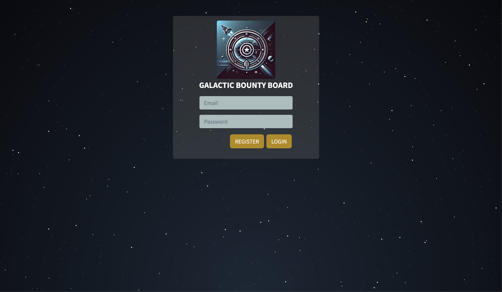
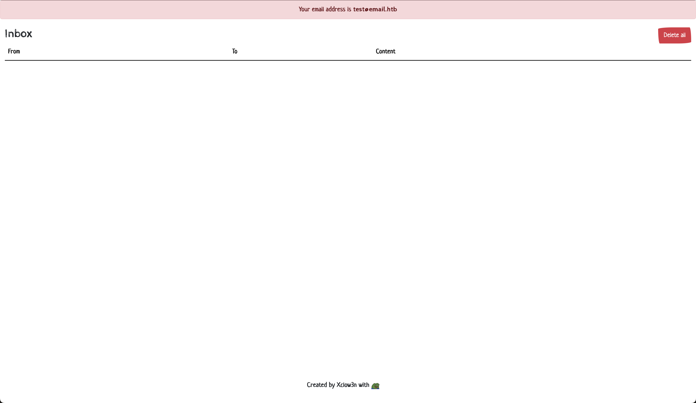
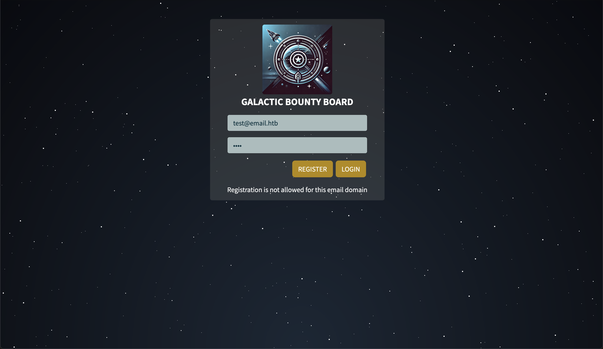
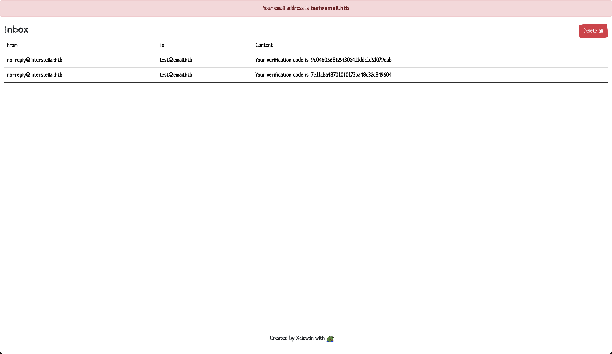
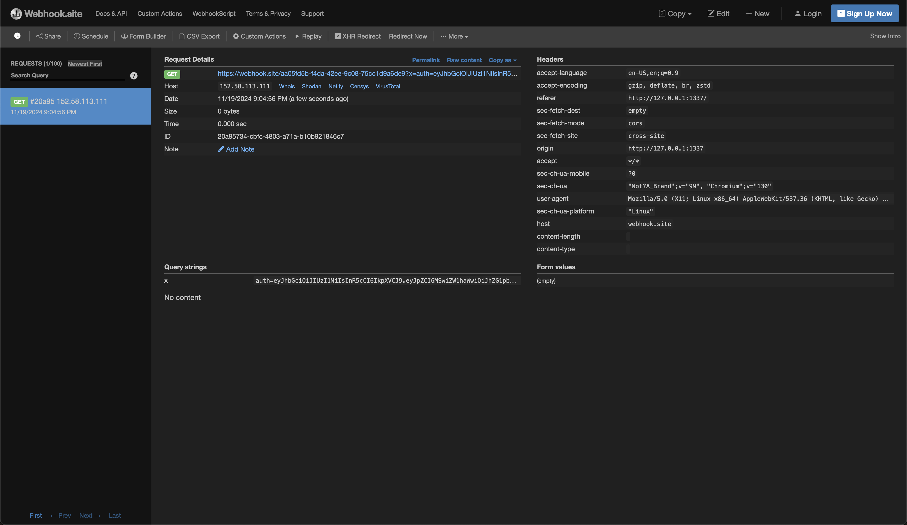
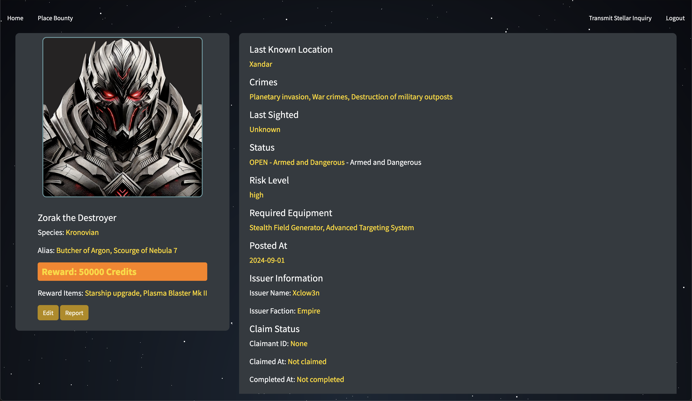
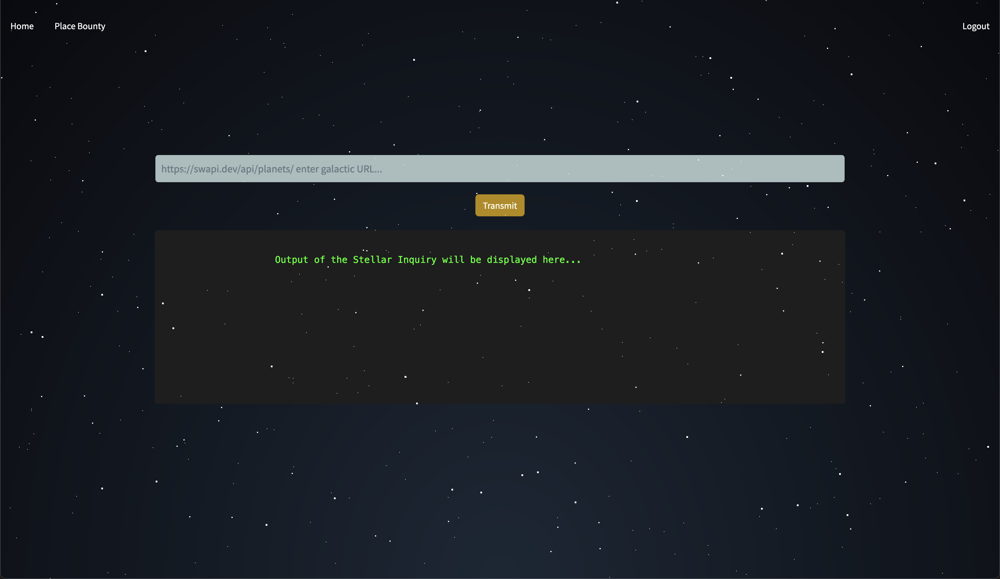

<font size="10">Intergalactic Bounty</font>
20<sup>th</sup> Nov 2024 / Document No. D24.102.261

**Prepared By:** Xclow3n

**Challenge Author:** Xclow3n

**Difficulty:** <font color=red>Hard</font>

**Classification:** Official

# [Synopsis](#synopsis)

The challenge involves exploiting an inconsistency in the email parser of Nodemailer, bypassing HTML sanitization using MXSS, and achieving Remote Code Execution (RCE) through file overwrite using a prototype pollution gadget chain.

# [Solution](#solution)

Visiting the home page presents the login page:



We are also provided with an email client:



Attempting to register with the provided email results in this error:



## Nodemailer Parser Discrepancy

Examining `package.json`, the application uses the latest versions for all packages, meaning there are no known CVEs. Our first goal is to create an account.

The register route functions as follows:

```javascript
const registerAPI = async (req, res) => {
  const { email, password, role = "guest" } = req.body;
  const emailDomain = emailAddresses.parseOneAddress(email)?.domain;

  if (!emailDomain || emailDomain !== "interstellar.htb") {
    return res
      .status(200)
      .json({ message: "Registration is not allowed for this email domain" });
  }

  try {
    await User.createUser(email, password, role);
    return res.json({
      message: "User registered. Verification email sent.",
      status: 201,
    });
  } catch (err) {
    return res.status(500).json({ message: err.message, status: 500 });
  }
};
```

The email domain must be `interstellar.htb`, and it uses the `email-addresses` library to parse the email according to RFC 5322.

Let's attempt to parse the following string with this library to see what domain we obtain: `"\"test\\@example.com x\"@super.com"`

```javascript
const emailAddresses = require("email-addresses");
let mail = '"test\\@email.htb x"@interstellar.htb';

const parsedEmail = emailAddresses.parseOneAddress(mail);

if (parsedEmail) {
  console.log(parsedEmail);
} else {
  console.log("Invalid email address");
}
```

Running this script yields the following output:

```json
{
  parts: {
    name: null,
    address: {
      name: 'addr-spec',
      tokens: '"test\\@email.htb x"@super.com',
      semantic: 'test@email.htb x@super.com',
      children: [Array]
    },
    local: {
      name: 'local-part',
      tokens: '"test\\@email.htb x"',
      semantic: 'test@email.htb x',
      children: [Array]
    },
    domain: {
      name: 'domain',
      tokens: 'super.com',
      semantic: 'super.com',
      children: [Array]
    },
    comments: []
  },
  type: 'mailbox',
  name: null,
  address: 'test@email.htb x@super.com',
  local: 'test@email.htb x',
  domain: 'super.com',
  comments: '',
  groupName: null
}
```

The domain is `super.com`. Let's use this as our email and see if we receive the verification email:

`"test\@email.htb x"@interstellar.htb`



We received the verification code and can now log in:


## MXSS

Next, we can create a bounty and report it. Examining the report addition functionality:

```javascript
const addBountiesAPI = async (req, res) => {
  const { status = "unapproved", ...bountyData } = req.body;

  const sanitizedBountyData = sanitizeHTMLContent(bountyData);

  try {
    const newBounty = await BountyModel.create({
      ...sanitizedBountyData,
      status,
    });
    return res.status(200).json({ message: "OK", data: newBounty });
  } catch (err) {
    return res
      .status(500)
      .json({ message: "Error adding bounty", error: err.message });
  }
};

const sanitizeHTMLContent = (data) => {
  return Object.entries(data).reduce((acc, [key, value]) => {
    acc[key] = sanitizeHtml(value, {
      allowedTags: sanitizeHtml.defaults.allowedTags.concat([
        "math",
        "style",
        "svg",
      ]),
      allowVulnerableTags: true,
    });
    return acc;
  }, {});
};
```

It uses the `sanitize-html` library to sanitize the HTML, allowing `style`, `math`, and `svg` elements along with the default HTML elements, and also allows vulnerable tags.

Apparently, this library is vulnerable to MXSS.

Using a payload like the following, we can achieve XSS:

```html
<math><style>
```

This allows us to steal the admin's cookies.

By adding a bounty with the following payload in the description and reporting our bounty, the admin bot views it:



We obtained the admin cookie.

Logging in as admin grants us access to two new features:



Editing bounties and



Sending GET requests to any URL.

## Prototype Pollution File Overwrite

The edit functionality operates as follows:

```javascript
const editBountiesAPI = async (req, res) => {
  const { ...bountyData } = req.body;
  try {
    const data = await BountyModel.findByPk(req.params.id, {
      attributes: [
        "target_name",
        "target_aliases",
        "target_species",
        "last_known_location",
        "galaxy",
        "star_system",
        "planet",
        "coordinates",
        "reward_credits",
        "reward_items",
        "issuer_name",
        "issuer_faction",
        "risk_level",
        "required_equipment",
        "posted_at",
        "status",
        "image",
        "description",
        "crimes",
        "id",
      ],
    });

    if (!data) {
      return res.status(404).json({ message: "Bounty not found" });
    }

    const updated = mergedeep(data.toJSON(), bountyData);

    await data.update(updated);

    return res.json(updated);
  } catch (err) {
    console.log(err);
    return res.status(500).json({ message: "Error fetching data" });
  }
};
```

It retrieves values from the database, performs a deep merge on both objects, and then stores the result in the database.

This code is vulnerable to prototype pollution.

However, we need a gadget to have a significant impact. Examining the libraries used by this application:

```javascript
const needle = require("needle");
```

The `needle` library has an option to write the output of a request to a file:

```
output: Dump response output to file. This occurs after parsing and charset decoding is done.
```

By setting this option to a file and making a web request, we can overwrite files.

This means we can overwrite a Node.js template and achieve RCE through it.

We need to crash the application so it reloads the updated template:

```javascript
const fetchURL = async (url) => {
  if (!url.startsWith("http://") && !url.startsWith("https://")) {
    throw new Error("Invalid URL: URL must start with http or https");
  }

  const options = {
    compressed: true,
    follow_max: 0,
  };

  return new Promise((resolve, reject) => {
    needle.get(url, options, (err, resp, body) => {
      if (err) {
        return reject(new Error("Error fetching the URL: " + err.message));
      }
      resolve(body);
    });
  });
};
```

There is an unhandled error that can be used to crash the app, causing Supervisord to restart it.

This concludes the challenge
