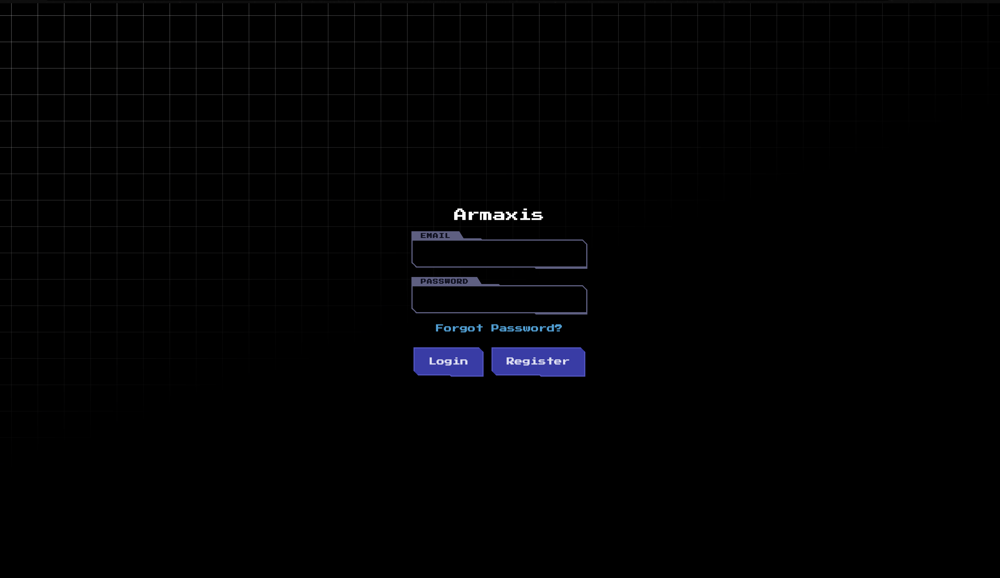
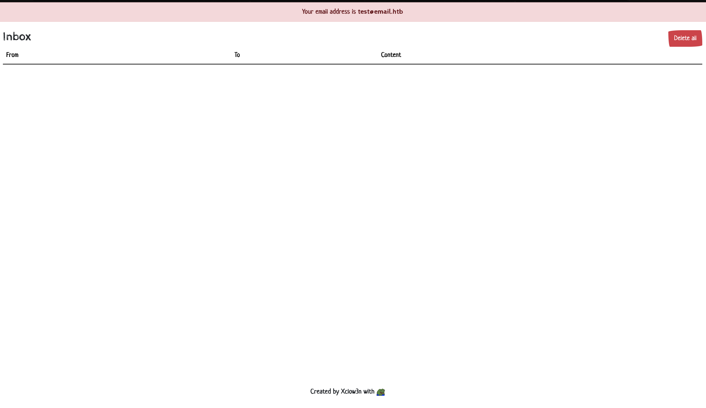
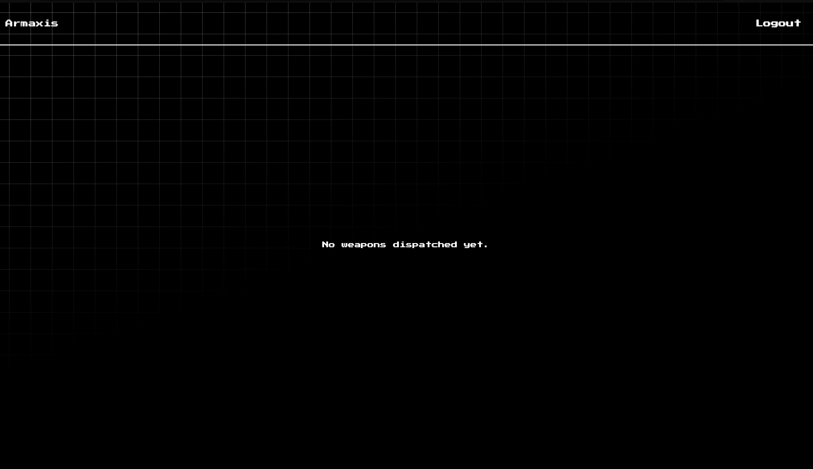
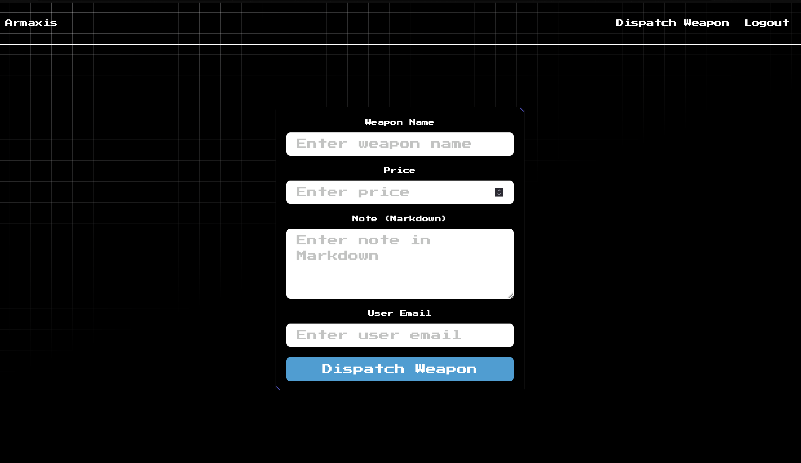
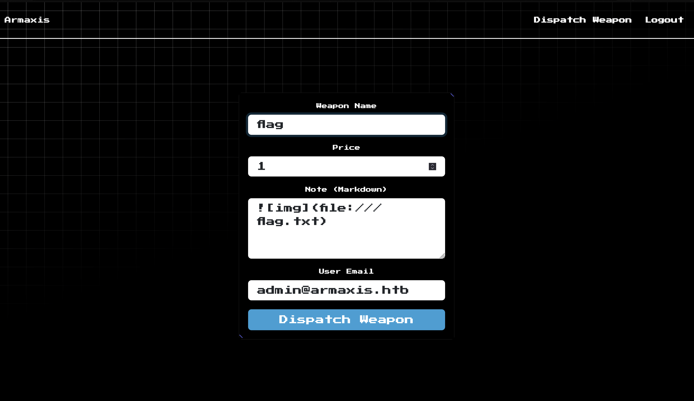
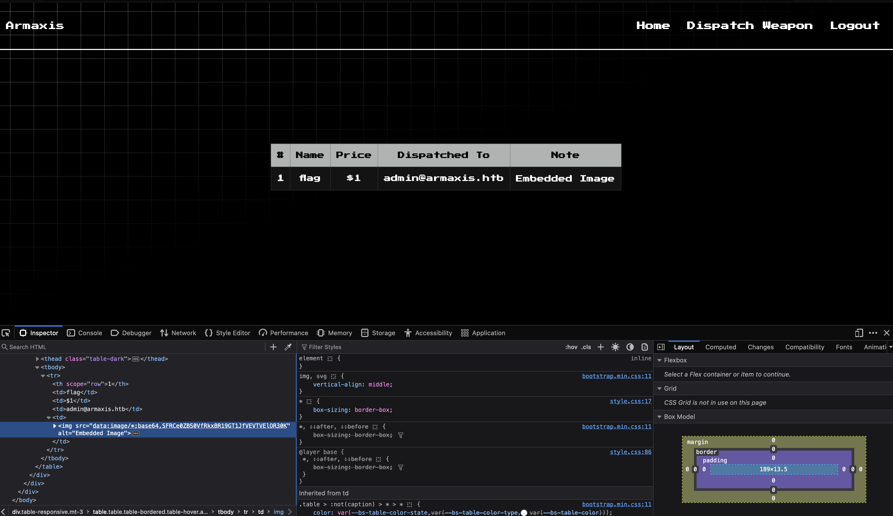

<font size="10">Armaxis</font><br>
1<sup>st</sup> Dec 2024 / Document No. D24.102.263

**Prepared By:** Xclow3n

**Challenge Author:** Xclow3n

**Difficulty:** <font color="green">Very Easy</font>

**Classification:** Official

# [Synopsis](#synopsis)

The challenge involves exploiting an Insecure Direct Object Reference (IDOR) vulnerability in the password reset functionality and then leveraging a Local File Inclusion (LFI) vulnerability in the markdown parser.

# [Solution](#solution)

When visiting the home page, the following interface is displayed:



We can register an account, log in, and reset the password. An email inbox is provided, and our email is `test@email.htb` to receive an OTP for resetting the password.



After logging in, the dashboard appears as shown below:



This dashboard represents the extent of the functionality available to us.

## IDOR on Password Reset

Let's examine the password reset functionality:

```javascript
router.post("/reset-password", async (req, res) => {
  const { token, newPassword, email } = req.body;
  if (!token || !newPassword || !email)
    return res.status(400).send("Token, email, and new password are required.");

  try {
    const reset = await getPasswordReset(token);
    if (!reset) return res.status(400).send("Invalid or expired token.");

    const user = await getUserByEmail(email);
    if (!user) return res.status(404).send("User not found.");

    await updateUserPassword(user.id, newPassword);
    await deletePasswordReset(token);

    res.send("Password reset successful.");
  } catch (err) {
    console.error("Error resetting password:", err);
    res.status(500).send("Error resetting password.");
  }
});

async function getPasswordReset(token) {
  const query = `SELECT * FROM password_resets WHERE token = ? AND expires_at > ?`;
  try {
    const reset = await get(query, [token, Date.now()]);
    return reset;
  } catch (error) {
    throw error;
  }
}
```

This functionality is vulnerable to IDOR because it verifies the validity of the token but does not check which user the token belongs to. This allows anyone with a valid token to reset another user's password.

By resetting the admin's password and logging in as the admin, we gain access to new functionality:



We can dispatch weapons to users via email, and in the note section, we can add markdown content.

```javascript
router.post("/weapons/dispatch", authenticate, async (req, res) => {
  const { role } = req.user;
  if (role !== "admin") return res.status(403).send("Access denied.");

  const { name, price, note, dispatched_to } = req.body;
  if (!name || !price || !note || !dispatched_to) {
    return res.status(400).send("All fields are required.");
  }

  try {
    const parsedNote = parseMarkdown(note);

    await dispatchWeapon(name, price, parsedNote, dispatched_to);

    res.send("Weapon dispatched successfully.");
  } catch (err) {
    console.error("Error dispatching weapon:", err);
    res.status(500).send("Error dispatching weapon.");
  }
});

// markdown.js
const MarkdownIt = require("markdown-it");
const { execSync } = require("child_process");

const md = new MarkdownIt({
  html: true,
});

function parseMarkdown(content) {
  if (!content) return "";
  return md.render(
    content.replace(/\!\[.*?\]\((.*?)\)/g, (match, url) => {
      try {
        const fileContent = execSync(`curl -s ${url}`);
        const base64Content = Buffer.from(fileContent).toString("base64");
        return ``;
      } catch (err) {
        console.error(`Error fetching image from URL ${url}:`, err.message);
        return `<p>Error loading image: ${url}</p>`;
      }
    }),
  );
}

module.exports = { parseMarkdown };
```

The markdown parser searches for image tags and fetches the image content, storing it in the database as base64. Since it uses `curl`, we can include files and potentially leak sensitive information.

By using a payload like the one below:



We are able to retrieve the content of `flag.txt`:


